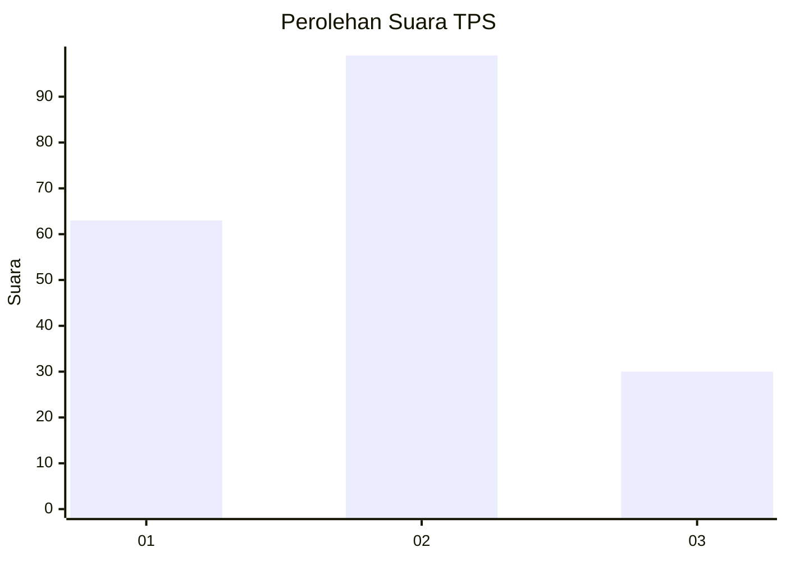
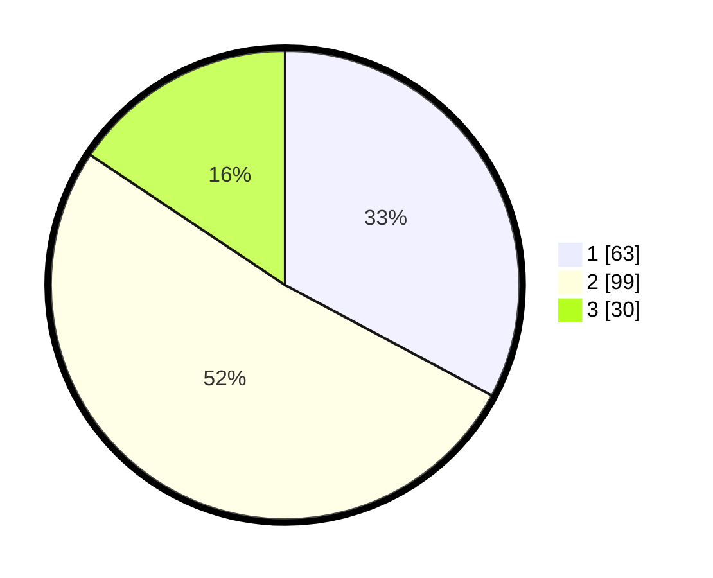

# Hasil

## Grafik

## Tabel

| No. | Nama Paslon    | Suara | Suara (raw) | Persentase |
|:--- |:-------------- | -----:| -----------:| ----------:|
| 1   | ANIES MUHAIMIN | 63    | [63][p-1]   | 32,81      |
| 2   | PRABOWO GIBRAN | 99    | [99][p-2]   | 51,56      |
| 3   | GANJAR MAHFUD  | 30    | [30][p-3]   | 15,63      |

[p-1]: https://github.com/gigit-pemilu/pemilu-2024-35-jawa-timur/blob/main/pilpres/hitung-suara/sub/35-jawa-timur/sub/01-pacitan/sub/11-ngadirojo/sub/2010-bodag/sub/001-tps/sub/paslon-1.txt
[p-2]: https://github.com/gigit-pemilu/pemilu-2024-35-jawa-timur/blob/main/pilpres/hitung-suara/sub/35-jawa-timur/sub/01-pacitan/sub/11-ngadirojo/sub/2010-bodag/sub/001-tps/sub/paslon-2.txt
[p-3]: https://github.com/gigit-pemilu/pemilu-2024-35-jawa-timur/blob/main/pilpres/hitung-suara/sub/35-jawa-timur/sub/01-pacitan/sub/11-ngadirojo/sub/2010-bodag/sub/001-tps/sub/paslon-3.txt

## Foto C Plano

https://sirekap-obj-formc.kpu.go.id/7b2d/pemilu/ppwp/35/01/11/20/10/3501112010001-20240217-122500--bfda5e2f-74de-4172-9d0d-88a0060aa535.jpg

https://sirekap-obj-formc.kpu.go.id/7b2d/pemilu/ppwp/35/01/11/20/10/3501112010001-20240217-122512--de8057b9-a27a-4e50-8481-b19ee65e9130.jpg

https://sirekap-obj-formc.kpu.go.id/7b2d/pemilu/ppwp/35/01/11/20/10/3501112010001-20240217-122515--59d274c1-c309-4f2a-ba19-c5d458dcf496.jpg

## Metadata

| Key        | Value               |
| ---------- | ------------------- |
| Time Stamp | 2024-02-17 13:37:34 |

