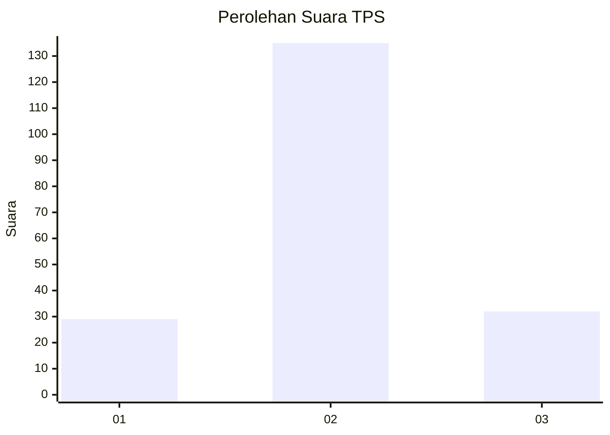
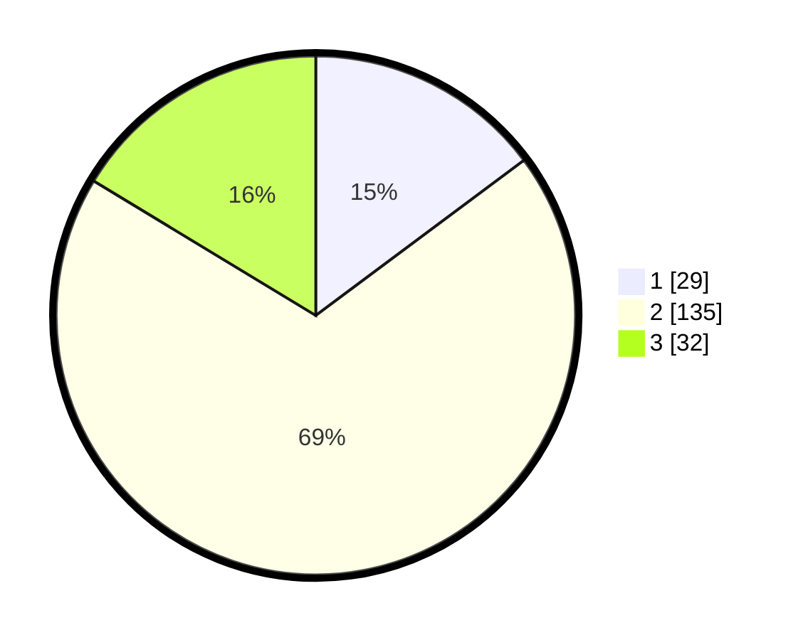

# Hasil

## Grafik

## Tabel

| No. | Nama Paslon    | Suara | Suara (raw) | Persentase |
|:--- |:-------------- | -----:| -----------:| ----------:|
| 1   | ANIES MUHAIMIN | 29    | [29][p-1]   | 14,80      |
| 2   | PRABOWO GIBRAN | 135   | [135][p-2]  | 68,88      |
| 3   | GANJAR MAHFUD  | 32    | [32][p-3]   | 16,33      |

[p-1]: https://github.com/gigit-pemilu/pemilu-2024-35-jawa-timur/blob/main/pilpres/hitung-suara/sub/35-jawa-timur/sub/01-pacitan/sub/11-ngadirojo/sub/2014-wonodadi-wetan/sub/004-tps/sub/paslon-1.txt
[p-2]: https://github.com/gigit-pemilu/pemilu-2024-35-jawa-timur/blob/main/pilpres/hitung-suara/sub/35-jawa-timur/sub/01-pacitan/sub/11-ngadirojo/sub/2014-wonodadi-wetan/sub/004-tps/sub/paslon-2.txt
[p-3]: https://github.com/gigit-pemilu/pemilu-2024-35-jawa-timur/blob/main/pilpres/hitung-suara/sub/35-jawa-timur/sub/01-pacitan/sub/11-ngadirojo/sub/2014-wonodadi-wetan/sub/004-tps/sub/paslon-3.txt

## Foto C Plano

https://sirekap-obj-formc.kpu.go.id/9dcb/pemilu/ppwp/35/01/11/20/14/3501112014004-20240218-161005--c8ae9b57-f4f0-4cfd-8d43-06896fe0e1bc.jpg

https://sirekap-obj-formc.kpu.go.id/9dcb/pemilu/ppwp/35/01/11/20/14/3501112014004-20240218-161306--d4fa9c2c-f30e-4d6a-bf2a-e6410d2bff7c.jpg

## Metadata

| Key        | Value               |
| ---------- | ------------------- |
| Time Stamp | 2024-02-24 22:31:28 |

