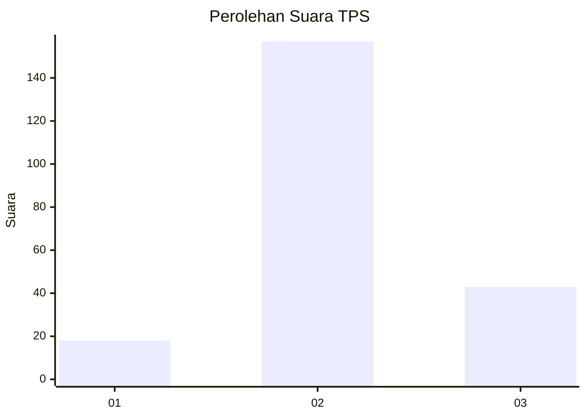
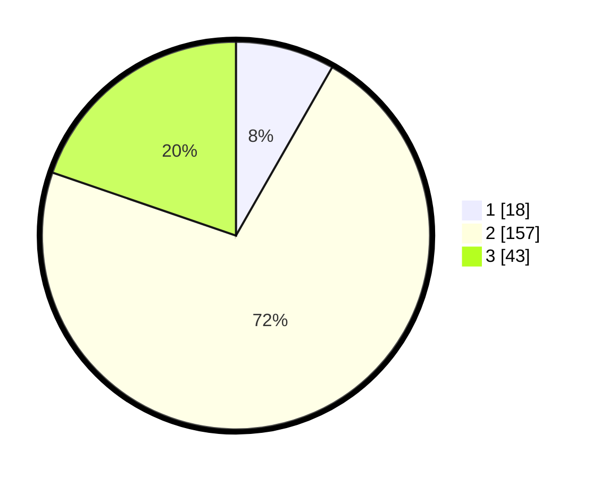

# Hasil

## Grafik

## Tabel

| No. | Nama Paslon    | Suara | Suara (raw) | Persentase |
|:--- |:-------------- | -----:| -----------:| ----------:|
| 1   | ANIES MUHAIMIN | 18    | [18][p-1]   | 8,26       |
| 2   | PRABOWO GIBRAN | 157   | [157][p-2]  | 72,02      |
| 3   | GANJAR MAHFUD  | 43    | [43][p-3]   | 19,72      |

[p-1]: https://github.com/gigit-pemilu/pemilu-2024/blob/main/pilpres/hitung-suara/sub/35-jawa-timur/sub/01-pacitan/sub/11-ngadirojo/sub/2016-wonokarto/sub/010-tps/sub/paslon-1.txt
[p-2]: https://github.com/gigit-pemilu/pemilu-2024/blob/main/pilpres/hitung-suara/sub/35-jawa-timur/sub/01-pacitan/sub/11-ngadirojo/sub/2016-wonokarto/sub/010-tps/sub/paslon-2.txt
[p-3]: https://github.com/gigit-pemilu/pemilu-2024/blob/main/pilpres/hitung-suara/sub/35-jawa-timur/sub/01-pacitan/sub/11-ngadirojo/sub/2016-wonokarto/sub/010-tps/sub/paslon-3.txt

## Foto C Plano

https://sirekap-obj-formc.kpu.go.id/548f/pemilu/ppwp/35/01/11/20/16/3501112016010-20240217-142137--6d83d346-aebb-412b-9884-fdb8c65c82c4.jpg

https://sirekap-obj-formc.kpu.go.id/548f/pemilu/ppwp/35/01/11/20/16/3501112016010-20240217-142441--1848dd53-fee9-4617-bd62-ebfbc7acb4ce.jpg

https://sirekap-obj-formc.kpu.go.id/548f/pemilu/ppwp/35/01/11/20/16/3501112016010-20240217-142339--0349a178-a292-4498-8743-97ce881afb58.jpg

## Metadata

| Key        | Value               |
| ---------- | ------------------- |
| Time Stamp | 2024-02-17 16:00:02 |

## DATA PEMILIH TETAP

Jumlah pemilih dalam DPT: **221**.
 * L: **130**.
 * P: **192**.

## DATA PENGGUNA HAK PILIH

Jumlah pengguna hak pilih dalam DPT: **224**.
 * L: **323**.
 * P: **639**.

Jumlah pengguna hak pilih dalam DPTb: **8**.
 * L: **0**.
 * P: **0**.

Jumlah pengguna hak pilih dalam DPK: **0**.
 * L: **0**.
 * P: **0**.

Jumlah pengguna hak pilih: **224**.
 * L: **152**.
 * P: **509**.

## JUMLAH SUARA SAH DAN TIDAK SAH

JUMLAH SELURUH SUARA SAH: **218**.

JUMLAH SUARA TIDAK SAH: **6**.

JUMLAH SELURUH SUARA SAH DAN SUARA TIDAK SAH: **224**.

