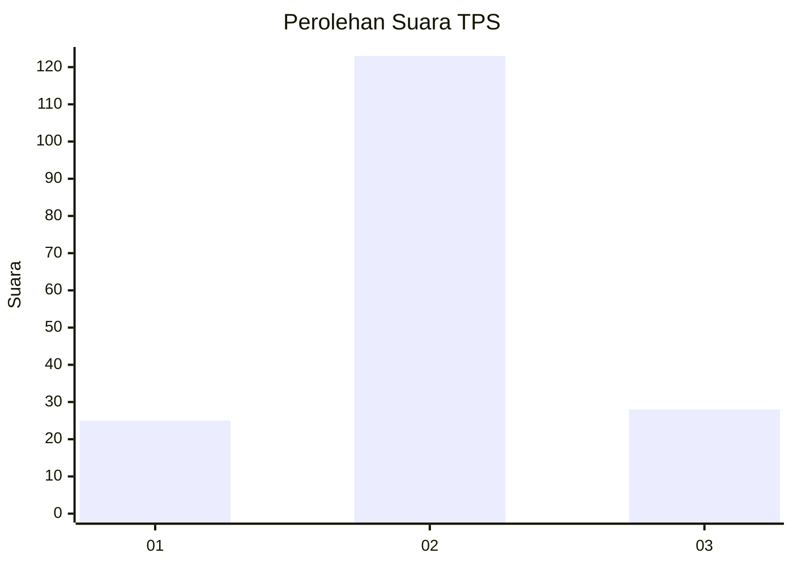

# Hasil

## Grafik

## Tabel

| No. | Nama Paslon    | Suara | Suara (raw) | Persentase |
|:--- |:-------------- | -----:| -----------:| ----------:|
| 1   | ANIES MUHAIMIN | 25    | [25][p-1]   | 14,20      |
| 2   | PRABOWO GIBRAN | 123   | [123][p-2]  | 69,89      |
| 3   | GANJAR MAHFUD  | 28    | [28][p-3]   | 15,91      |

[p-1]: https://github.com/gigit-pemilu/pemilu-2024/blob/main/pilpres/hitung-suara/sub/35-jawa-timur/sub/01-pacitan/sub/12-sudimoro/sub/2001-pagerkidul/sub/001-tps/sub/paslon-1.txt
[p-2]: https://github.com/gigit-pemilu/pemilu-2024/blob/main/pilpres/hitung-suara/sub/35-jawa-timur/sub/01-pacitan/sub/12-sudimoro/sub/2001-pagerkidul/sub/001-tps/sub/paslon-2.txt
[p-3]: https://github.com/gigit-pemilu/pemilu-2024/blob/main/pilpres/hitung-suara/sub/35-jawa-timur/sub/01-pacitan/sub/12-sudimoro/sub/2001-pagerkidul/sub/001-tps/sub/paslon-3.txt

## Foto C Plano

https://sirekap-obj-formc.kpu.go.id/9e8a/pemilu/ppwp/35/01/12/20/01/3501122001001-20240216-160415--cda77440-00c1-42f1-8bb4-c88294748963.jpg

https://sirekap-obj-formc.kpu.go.id/9e8a/pemilu/ppwp/35/01/12/20/01/3501122001001-20240216-165053--d84cf0ca-fc09-473e-80d7-1daf0a21baa9.jpg

https://sirekap-obj-formc.kpu.go.id/9e8a/pemilu/ppwp/35/01/12/20/01/3501122001001-20240216-165217--9e43af0b-7b8a-4ed0-b638-d724a7b477cc.jpg

## Metadata

| Key        | Value               |
| ---------- | ------------------- |
| Time Stamp | 2024-02-16 17:00:00 |

## DATA PEMILIH TETAP

Jumlah pemilih dalam DPT: **246**.
 * L: **112**.
 * P: **134**.

## DATA PENGGUNA HAK PILIH

Jumlah pengguna hak pilih dalam DPT: **175**.
 * L: **73**.
 * P: **102**.

Jumlah pengguna hak pilih dalam DPTb: **4**.
 * L: **3**.
 * P: **1**.

Jumlah pengguna hak pilih dalam DPK: **0**.
 * L: **0**.
 * P: **0**.

Jumlah pengguna hak pilih: **179**.
 * L: **76**.
 * P: **103**.

## JUMLAH SUARA SAH DAN TIDAK SAH

JUMLAH SELURUH SUARA SAH: **176**.

JUMLAH SUARA TIDAK SAH: **3**.

JUMLAH SELURUH SUARA SAH DAN SUARA TIDAK SAH: **179**.

