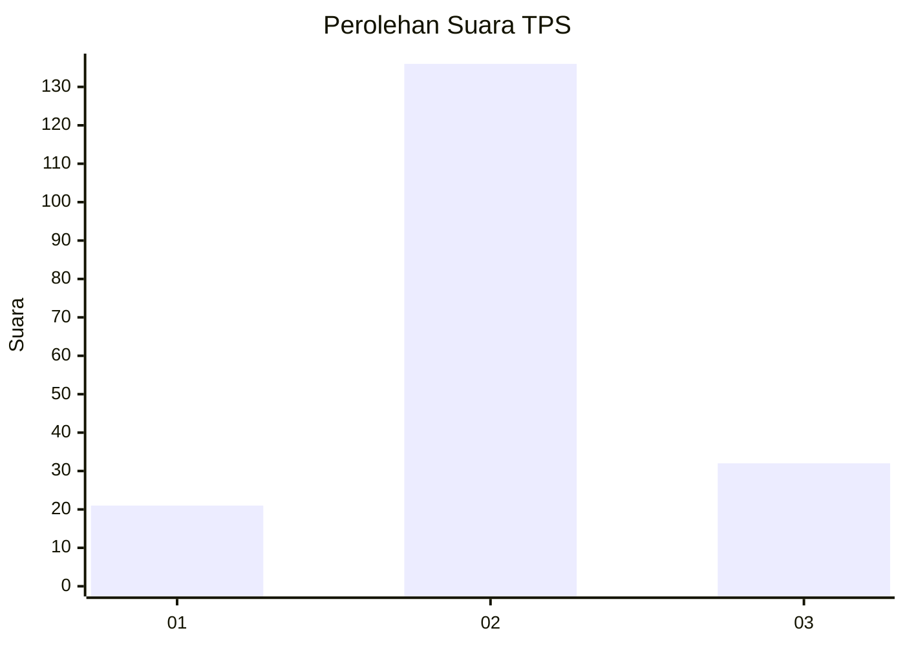
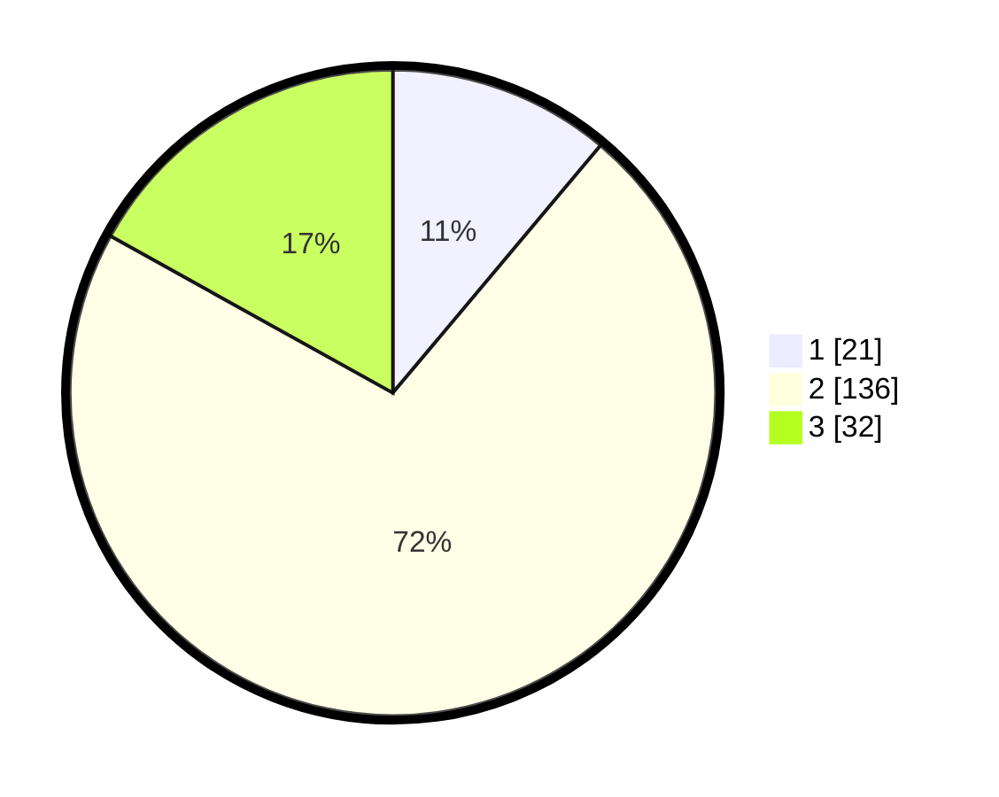

# Hasil

## Grafik

## Tabel

| No. | Nama Paslon    | Suara | Suara (raw) | Persentase |
|:--- |:-------------- | -----:| -----------:| ----------:|
| 1   | ANIES MUHAIMIN | 21    | [21][p-1]   | 11,11      |
| 2   | PRABOWO GIBRAN | 136   | [136][p-2]  | 71,96      |
| 3   | GANJAR MAHFUD  | 32    | [32][p-3]   | 16,93      |

[p-1]: https://github.com/gigit-pemilu/pemilu-2024/blob/main/pilpres/hitung-suara/sub/35-jawa-timur/sub/01-pacitan/sub/12-sudimoro/sub/2001-pagerkidul/sub/002-tps/sub/paslon-1.txt
[p-2]: https://github.com/gigit-pemilu/pemilu-2024/blob/main/pilpres/hitung-suara/sub/35-jawa-timur/sub/01-pacitan/sub/12-sudimoro/sub/2001-pagerkidul/sub/002-tps/sub/paslon-2.txt
[p-3]: https://github.com/gigit-pemilu/pemilu-2024/blob/main/pilpres/hitung-suara/sub/35-jawa-timur/sub/01-pacitan/sub/12-sudimoro/sub/2001-pagerkidul/sub/002-tps/sub/paslon-3.txt

## Foto C Plano

https://sirekap-obj-formc.kpu.go.id/1dd4/pemilu/ppwp/35/01/12/20/01/3501122001002-20240214-141005--734e005f-0eb0-40cd-a4d4-899423e2a1bf.jpg

https://sirekap-obj-formc.kpu.go.id/1dd4/pemilu/ppwp/35/01/12/20/01/3501122001002-20240214-141039--a087e863-54a3-48f7-8728-c3f0860b96e6.jpg

https://sirekap-obj-formc.kpu.go.id/1dd4/pemilu/ppwp/35/01/12/20/01/3501122001002-20240214-155700--c7575dcf-1dae-4495-9cee-dba1f4157dd4.jpg

## Metadata

| Key        | Value               |
| ---------- | ------------------- |
| Time Stamp | 2024-02-14 21:46:01 |

## DATA PEMILIH TETAP

Jumlah pemilih dalam DPT: **274**.
 * L: **134**.
 * P: **140**.

## DATA PENGGUNA HAK PILIH

Jumlah pengguna hak pilih dalam DPT: **198**.
 * L: **96**.
 * P: **102**.

Jumlah pengguna hak pilih dalam DPTb: **0**.
 * L: **0**.
 * P: **0**.

Jumlah pengguna hak pilih dalam DPK: **0**.
 * L: **0**.
 * P: **0**.

Jumlah pengguna hak pilih: **198**.
 * L: **96**.
 * P: **102**.

## JUMLAH SUARA SAH DAN TIDAK SAH

JUMLAH SELURUH SUARA SAH: **189**.

JUMLAH SUARA TIDAK SAH: **9**.

JUMLAH SELURUH SUARA SAH DAN SUARA TIDAK SAH: **198**.

