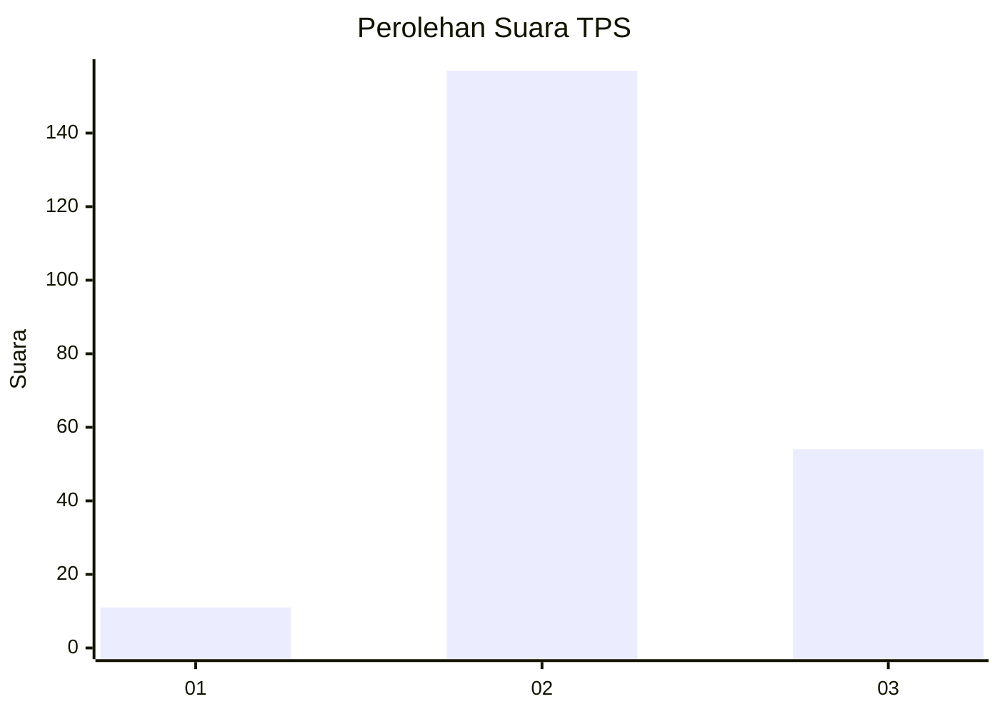
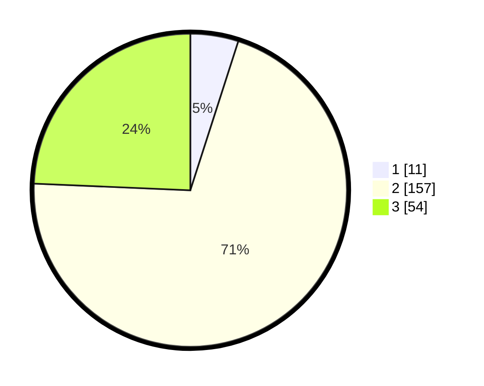

# Hasil

## Grafik

## Tabel

| No. | Nama Paslon    | Suara | Suara (raw) | Persentase |
|:--- |:-------------- | -----:| -----------:| ----------:|
| 1   | ANIES MUHAIMIN | 11    | [11][p-1]   | 4,95       |
| 2   | PRABOWO GIBRAN | 157   | [157][p-2]  | 70,72      |
| 3   | GANJAR MAHFUD  | 54    | [54][p-3]   | 24,32      |

[p-1]: https://github.com/gigit-pemilu/pemilu-2024-35-jawa-timur/blob/main/pilpres/hitung-suara/sub/35-jawa-timur/sub/01-pacitan/sub/12-sudimoro/sub/2001-pagerkidul/sub/004-tps/sub/paslon-1.txt
[p-2]: https://github.com/gigit-pemilu/pemilu-2024-35-jawa-timur/blob/main/pilpres/hitung-suara/sub/35-jawa-timur/sub/01-pacitan/sub/12-sudimoro/sub/2001-pagerkidul/sub/004-tps/sub/paslon-2.txt
[p-3]: https://github.com/gigit-pemilu/pemilu-2024-35-jawa-timur/blob/main/pilpres/hitung-suara/sub/35-jawa-timur/sub/01-pacitan/sub/12-sudimoro/sub/2001-pagerkidul/sub/004-tps/sub/paslon-3.txt

## Foto C Plano

https://sirekap-obj-formc.kpu.go.id/130e/pemilu/ppwp/35/01/12/20/01/3501122001004-20240214-185337--4d7ee3b6-323b-4c83-bc38-b28a40b1a055.jpg

https://sirekap-obj-formc.kpu.go.id/130e/pemilu/ppwp/35/01/12/20/01/3501122001004-20240214-185550--ea2964f4-007d-4b2d-bed7-96081889fd2f.jpg

https://sirekap-obj-formc.kpu.go.id/130e/pemilu/ppwp/35/01/12/20/01/3501122001004-20240214-185651--e877e3ae-2a40-4efa-9f17-db07f0fa4cfe.jpg

## Metadata

| Key        | Value               |
| ---------- | ------------------- |
| Time Stamp | 2024-02-14 21:46:01 |

## DATA PEMILIH TETAP

Jumlah pemilih dalam DPT: **286**.
 * L: **136**.
 * P: **150**.

## DATA PENGGUNA HAK PILIH

Jumlah pengguna hak pilih dalam DPT: **231**.
 * L: **111**.
 * P: **120**.

Jumlah pengguna hak pilih dalam DPTb: **3**.
 * L: **1**.
 * P: **2**.

Jumlah pengguna hak pilih dalam DPK: **0**.
 * L: **0**.
 * P: **0**.

Jumlah pengguna hak pilih: **234**.
 * L: **112**.
 * P: **122**.

## JUMLAH SUARA SAH DAN TIDAK SAH

JUMLAH SELURUH SUARA SAH: **222**.

JUMLAH SUARA TIDAK SAH: **12**.

JUMLAH SELURUH SUARA SAH DAN SUARA TIDAK SAH: **234**.

