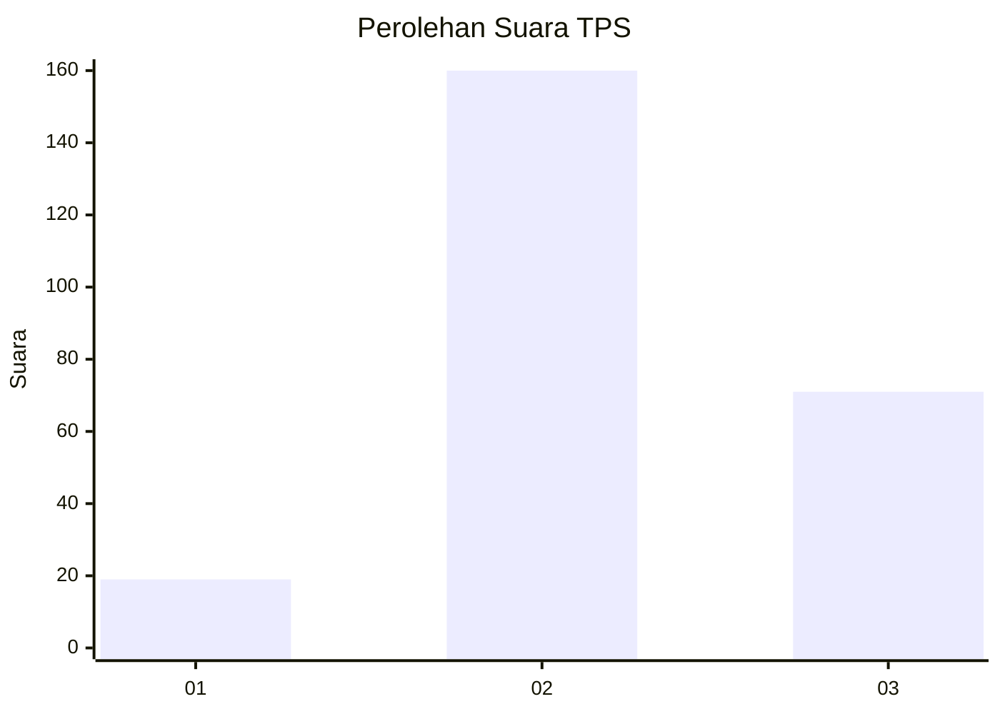
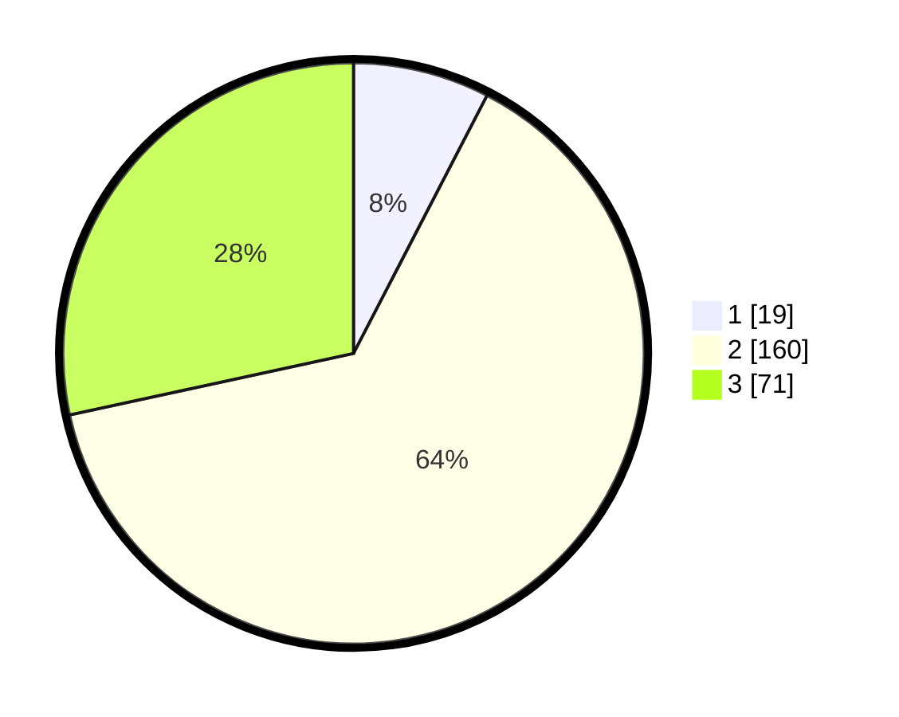

# Hasil

## Grafik

## Tabel

| No. | Nama Paslon    | Suara | Suara (raw) | Persentase |
|:--- |:-------------- | -----:| -----------:| ----------:|
| 1   | ANIES MUHAIMIN | 19    | [19][p-1]   | 7,60       |
| 2   | PRABOWO GIBRAN | 160   | [160][p-2]  | 64,00      |
| 3   | GANJAR MAHFUD  | 71    | [71][p-3]   | 28,40      |

[p-1]: https://github.com/gigit-pemilu/pemilu-2024-35-jawa-timur/blob/main/pilpres/hitung-suara/sub/35-jawa-timur/sub/02-ponorogo/sub/01-slahung/sub/2001-tugurejo/sub/001-tps/sub/paslon-1.txt
[p-2]: https://github.com/gigit-pemilu/pemilu-2024-35-jawa-timur/blob/main/pilpres/hitung-suara/sub/35-jawa-timur/sub/02-ponorogo/sub/01-slahung/sub/2001-tugurejo/sub/001-tps/sub/paslon-2.txt
[p-3]: https://github.com/gigit-pemilu/pemilu-2024-35-jawa-timur/blob/main/pilpres/hitung-suara/sub/35-jawa-timur/sub/02-ponorogo/sub/01-slahung/sub/2001-tugurejo/sub/001-tps/sub/paslon-3.txt

## Foto C Plano

https://sirekap-obj-formc.kpu.go.id/db75/pemilu/ppwp/35/02/01/20/01/3502012001001-20240214-160104--a8772230-aa1c-40c5-bd0b-7038e06a9433.jpg

https://sirekap-obj-formc.kpu.go.id/db75/pemilu/ppwp/35/02/01/20/01/3502012001001-20240214-190916--3b6d98e4-75c2-4b0b-acd7-dbde6ba7bcf7.jpg

https://sirekap-obj-formc.kpu.go.id/db75/pemilu/ppwp/35/02/01/20/01/3502012001001-20240218-203543--5c35168d-8d6d-4b8e-b8f4-017d7b082b98.jpg

## Metadata

| Key        | Value               |
| ---------- | ------------------- |
| Time Stamp | 2024-02-20 11:00:00 |

## DATA PEMILIH TETAP

Jumlah pemilih dalam DPT: **289**.
 * L: **138**.
 * P: **151**.

## DATA PENGGUNA HAK PILIH

Jumlah pengguna hak pilih dalam DPT: **251**.
 * L: **123**.
 * P: **128**.

Jumlah pengguna hak pilih dalam DPTb: **1**.
 * L: **1**.
 * P: **0**.

Jumlah pengguna hak pilih dalam DPK: **0**.
 * L: **0**.
 * P: **0**.

Jumlah pengguna hak pilih: **252**.
 * L: **124**.
 * P: **128**.

## JUMLAH SUARA SAH DAN TIDAK SAH

JUMLAH SELURUH SUARA SAH: **250**.

JUMLAH SUARA TIDAK SAH: **2**.

JUMLAH SELURUH SUARA SAH DAN SUARA TIDAK SAH: **252**.

