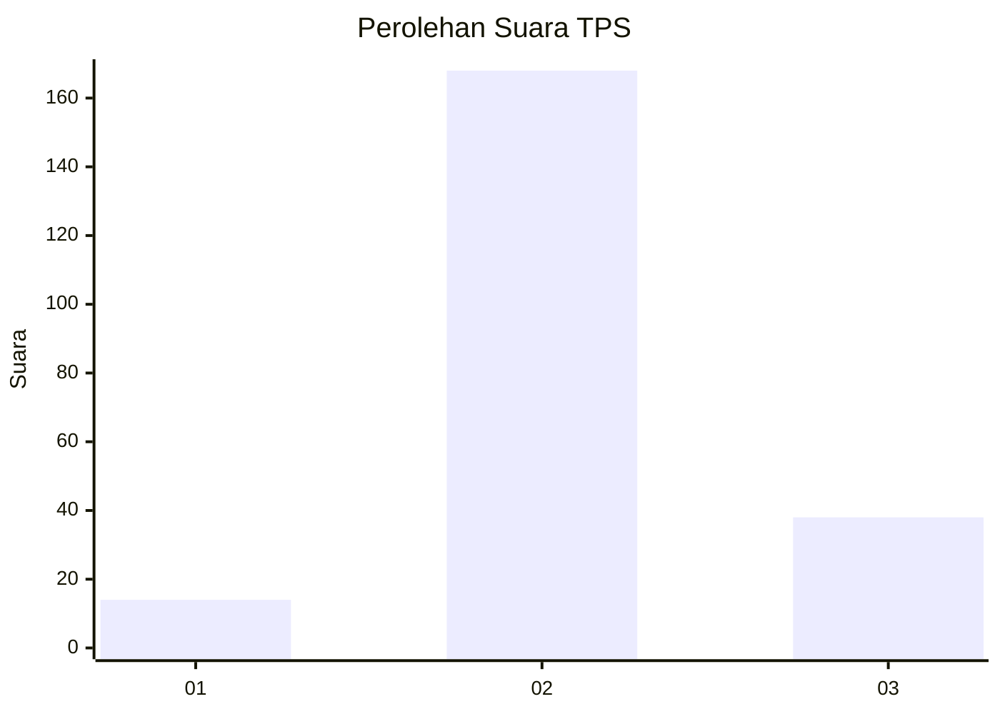

# Hasil

## Grafik

## Tabel

| No. | Nama Paslon    | Suara | Suara (raw) | Persentase |
|:--- |:-------------- | -----:| -----------:| ----------:|
| 1   | ANIES MUHAIMIN | 14    | [14][p-1]   | 6,36       |
| 2   | PRABOWO GIBRAN | 168   | [168][p-2]  | 76,36      |
| 3   | GANJAR MAHFUD  | 38    | [38][p-3]   | 17,27      |

[p-1]: https://github.com/gigit-pemilu/pemilu-2024-35-jawa-timur/blob/main/pilpres/hitung-suara/sub/35-jawa-timur/sub/02-ponorogo/sub/01-slahung/sub/2001-tugurejo/sub/002-tps/sub/paslon-1.txt
[p-2]: https://github.com/gigit-pemilu/pemilu-2024-35-jawa-timur/blob/main/pilpres/hitung-suara/sub/35-jawa-timur/sub/02-ponorogo/sub/01-slahung/sub/2001-tugurejo/sub/002-tps/sub/paslon-2.txt
[p-3]: https://github.com/gigit-pemilu/pemilu-2024-35-jawa-timur/blob/main/pilpres/hitung-suara/sub/35-jawa-timur/sub/02-ponorogo/sub/01-slahung/sub/2001-tugurejo/sub/002-tps/sub/paslon-3.txt

## Foto C Plano

https://sirekap-obj-formc.kpu.go.id/ed83/pemilu/ppwp/35/02/01/20/01/3502012001002-20240218-221635--d4d36a93-9ec6-4f49-a7b5-239fada35f9b.jpg

https://sirekap-obj-formc.kpu.go.id/ed83/pemilu/ppwp/35/02/01/20/01/3502012001002-20240218-221636--82c2f3d6-840e-4128-a39d-83a4f03f2cb7.jpg

https://sirekap-obj-formc.kpu.go.id/ed83/pemilu/ppwp/35/02/01/20/01/3502012001002-20240218-221635--52ec54e4-e512-490d-a197-980b0fc095a9.jpg

## Metadata

| Key        | Value               |
| ---------- | ------------------- |
| Time Stamp | 2024-02-19 10:00:00 |

## DATA PEMILIH TETAP

Jumlah pemilih dalam DPT: **285**.
 * L: **143**.
 * P: **142**.

## DATA PENGGUNA HAK PILIH

Jumlah pengguna hak pilih dalam DPT: **224**.
 * L: **113**.
 * P: **111**.

Jumlah pengguna hak pilih dalam DPTb: **0**.
 * L: **0**.
 * P: **0**.

Jumlah pengguna hak pilih dalam DPK: **0**.
 * L: **0**.
 * P: **0**.

Jumlah pengguna hak pilih: **224**.
 * L: **113**.
 * P: **111**.

## JUMLAH SUARA SAH DAN TIDAK SAH

JUMLAH SELURUH SUARA SAH: **220**.

JUMLAH SUARA TIDAK SAH: **4**.

JUMLAH SELURUH SUARA SAH DAN SUARA TIDAK SAH: **224**.

