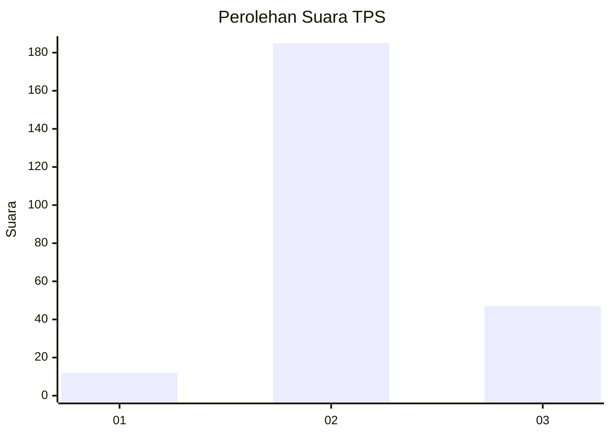
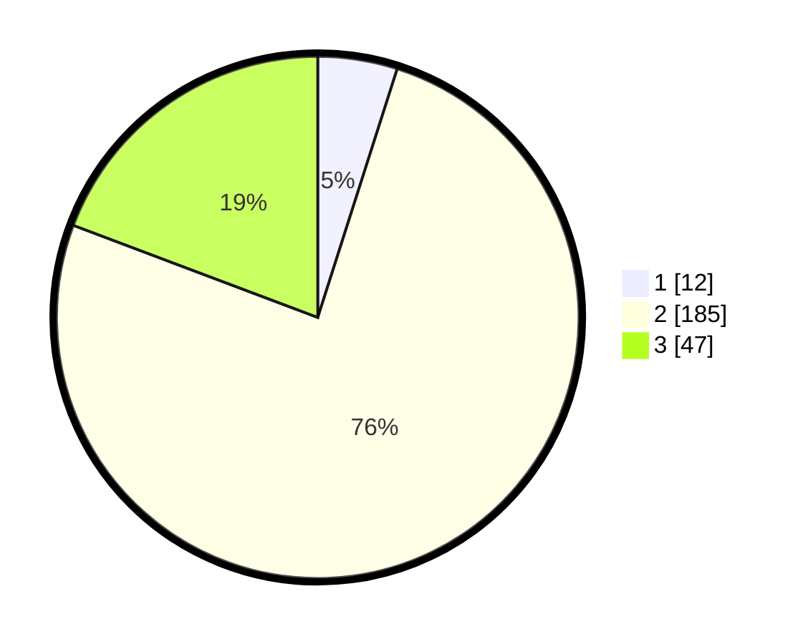

# Hasil

## Grafik

## Tabel

| No. | Nama Paslon    | Suara | Suara (raw) | Persentase |
|:--- |:-------------- | -----:| -----------:| ----------:|
| 1   | ANIES MUHAIMIN | 12    | [12][p-1]   | 4,92       |
| 2   | PRABOWO GIBRAN | 185   | [185][p-2]  | 75,82      |
| 3   | GANJAR MAHFUD  | 47    | [47][p-3]   | 19,26      |

[p-1]: https://github.com/gigit-pemilu/pemilu-2024-35-jawa-timur/blob/main/pilpres/hitung-suara/sub/35-jawa-timur/sub/02-ponorogo/sub/01-slahung/sub/2001-tugurejo/sub/003-tps/sub/paslon-1.txt
[p-2]: https://github.com/gigit-pemilu/pemilu-2024-35-jawa-timur/blob/main/pilpres/hitung-suara/sub/35-jawa-timur/sub/02-ponorogo/sub/01-slahung/sub/2001-tugurejo/sub/003-tps/sub/paslon-2.txt
[p-3]: https://github.com/gigit-pemilu/pemilu-2024-35-jawa-timur/blob/main/pilpres/hitung-suara/sub/35-jawa-timur/sub/02-ponorogo/sub/01-slahung/sub/2001-tugurejo/sub/003-tps/sub/paslon-3.txt

## Foto C Plano

https://sirekap-obj-formc.kpu.go.id/9b90/pemilu/ppwp/35/02/01/20/01/3502012001003-20240215-015407--965499a9-785c-4d90-9617-00a792e634d2.jpg

https://sirekap-obj-formc.kpu.go.id/9b90/pemilu/ppwp/35/02/01/20/01/3502012001003-20240215-064000--ad648e59-3ce2-45d8-9740-7335009da7b8.jpg

https://sirekap-obj-formc.kpu.go.id/9b90/pemilu/ppwp/35/02/01/20/01/3502012001003-20240215-015722--340455e1-2bc4-4454-b7f4-aa57014fc17f.jpg

## Metadata

| Key        | Value               |
| ---------- | ------------------- |
| Time Stamp | 2024-02-19 06:16:00 |

## DATA PEMILIH TETAP

Jumlah pemilih dalam DPT: **292**.
 * L: **148**.
 * P: **144**.

## DATA PENGGUNA HAK PILIH

Jumlah pengguna hak pilih dalam DPT: **251**.
 * L: **130**.
 * P: **121**.

Jumlah pengguna hak pilih dalam DPTb: **0**.
 * L: **0**.
 * P: **0**.

Jumlah pengguna hak pilih dalam DPK: **0**.
 * L: **0**.
 * P: **0**.

Jumlah pengguna hak pilih: **251**.
 * L: **130**.
 * P: **121**.

## JUMLAH SUARA SAH DAN TIDAK SAH

JUMLAH SELURUH SUARA SAH: **244**.

JUMLAH SUARA TIDAK SAH: **7**.

JUMLAH SELURUH SUARA SAH DAN SUARA TIDAK SAH: **251**.

