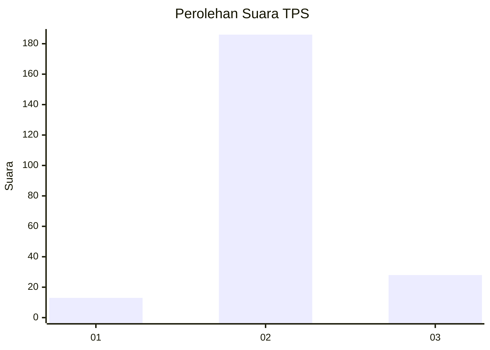
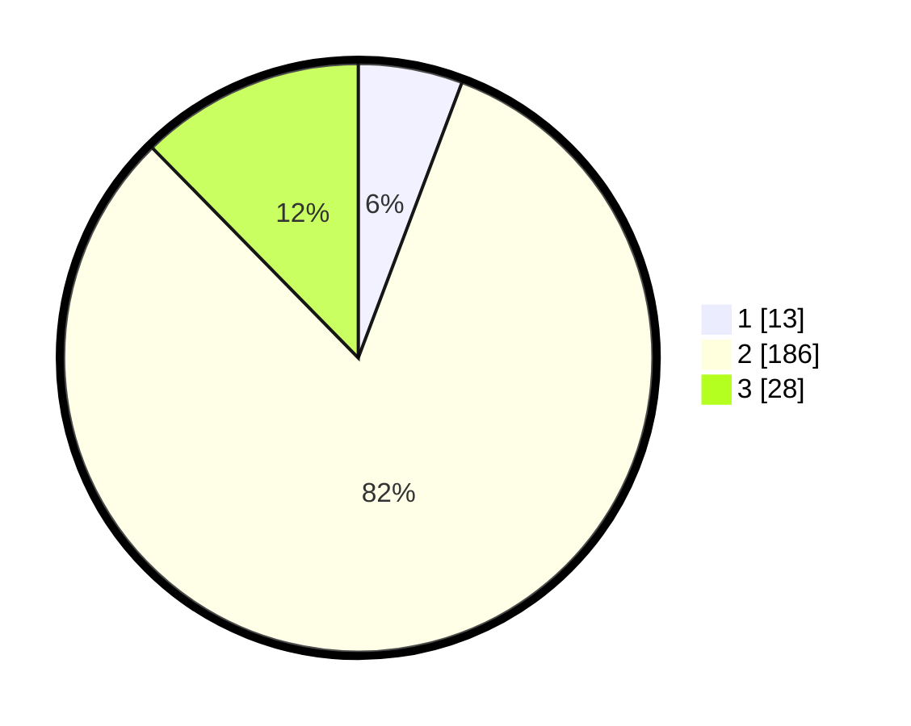

# Hasil

## Grafik

## Tabel

| No. | Nama Paslon    | Suara | Suara (raw) | Persentase |
|:--- |:-------------- | -----:| -----------:| ----------:|
| 1   | ANIES MUHAIMIN | 13    | [13][p-1]   | 5,73       |
| 2   | PRABOWO GIBRAN | 186   | [186][p-2]  | 81,94      |
| 3   | GANJAR MAHFUD  | 28    | [28][p-3]   | 12,33      |

[p-1]: https://github.com/gigit-pemilu/pemilu-2024/blob/main/pilpres/hitung-suara/sub/35-jawa-timur/sub/02-ponorogo/sub/01-slahung/sub/2001-tugurejo/sub/004-tps/sub/paslon-1.txt
[p-2]: https://github.com/gigit-pemilu/pemilu-2024/blob/main/pilpres/hitung-suara/sub/35-jawa-timur/sub/02-ponorogo/sub/01-slahung/sub/2001-tugurejo/sub/004-tps/sub/paslon-2.txt
[p-3]: https://github.com/gigit-pemilu/pemilu-2024/blob/main/pilpres/hitung-suara/sub/35-jawa-timur/sub/02-ponorogo/sub/01-slahung/sub/2001-tugurejo/sub/004-tps/sub/paslon-3.txt

## Foto C Plano

https://sirekap-obj-formc.kpu.go.id/e066/pemilu/ppwp/35/02/01/20/01/3502012001004-20240216-145853--15507b7a-fef0-4e28-8309-cfd06cc3cdec.jpg

https://sirekap-obj-formc.kpu.go.id/e066/pemilu/ppwp/35/02/01/20/01/3502012001004-20240216-145854--156aecfe-2b4f-4861-832f-07029b78279a.jpg

https://sirekap-obj-formc.kpu.go.id/e066/pemilu/ppwp/35/02/01/20/01/3502012001004-20240216-145854--2f5dad4c-e950-465e-8c9d-04b95882ddd4.jpg

## Metadata

| Key        | Value               |
| ---------- | ------------------- |
| Time Stamp | 2024-02-16 16:30:00 |

## DATA PEMILIH TETAP

Jumlah pemilih dalam DPT: **282**.
 * L: **143**.
 * P: **139**.

## DATA PENGGUNA HAK PILIH

Jumlah pengguna hak pilih dalam DPT: **228**.
 * L: **115**.
 * P: **113**.

Jumlah pengguna hak pilih dalam DPTb: **0**.
 * L: **0**.
 * P: **0**.

Jumlah pengguna hak pilih dalam DPK: **0**.
 * L: **0**.
 * P: **0**.

Jumlah pengguna hak pilih: **228**.
 * L: **115**.
 * P: **113**.

## JUMLAH SUARA SAH DAN TIDAK SAH

JUMLAH SELURUH SUARA SAH: **227**.

JUMLAH SUARA TIDAK SAH: **1**.

JUMLAH SELURUH SUARA SAH DAN SUARA TIDAK SAH: **228**.

