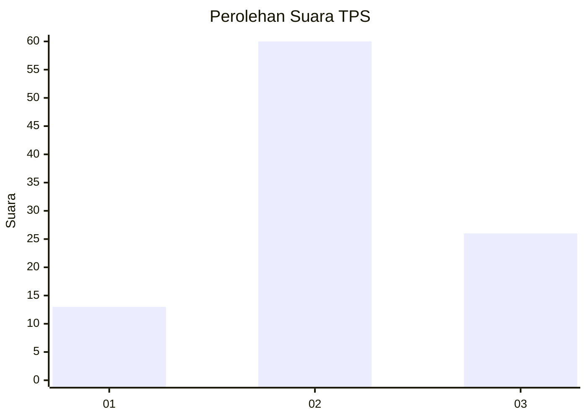
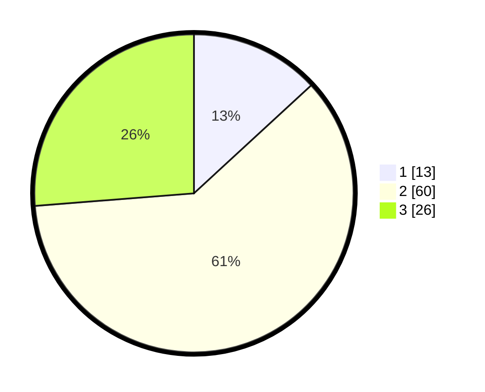

# Hasil

## Grafik

## Tabel

| No. | Nama Paslon    | Suara | Suara (raw) | Persentase |
|:--- |:-------------- | -----:| -----------:| ----------:|
| 1   | ANIES MUHAIMIN | 13    | [13][p-1]   | 13,13      |
| 2   | PRABOWO GIBRAN | 60    | [60][p-2]   | 60,61      |
| 3   | GANJAR MAHFUD  | 26    | [26][p-3]   | 26,26      |

[p-1]: https://github.com/gigit-pemilu/pemilu-2024/blob/main/pilpres/hitung-suara/sub/35-jawa-timur/sub/02-ponorogo/sub/01-slahung/sub/2001-tugurejo/sub/005-tps/sub/paslon-1.txt
[p-2]: https://github.com/gigit-pemilu/pemilu-2024/blob/main/pilpres/hitung-suara/sub/35-jawa-timur/sub/02-ponorogo/sub/01-slahung/sub/2001-tugurejo/sub/005-tps/sub/paslon-2.txt
[p-3]: https://github.com/gigit-pemilu/pemilu-2024/blob/main/pilpres/hitung-suara/sub/35-jawa-timur/sub/02-ponorogo/sub/01-slahung/sub/2001-tugurejo/sub/005-tps/sub/paslon-3.txt

## Foto C Plano

https://sirekap-obj-formc.kpu.go.id/f6b3/pemilu/ppwp/35/02/01/20/01/3502012001005-20240214-202225--451f152f-6358-4e7e-b5fb-37de4f4b4cf5.jpg

https://sirekap-obj-formc.kpu.go.id/f6b3/pemilu/ppwp/35/02/01/20/01/3502012001005-20240214-202508--b46baaec-8989-4a36-bdf1-2daf41b9f7e4.jpg

https://sirekap-obj-formc.kpu.go.id/f6b3/pemilu/ppwp/35/02/01/20/01/3502012001005-20240216-135330--8770bea2-f758-4c9d-9074-c5be75cb26d3.jpg

## Metadata

| Key        | Value               |
| ---------- | ------------------- |
| Time Stamp | 2024-02-16 14:00:34 |

## DATA PEMILIH TETAP

Jumlah pemilih dalam DPT: **253**.
 * L: **133**.
 * P: **120**.

## DATA PENGGUNA HAK PILIH

Jumlah pengguna hak pilih dalam DPT: **202**.
 * L: **104**.
 * P: **98**.

Jumlah pengguna hak pilih dalam DPTb: **0**.
 * L: **0**.
 * P: **0**.

Jumlah pengguna hak pilih dalam DPK: **0**.
 * L: **0**.
 * P: **0**.

Jumlah pengguna hak pilih: **202**.
 * L: **104**.
 * P: **98**.

## JUMLAH SUARA SAH DAN TIDAK SAH

JUMLAH SELURUH SUARA SAH: **199**.

JUMLAH SUARA TIDAK SAH: **3**.

JUMLAH SELURUH SUARA SAH DAN SUARA TIDAK SAH: **202**.

