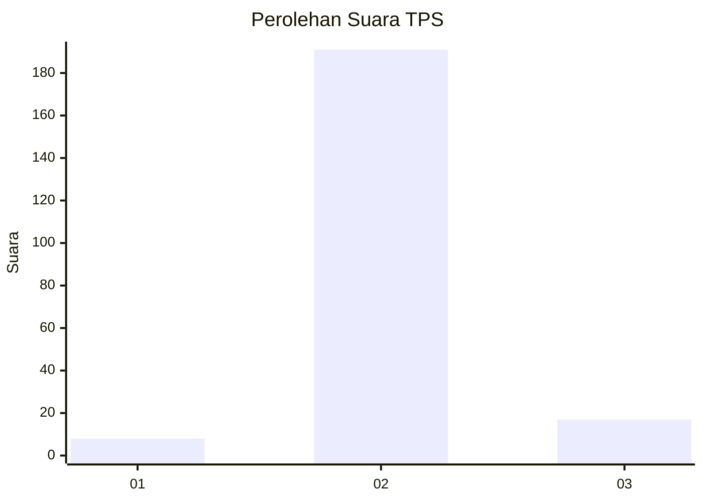
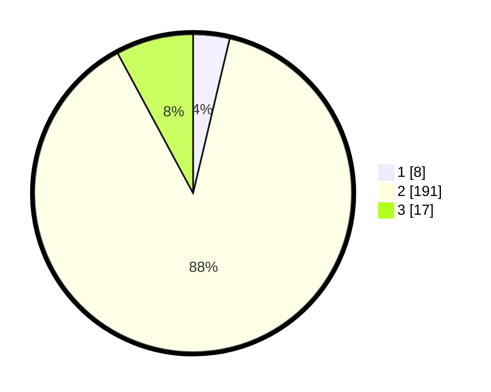

# Hasil

## Grafik

## Tabel

| No. | Nama Paslon    | Suara | Suara (raw) | Persentase |
|:--- |:-------------- | -----:| -----------:| ----------:|
| 1   | ANIES MUHAIMIN | 8     | [8][p-1]    | 3,70       |
| 2   | PRABOWO GIBRAN | 191   | [191][p-2]  | 88,43      |
| 3   | GANJAR MAHFUD  | 17    | [17][p-3]   | 7,87       |

[p-1]: https://github.com/gigit-pemilu/pemilu-2024/blob/main/pilpres/hitung-suara/sub/35-jawa-timur/sub/02-ponorogo/sub/01-slahung/sub/2001-tugurejo/sub/011-tps/sub/paslon-1.txt
[p-2]: https://github.com/gigit-pemilu/pemilu-2024/blob/main/pilpres/hitung-suara/sub/35-jawa-timur/sub/02-ponorogo/sub/01-slahung/sub/2001-tugurejo/sub/011-tps/sub/paslon-2.txt
[p-3]: https://github.com/gigit-pemilu/pemilu-2024/blob/main/pilpres/hitung-suara/sub/35-jawa-timur/sub/02-ponorogo/sub/01-slahung/sub/2001-tugurejo/sub/011-tps/sub/paslon-3.txt

## Foto C Plano

https://sirekap-obj-formc.kpu.go.id/f759/pemilu/ppwp/35/02/01/20/01/3502012001011-20240219-140111--9857ec9c-58d9-492d-b46c-6d1437522fbf.jpg

https://sirekap-obj-formc.kpu.go.id/f759/pemilu/ppwp/35/02/01/20/01/3502012001011-20240220-004925--75b5be7c-a694-4514-b8f9-c81b3426e85f.jpg

https://sirekap-obj-formc.kpu.go.id/f759/pemilu/ppwp/35/02/01/20/01/3502012001011-20240215-011617--6750864d-179f-4872-9c14-07bfe9b00f1f.jpg

## Metadata

| Key        | Value               |
| ---------- | ------------------- |
| Time Stamp | 2024-02-20 16:00:00 |

