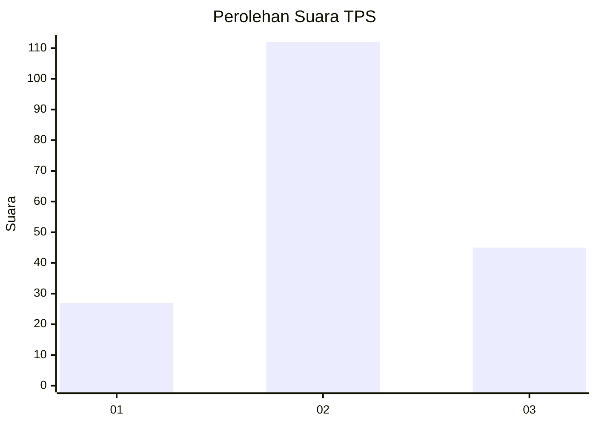
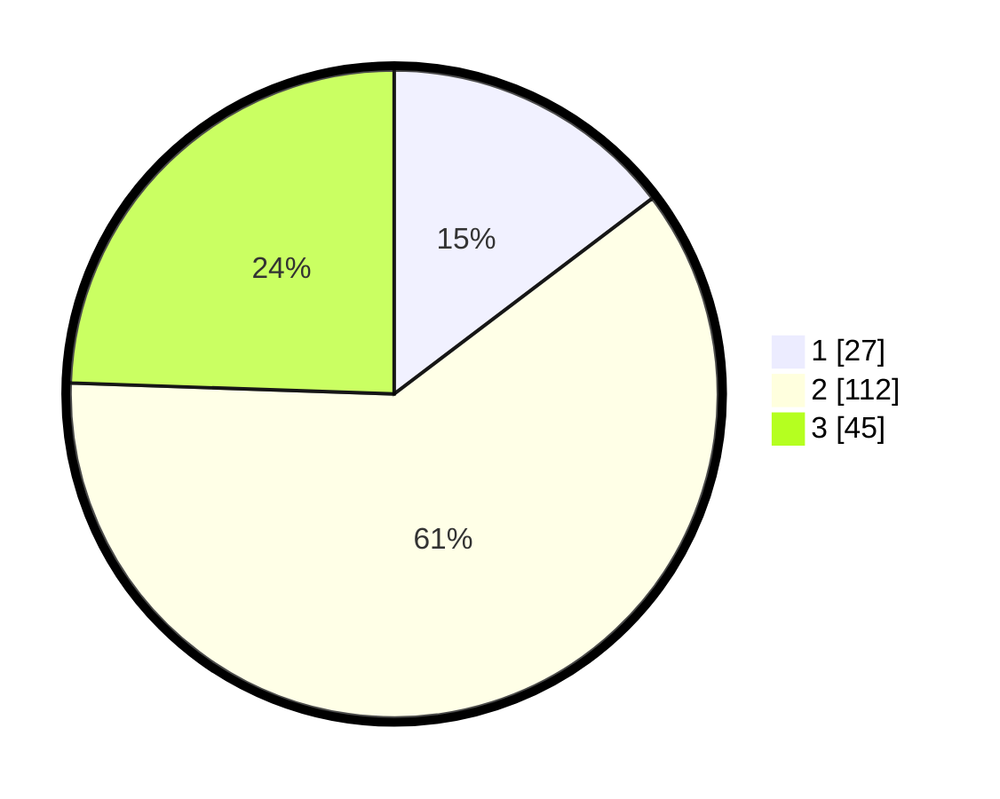

# Hasil

## Grafik

## Tabel

| No. | Nama Paslon    | Suara | Suara (raw) | Persentase |
|:--- |:-------------- | -----:| -----------:| ----------:|
| 1   | ANIES MUHAIMIN | 27    | [27][p-1]   | 14,67      |
| 2   | PRABOWO GIBRAN | 112   | [112][p-2]  | 60,87      |
| 3   | GANJAR MAHFUD  | 45    | [45][p-3]   | 24,46      |

[p-1]: https://github.com/gigit-pemilu/pemilu-2024-35-jawa-timur/blob/main/pilpres/hitung-suara/sub/35-jawa-timur/sub/02-ponorogo/sub/01-slahung/sub/2005-broto/sub/006-tps/sub/paslon-1.txt
[p-2]: https://github.com/gigit-pemilu/pemilu-2024-35-jawa-timur/blob/main/pilpres/hitung-suara/sub/35-jawa-timur/sub/02-ponorogo/sub/01-slahung/sub/2005-broto/sub/006-tps/sub/paslon-2.txt
[p-3]: https://github.com/gigit-pemilu/pemilu-2024-35-jawa-timur/blob/main/pilpres/hitung-suara/sub/35-jawa-timur/sub/02-ponorogo/sub/01-slahung/sub/2005-broto/sub/006-tps/sub/paslon-3.txt

## Foto C Plano

https://sirekap-obj-formc.kpu.go.id/b072/pemilu/ppwp/35/02/01/20/05/3502012005006-20240215-001548--5a2d5407-e992-4ddd-bf8d-0626f3ef8050.jpg

https://sirekap-obj-formc.kpu.go.id/b072/pemilu/ppwp/35/02/01/20/05/3502012005006-20240215-001936--c4948019-f231-432a-a089-48e10d6706fe.jpg

https://sirekap-obj-formc.kpu.go.id/b072/pemilu/ppwp/35/02/01/20/05/3502012005006-20240215-002053--64035855-386d-4ac2-becb-e7b481cbec63.jpg

## Metadata

| Key        | Value               |
| ---------- | ------------------- |
| Time Stamp | 2024-02-17 16:00:02 |

