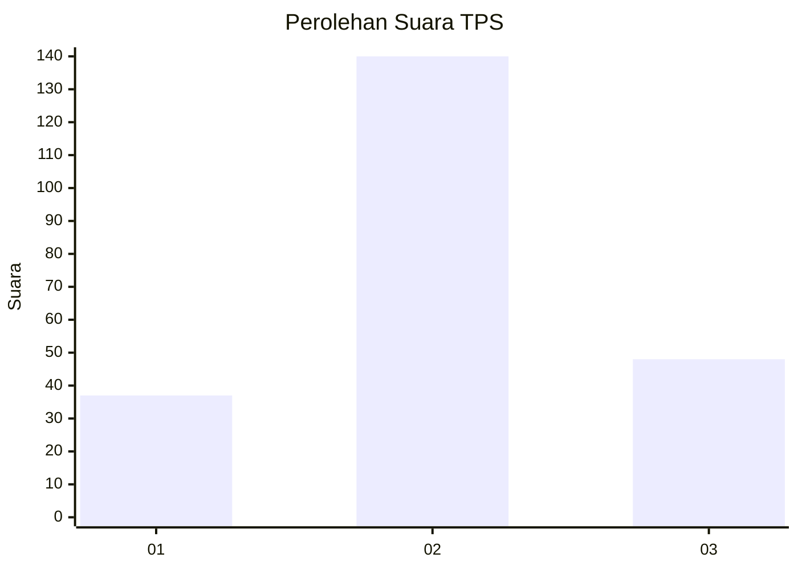
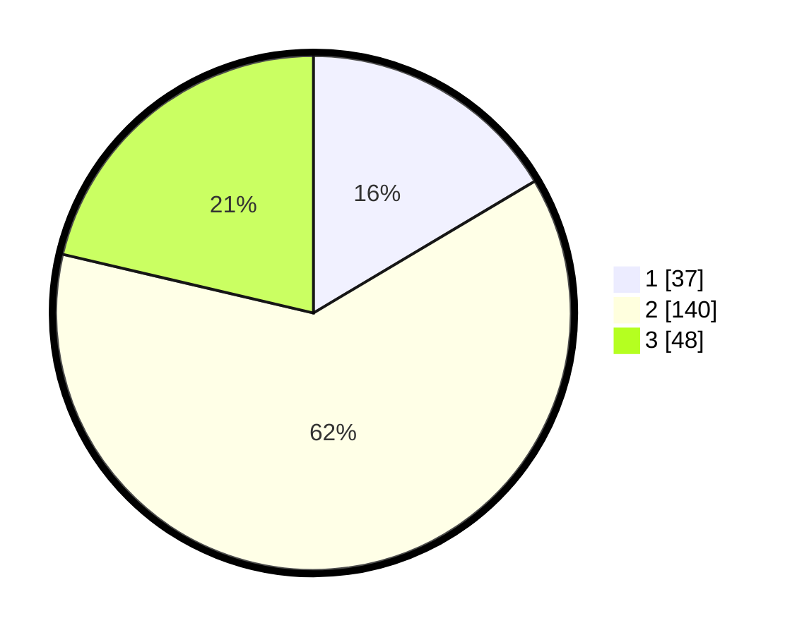

# Hasil

## Grafik

## Tabel

| No. | Nama Paslon    | Suara | Suara (raw) | Persentase |
|:--- |:-------------- | -----:| -----------:| ----------:|
| 1   | ANIES MUHAIMIN | 37    | [37][p-1]   | 16,44      |
| 2   | PRABOWO GIBRAN | 140   | [140][p-2]  | 62,22      |
| 3   | GANJAR MAHFUD  | 48    | [48][p-3]   | 21,33      |

[p-1]: https://github.com/gigit-pemilu/pemilu-2024/blob/main/pilpres/hitung-suara/sub/35-jawa-timur/sub/02-ponorogo/sub/01-slahung/sub/2007-kambeng/sub/005-tps/sub/paslon-1.txt
[p-2]: https://github.com/gigit-pemilu/pemilu-2024/blob/main/pilpres/hitung-suara/sub/35-jawa-timur/sub/02-ponorogo/sub/01-slahung/sub/2007-kambeng/sub/005-tps/sub/paslon-2.txt
[p-3]: https://github.com/gigit-pemilu/pemilu-2024/blob/main/pilpres/hitung-suara/sub/35-jawa-timur/sub/02-ponorogo/sub/01-slahung/sub/2007-kambeng/sub/005-tps/sub/paslon-3.txt

## Foto C Plano

https://sirekap-obj-formc.kpu.go.id/21cb/pemilu/ppwp/35/02/01/20/07/3502012007005-20240214-203751--f5409375-0e70-4adf-81d3-7f7646011e37.jpg

https://sirekap-obj-formc.kpu.go.id/21cb/pemilu/ppwp/35/02/01/20/07/3502012007005-20240214-215624--4852b8a5-258d-4424-aa86-2107c8d2fabc.jpg

https://sirekap-obj-formc.kpu.go.id/21cb/pemilu/ppwp/35/02/01/20/07/3502012007005-20240214-203805--ea5a5b7e-daef-4b6b-94c1-74e8453c7cba.jpg

## Metadata

| Key        | Value               |
| ---------- | ------------------- |
| Time Stamp | 2024-02-15 04:00:24 |

