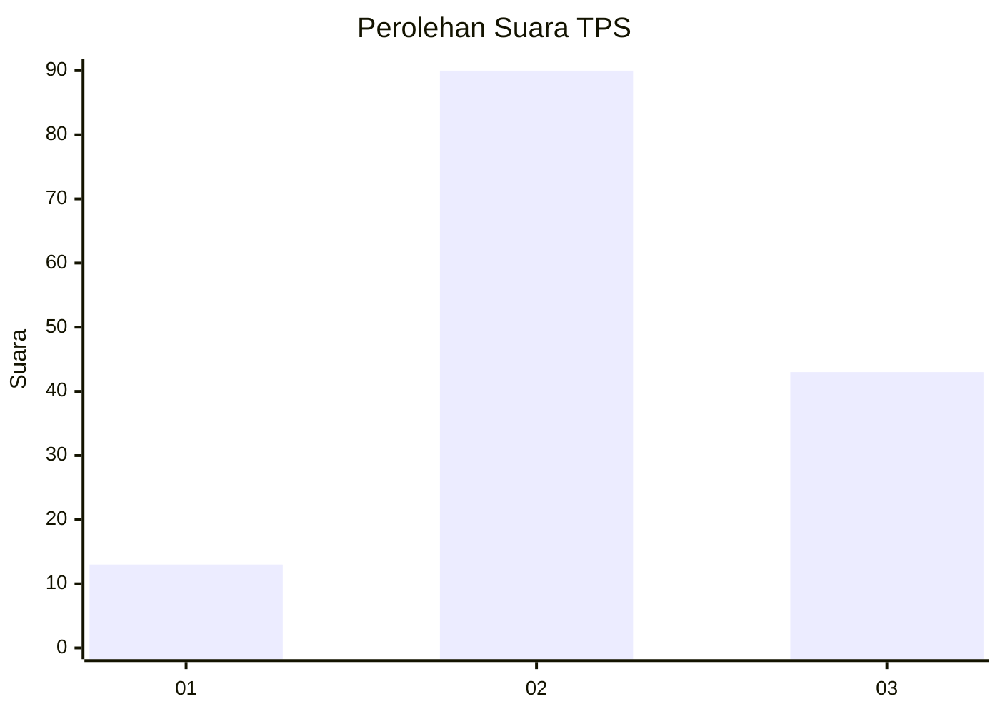
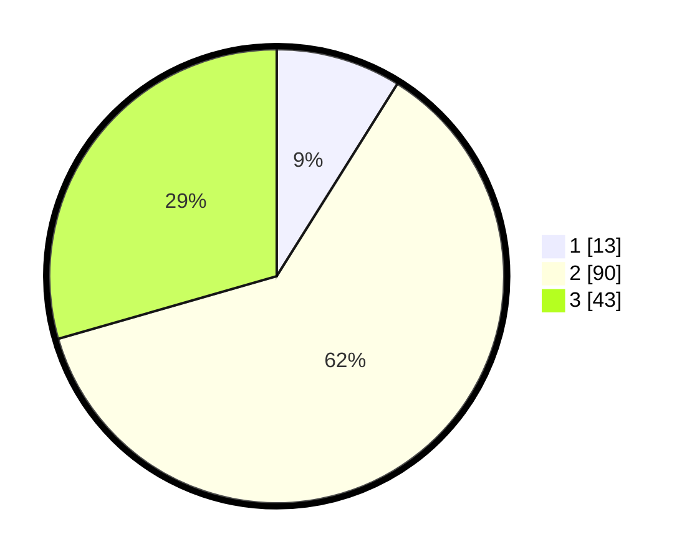

# Hasil

## Grafik

## Tabel

| No. | Nama Paslon    | Suara | Suara (raw) | Persentase |
|:--- |:-------------- | -----:| -----------:| ----------:|
| 1   | ANIES MUHAIMIN | 13    | [13][p-1]   | 8,90       |
| 2   | PRABOWO GIBRAN | 90    | [90][p-2]   | 61,64      |
| 3   | GANJAR MAHFUD  | 43    | [43][p-3]   | 29,45      |

[p-1]: https://github.com/gigit-pemilu/pemilu-2024-35-jawa-timur/blob/main/pilpres/hitung-suara/sub/35-jawa-timur/sub/02-ponorogo/sub/01-slahung/sub/2008-wates/sub/011-tps/sub/paslon-1.txt
[p-2]: https://github.com/gigit-pemilu/pemilu-2024-35-jawa-timur/blob/main/pilpres/hitung-suara/sub/35-jawa-timur/sub/02-ponorogo/sub/01-slahung/sub/2008-wates/sub/011-tps/sub/paslon-2.txt
[p-3]: https://github.com/gigit-pemilu/pemilu-2024-35-jawa-timur/blob/main/pilpres/hitung-suara/sub/35-jawa-timur/sub/02-ponorogo/sub/01-slahung/sub/2008-wates/sub/011-tps/sub/paslon-3.txt

## Foto C Plano

https://sirekap-obj-formc.kpu.go.id/c18c/pemilu/ppwp/35/02/01/20/08/3502012008011-20240218-205710--609f0be1-6d41-4d7c-9b48-aa162cf9e889.jpg

https://sirekap-obj-formc.kpu.go.id/c18c/pemilu/ppwp/35/02/01/20/08/3502012008011-20240214-230530--6465b311-0cca-4831-8bdc-48ddad0d4e19.jpg

https://sirekap-obj-formc.kpu.go.id/c18c/pemilu/ppwp/35/02/01/20/08/3502012008011-20240214-230702--3e7f6464-9e0f-46ec-b4d0-e7adadc4e301.jpg

## Metadata

| Key        | Value               |
| ---------- | ------------------- |
| Time Stamp | 2024-02-19 06:16:00 |

