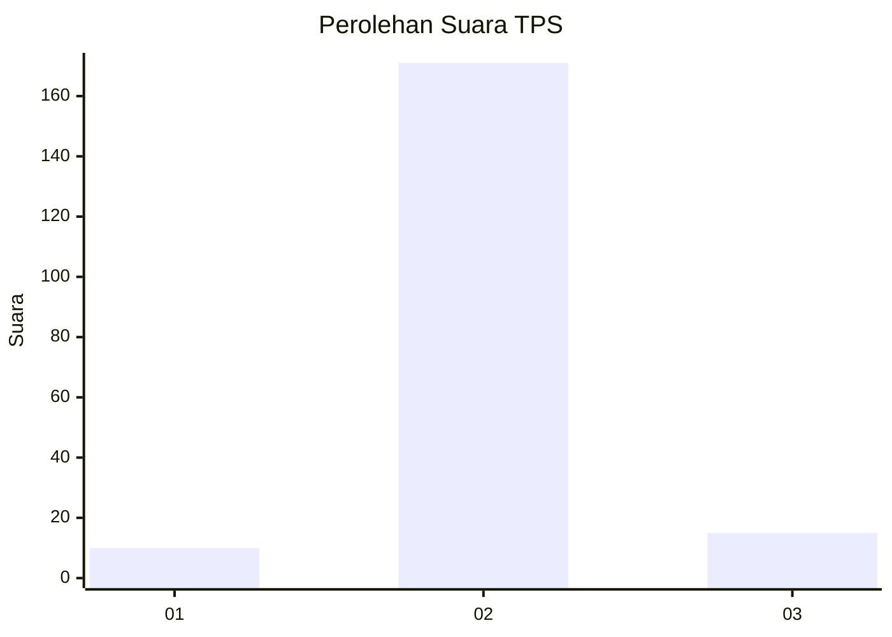
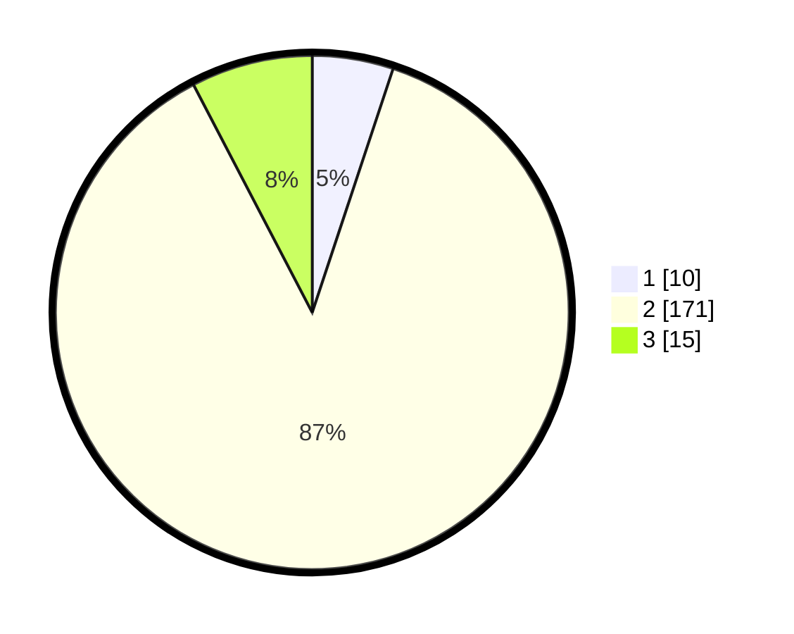

# Hasil

## Grafik

## Tabel

| No. | Nama Paslon    | Suara | Suara (raw) | Persentase |
|:--- |:-------------- | -----:| -----------:| ----------:|
| 1   | ANIES MUHAIMIN | 10    | [10][p-1]   | 5,10       |
| 2   | PRABOWO GIBRAN | 171   | [171][p-2]  | 87,24      |
| 3   | GANJAR MAHFUD  | 15    | [15][p-3]   | 7,65       |

[p-1]: https://github.com/gigit-pemilu/pemilu-2024-35-jawa-timur/blob/main/pilpres/hitung-suara/sub/35-jawa-timur/sub/02-ponorogo/sub/01-slahung/sub/2009-ngilo-ilo/sub/003-tps/sub/paslon-1.txt
[p-2]: https://github.com/gigit-pemilu/pemilu-2024-35-jawa-timur/blob/main/pilpres/hitung-suara/sub/35-jawa-timur/sub/02-ponorogo/sub/01-slahung/sub/2009-ngilo-ilo/sub/003-tps/sub/paslon-2.txt
[p-3]: https://github.com/gigit-pemilu/pemilu-2024-35-jawa-timur/blob/main/pilpres/hitung-suara/sub/35-jawa-timur/sub/02-ponorogo/sub/01-slahung/sub/2009-ngilo-ilo/sub/003-tps/sub/paslon-3.txt

## Foto C Plano

https://sirekap-obj-formc.kpu.go.id/8b78/pemilu/ppwp/35/02/01/20/09/3502012009003-20240218-064728--840ae4a7-b17b-47a8-a3e1-1e019ec9b1b5.jpg

https://sirekap-obj-formc.kpu.go.id/8b78/pemilu/ppwp/35/02/01/20/09/3502012009003-20240218-064940--bb5790cb-2e17-4d69-8439-5dc46ed42e98.jpg

https://sirekap-obj-formc.kpu.go.id/8b78/pemilu/ppwp/35/02/01/20/09/3502012009003-20240218-065025--35d419ba-093e-4f4b-ad1b-676a60c3de7d.jpg

## Metadata

| Key        | Value               |
| ---------- | ------------------- |
| Time Stamp | 2024-02-19 06:16:00 |

