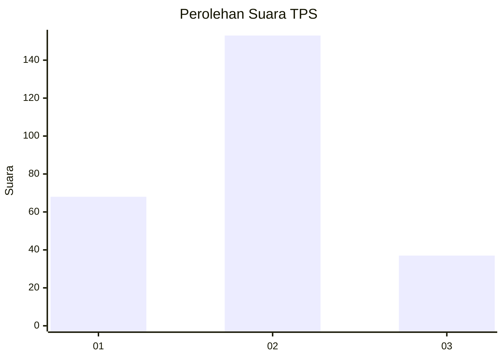
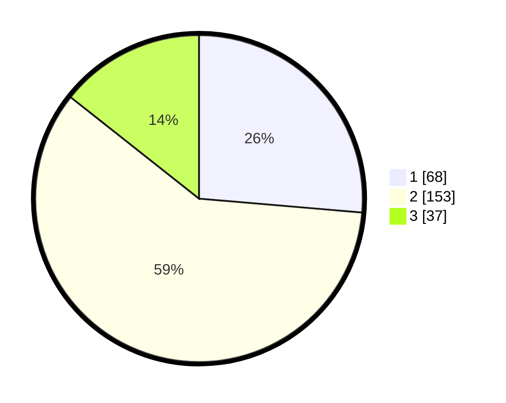

# Hasil

## Grafik

## Tabel

| No. | Nama Paslon    | Suara | Suara (raw) | Persentase |
|:--- |:-------------- | -----:| -----------:| ----------:|
| 1   | ANIES MUHAIMIN | 68    | [68][p-1]   | 26,36      |
| 2   | PRABOWO GIBRAN | 153   | [153][p-2]  | 59,30      |
| 3   | GANJAR MAHFUD  | 37    | [37][p-3]   | 14,34      |

[p-1]: https://github.com/gigit-pemilu/pemilu-2024-35-jawa-timur/blob/main/pilpres/hitung-suara/sub/35-jawa-timur/sub/02-ponorogo/sub/01-slahung/sub/2010-duri/sub/008-tps/sub/paslon-1.txt
[p-2]: https://github.com/gigit-pemilu/pemilu-2024-35-jawa-timur/blob/main/pilpres/hitung-suara/sub/35-jawa-timur/sub/02-ponorogo/sub/01-slahung/sub/2010-duri/sub/008-tps/sub/paslon-2.txt
[p-3]: https://github.com/gigit-pemilu/pemilu-2024-35-jawa-timur/blob/main/pilpres/hitung-suara/sub/35-jawa-timur/sub/02-ponorogo/sub/01-slahung/sub/2010-duri/sub/008-tps/sub/paslon-3.txt

## Foto C Plano

https://sirekap-obj-formc.kpu.go.id/9270/pemilu/ppwp/35/02/01/20/10/3502012010008-20240214-192618--b55fa1fa-b8df-4ef4-bab5-20c8d4a77174.jpg

https://sirekap-obj-formc.kpu.go.id/9270/pemilu/ppwp/35/02/01/20/10/3502012010008-20240214-224320--3c12f8d8-0a65-4633-849b-13c0d0c30149.jpg

https://sirekap-obj-formc.kpu.go.id/9270/pemilu/ppwp/35/02/01/20/10/3502012010008-20240214-224911--da57148c-d31a-4400-9bc0-1813af7092e9.jpg

## Metadata

| Key        | Value               |
| ---------- | ------------------- |
| Time Stamp | 2024-02-16 21:01:00 |

