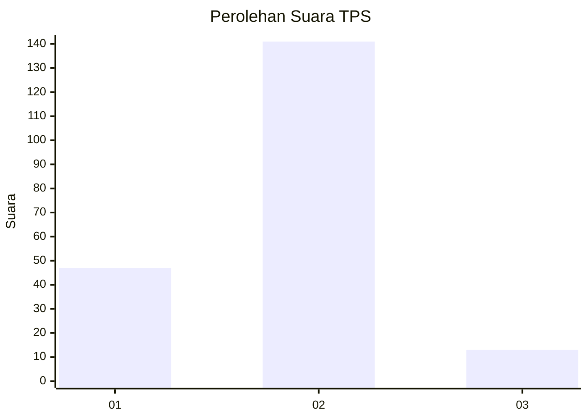

# Hasil

## Grafik

## Tabel

| No. | Nama Paslon    | Suara | Suara (raw) | Persentase |
|:--- |:-------------- | -----:| -----------:| ----------:|
| 1   | ANIES MUHAIMIN | 47    | [47][p-1]   | 23,38      |
| 2   | PRABOWO GIBRAN | 141   | [141][p-2]  | 70,15      |
| 3   | GANJAR MAHFUD  | 13    | [13][p-3]   | 6,47       |

[p-1]: https://github.com/gigit-pemilu/pemilu-2024-35-jawa-timur/blob/main/pilpres/hitung-suara/sub/35-jawa-timur/sub/02-ponorogo/sub/01-slahung/sub/2013-jebeng/sub/004-tps/sub/paslon-1.txt
[p-2]: https://github.com/gigit-pemilu/pemilu-2024-35-jawa-timur/blob/main/pilpres/hitung-suara/sub/35-jawa-timur/sub/02-ponorogo/sub/01-slahung/sub/2013-jebeng/sub/004-tps/sub/paslon-2.txt
[p-3]: https://github.com/gigit-pemilu/pemilu-2024-35-jawa-timur/blob/main/pilpres/hitung-suara/sub/35-jawa-timur/sub/02-ponorogo/sub/01-slahung/sub/2013-jebeng/sub/004-tps/sub/paslon-3.txt

## Foto C Plano

https://sirekap-obj-formc.kpu.go.id/4d18/pemilu/ppwp/35/02/01/20/13/3502012013004-20240219-060950--c9f81b4b-9bb8-424d-bab3-1181a055c5fc.jpg

https://sirekap-obj-formc.kpu.go.id/4d18/pemilu/ppwp/35/02/01/20/13/3502012013004-20240218-085334--c247a492-0e9e-460b-b28c-73096b567d81.jpg

https://sirekap-obj-formc.kpu.go.id/4d18/pemilu/ppwp/35/02/01/20/13/3502012013004-20240218-085351--952246d8-c867-4558-a46c-1d99f685a2c6.jpg

## Metadata

| Key        | Value               |
| ---------- | ------------------- |
| Time Stamp | 2024-02-19 06:16:00 |

