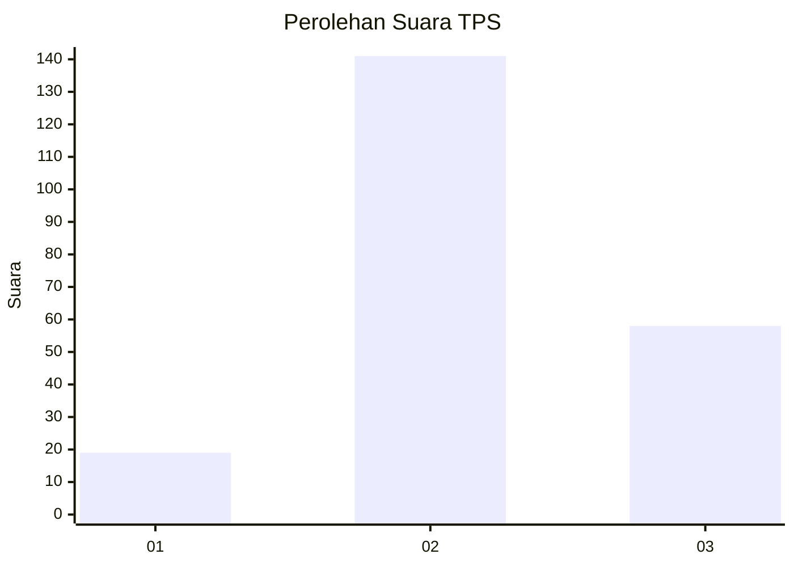
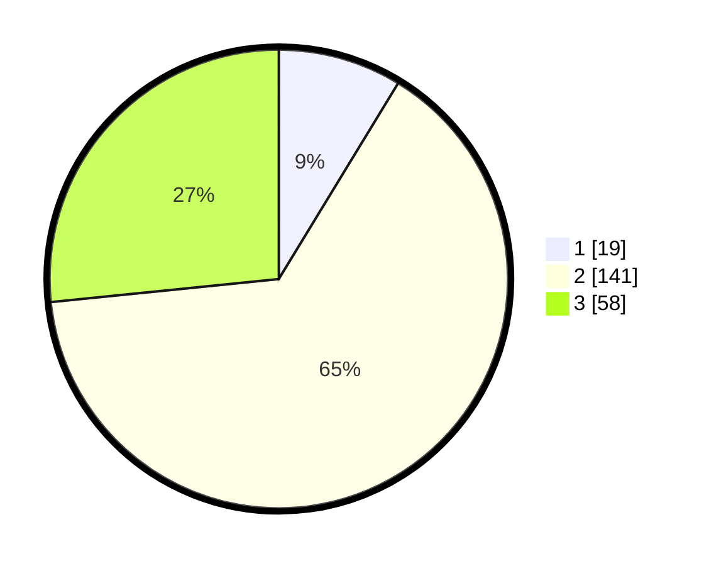

# Hasil

## Grafik

## Tabel

| No. | Nama Paslon    | Suara | Suara (raw) | Persentase |
|:--- |:-------------- | -----:| -----------:| ----------:|
| 1   | ANIES MUHAIMIN | 19    | [19][p-1]   | 8,72       |
| 2   | PRABOWO GIBRAN | 141   | [141][p-2]  | 64,68      |
| 3   | GANJAR MAHFUD  | 58    | [58][p-3]   | 26,61      |

[p-1]: https://github.com/gigit-pemilu/pemilu-2024/blob/main/pilpres/hitung-suara/sub/35-jawa-timur/sub/02-ponorogo/sub/01-slahung/sub/2020-nailan/sub/003-tps/sub/paslon-1.txt
[p-2]: https://github.com/gigit-pemilu/pemilu-2024/blob/main/pilpres/hitung-suara/sub/35-jawa-timur/sub/02-ponorogo/sub/01-slahung/sub/2020-nailan/sub/003-tps/sub/paslon-2.txt
[p-3]: https://github.com/gigit-pemilu/pemilu-2024/blob/main/pilpres/hitung-suara/sub/35-jawa-timur/sub/02-ponorogo/sub/01-slahung/sub/2020-nailan/sub/003-tps/sub/paslon-3.txt

## Foto C Plano

https://sirekap-obj-formc.kpu.go.id/7f5c/pemilu/ppwp/35/02/01/20/20/3502012020003-20240214-224013--602bb5e4-0d2e-4a40-9309-dbaec1699152.jpg

https://sirekap-obj-formc.kpu.go.id/7f5c/pemilu/ppwp/35/02/01/20/20/3502012020003-20240214-224205--8afc340e-babd-493d-8c32-58ecbd15f4bc.jpg

https://sirekap-obj-formc.kpu.go.id/7f5c/pemilu/ppwp/35/02/01/20/20/3502012020003-20240214-224244--8c281e40-1b88-40a2-a059-703ace55000d.jpg

## Metadata

| Key        | Value               |
| ---------- | ------------------- |
| Time Stamp | 2024-02-15 16:00:26 |

