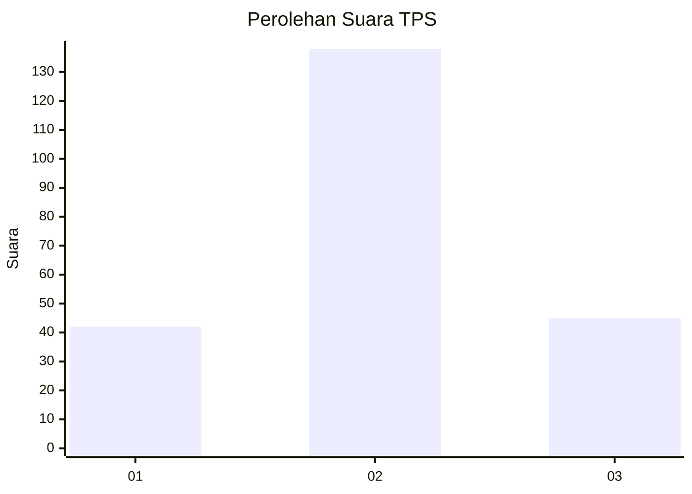
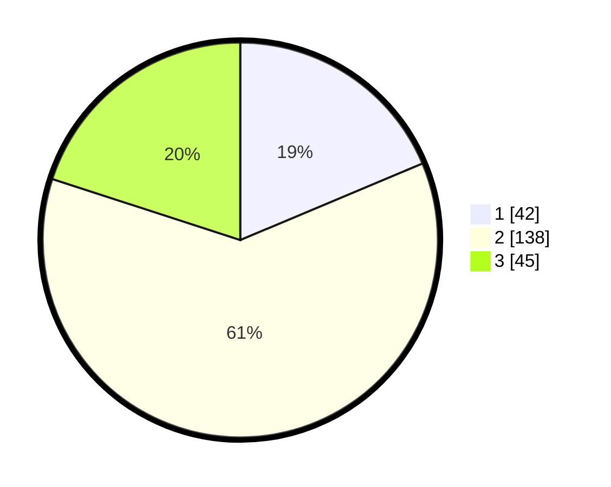

# Hasil

## Grafik

## Tabel

| No. | Nama Paslon    | Suara | Suara (raw) | Persentase |
|:--- |:-------------- | -----:| -----------:| ----------:|
| 1   | ANIES MUHAIMIN | 42    | [42][p-1]   | 18,67      |
| 2   | PRABOWO GIBRAN | 138   | [138][p-2]  | 61,33      |
| 3   | GANJAR MAHFUD  | 45    | [45][p-3]   | 20,00      |

[p-1]: https://github.com/gigit-pemilu/pemilu-2024/blob/main/pilpres/hitung-suara/sub/35-jawa-timur/sub/02-ponorogo/sub/01-slahung/sub/2021-gombang/sub/001-tps/sub/paslon-1.txt
[p-2]: https://github.com/gigit-pemilu/pemilu-2024/blob/main/pilpres/hitung-suara/sub/35-jawa-timur/sub/02-ponorogo/sub/01-slahung/sub/2021-gombang/sub/001-tps/sub/paslon-2.txt
[p-3]: https://github.com/gigit-pemilu/pemilu-2024/blob/main/pilpres/hitung-suara/sub/35-jawa-timur/sub/02-ponorogo/sub/01-slahung/sub/2021-gombang/sub/001-tps/sub/paslon-3.txt

## Foto C Plano

https://sirekap-obj-formc.kpu.go.id/2e09/pemilu/ppwp/35/02/01/20/21/3502012021001-20240215-082826--0fa6d7b1-e4f6-47cc-a0be-e23afbe5c561.jpg

https://sirekap-obj-formc.kpu.go.id/2e09/pemilu/ppwp/35/02/01/20/21/3502012021001-20240215-083006--8757c72b-9a2a-40b8-b6a0-a9945b130c42.jpg

https://sirekap-obj-formc.kpu.go.id/2e09/pemilu/ppwp/35/02/01/20/21/3502012021001-20240215-083123--c585e758-5e20-4580-aae4-4454e306a239.jpg

## Metadata

| Key        | Value               |
| ---------- | ------------------- |
| Time Stamp | 2024-02-15 18:30:25 |

