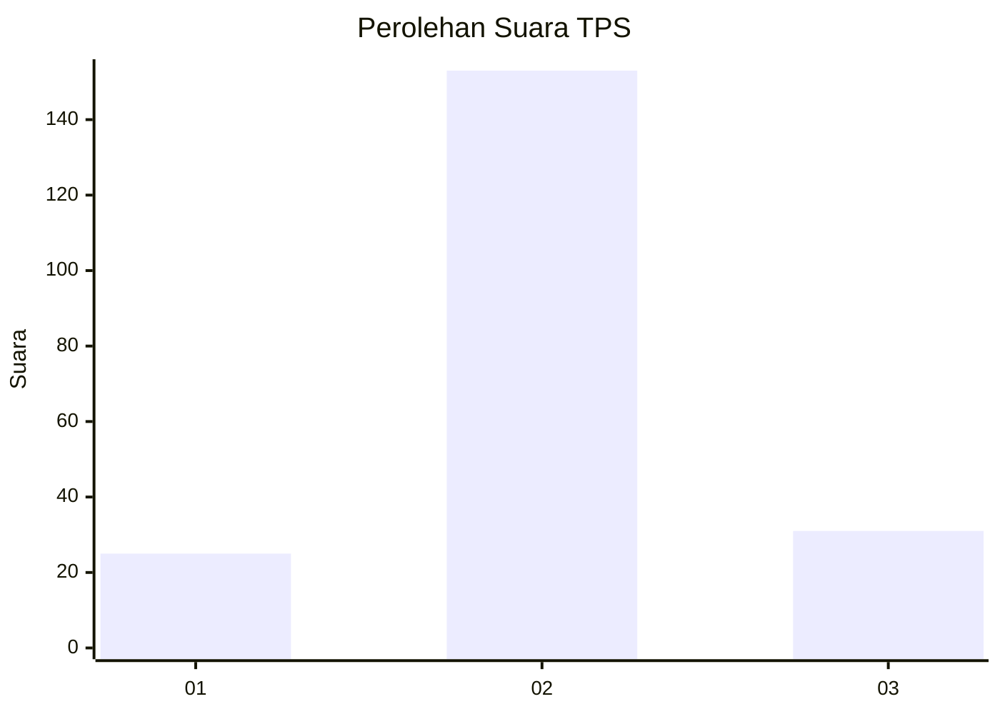
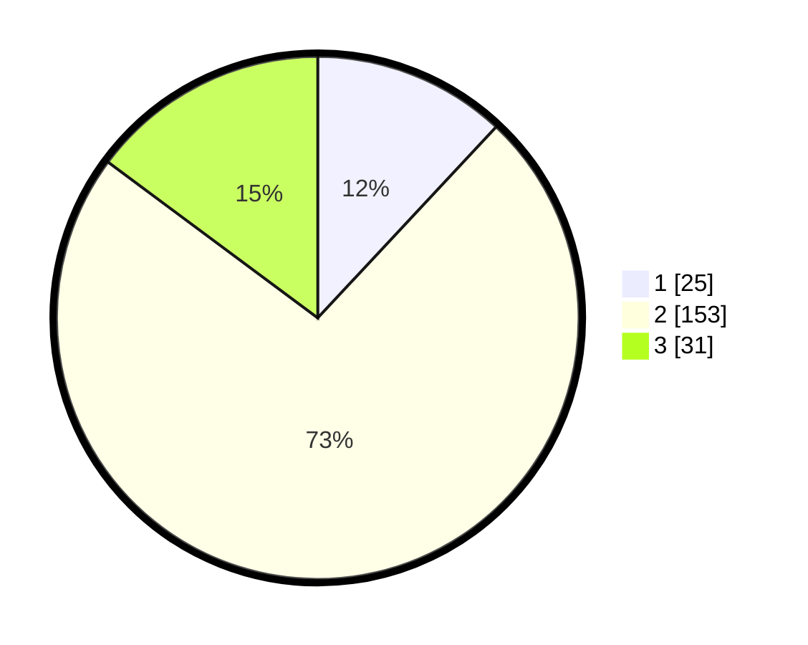

# Hasil

## Grafik

## Tabel

| No. | Nama Paslon    | Suara | Suara (raw) | Persentase |
|:--- |:-------------- | -----:| -----------:| ----------:|
| 1   | ANIES MUHAIMIN | 25    | [25][p-1]   | 11,96      |
| 2   | PRABOWO GIBRAN | 153   | [153][p-2]  | 73,21      |
| 3   | GANJAR MAHFUD  | 31    | [31][p-3]   | 14,83      |

[p-1]: https://github.com/gigit-pemilu/pemilu-2024/blob/main/pilpres/hitung-suara/sub/35-jawa-timur/sub/02-ponorogo/sub/01-slahung/sub/2022-janti/sub/002-tps/sub/paslon-1.txt
[p-2]: https://github.com/gigit-pemilu/pemilu-2024/blob/main/pilpres/hitung-suara/sub/35-jawa-timur/sub/02-ponorogo/sub/01-slahung/sub/2022-janti/sub/002-tps/sub/paslon-2.txt
[p-3]: https://github.com/gigit-pemilu/pemilu-2024/blob/main/pilpres/hitung-suara/sub/35-jawa-timur/sub/02-ponorogo/sub/01-slahung/sub/2022-janti/sub/002-tps/sub/paslon-3.txt

## Foto C Plano

https://sirekap-obj-formc.kpu.go.id/0f10/pemilu/ppwp/35/02/01/20/22/3502012022002-20240215-050502--ca7e3107-6242-4be5-85a8-19cd9d44611a.jpg

https://sirekap-obj-formc.kpu.go.id/0f10/pemilu/ppwp/35/02/01/20/22/3502012022002-20240215-050627--77a7dbbe-c5e4-4bdd-b777-6cd102b76da9.jpg

https://sirekap-obj-formc.kpu.go.id/0f10/pemilu/ppwp/35/02/01/20/22/3502012022002-20240215-050742--77afb112-f464-4dab-a56b-f8944005b695.jpg

## Metadata

| Key        | Value               |
| ---------- | ------------------- |
| Time Stamp | 2024-02-15 15:00:29 |

