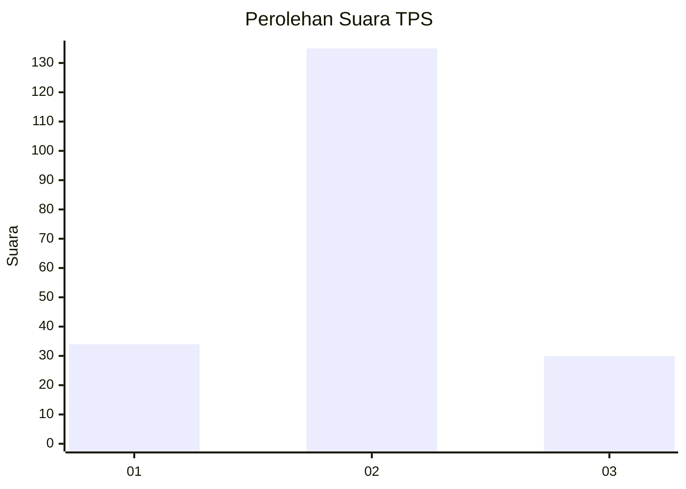
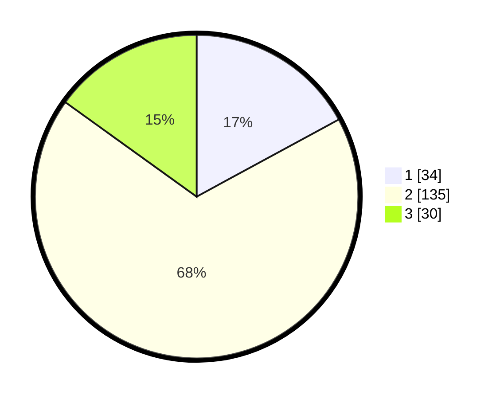

# Hasil

## Grafik

## Tabel

| No. | Nama Paslon    | Suara | Suara (raw) | Persentase |
|:--- |:-------------- | -----:| -----------:| ----------:|
| 1   | ANIES MUHAIMIN | 34    | [34][p-1]   | 17,09      |
| 2   | PRABOWO GIBRAN | 135   | [135][p-2]  | 67,84      |
| 3   | GANJAR MAHFUD  | 30    | [30][p-3]   | 15,08      |

[p-1]: https://github.com/gigit-pemilu/pemilu-2024/blob/main/pilpres/hitung-suara/sub/35-jawa-timur/sub/02-ponorogo/sub/01-slahung/sub/2022-janti/sub/003-tps/sub/paslon-1.txt
[p-2]: https://github.com/gigit-pemilu/pemilu-2024/blob/main/pilpres/hitung-suara/sub/35-jawa-timur/sub/02-ponorogo/sub/01-slahung/sub/2022-janti/sub/003-tps/sub/paslon-2.txt
[p-3]: https://github.com/gigit-pemilu/pemilu-2024/blob/main/pilpres/hitung-suara/sub/35-jawa-timur/sub/02-ponorogo/sub/01-slahung/sub/2022-janti/sub/003-tps/sub/paslon-3.txt

## Foto C Plano

https://sirekap-obj-formc.kpu.go.id/2b02/pemilu/ppwp/35/02/01/20/22/3502012022003-20240214-204353--1a8b4095-5103-4634-8d04-5582080f8670.jpg

https://sirekap-obj-formc.kpu.go.id/2b02/pemilu/ppwp/35/02/01/20/22/3502012022003-20240214-204456--4fe6ad20-b474-4db1-bf50-113760c33a91.jpg

https://sirekap-obj-formc.kpu.go.id/2b02/pemilu/ppwp/35/02/01/20/22/3502012022003-20240214-204628--84a1ae11-4881-46f0-8152-f366498cb524.jpg

## Metadata

| Key        | Value               |
| ---------- | ------------------- |
| Time Stamp | 2024-02-17 16:00:02 |

