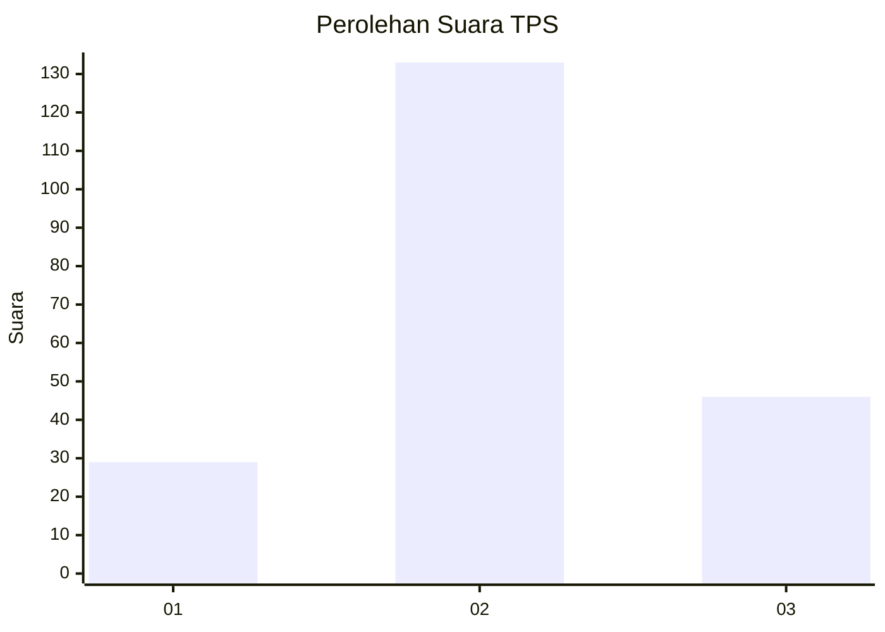
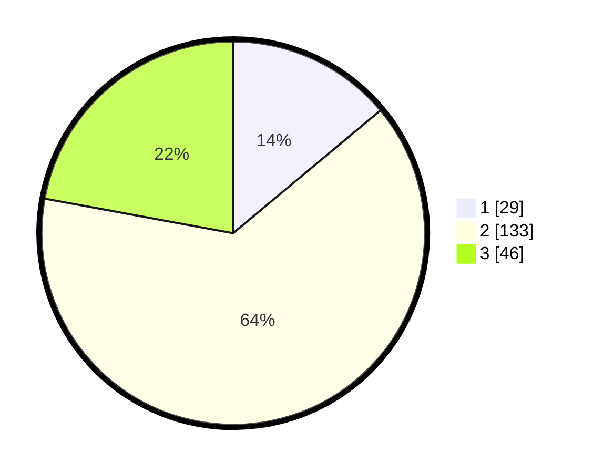

# Hasil

## Grafik

## Tabel

| No. | Nama Paslon    | Suara | Suara (raw) | Persentase |
|:--- |:-------------- | -----:| -----------:| ----------:|
| 1   | ANIES MUHAIMIN | 29    | [29][p-1]   | 13,94      |
| 2   | PRABOWO GIBRAN | 133   | [133][p-2]  | 63,94      |
| 3   | GANJAR MAHFUD  | 46    | [46][p-3]   | 22,12      |

[p-1]: https://github.com/gigit-pemilu/pemilu-2024/blob/main/pilpres/hitung-suara/sub/35-jawa-timur/sub/02-ponorogo/sub/01-slahung/sub/2022-janti/sub/006-tps/sub/paslon-1.txt
[p-2]: https://github.com/gigit-pemilu/pemilu-2024/blob/main/pilpres/hitung-suara/sub/35-jawa-timur/sub/02-ponorogo/sub/01-slahung/sub/2022-janti/sub/006-tps/sub/paslon-2.txt
[p-3]: https://github.com/gigit-pemilu/pemilu-2024/blob/main/pilpres/hitung-suara/sub/35-jawa-timur/sub/02-ponorogo/sub/01-slahung/sub/2022-janti/sub/006-tps/sub/paslon-3.txt

## Foto C Plano

https://sirekap-obj-formc.kpu.go.id/1765/pemilu/ppwp/35/02/01/20/22/3502012022006-20240215-034511--f491cc53-3975-45e3-a4fb-cf9aaa42c3c6.jpg

https://sirekap-obj-formc.kpu.go.id/1765/pemilu/ppwp/35/02/01/20/22/3502012022006-20240215-034546--3e19c533-8645-44bb-b42a-65fec4a4266c.jpg

https://sirekap-obj-formc.kpu.go.id/1765/pemilu/ppwp/35/02/01/20/22/3502012022006-20240215-034643--3109cd7e-a6c9-411a-93d4-8b828510a12d.jpg

## Metadata

| Key        | Value               |
| ---------- | ------------------- |
| Time Stamp | 2024-02-15 19:00:26 |

