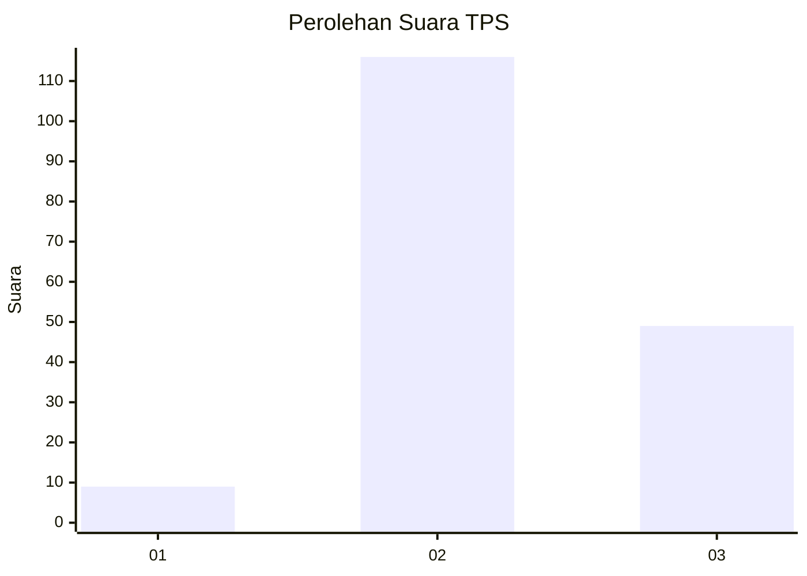
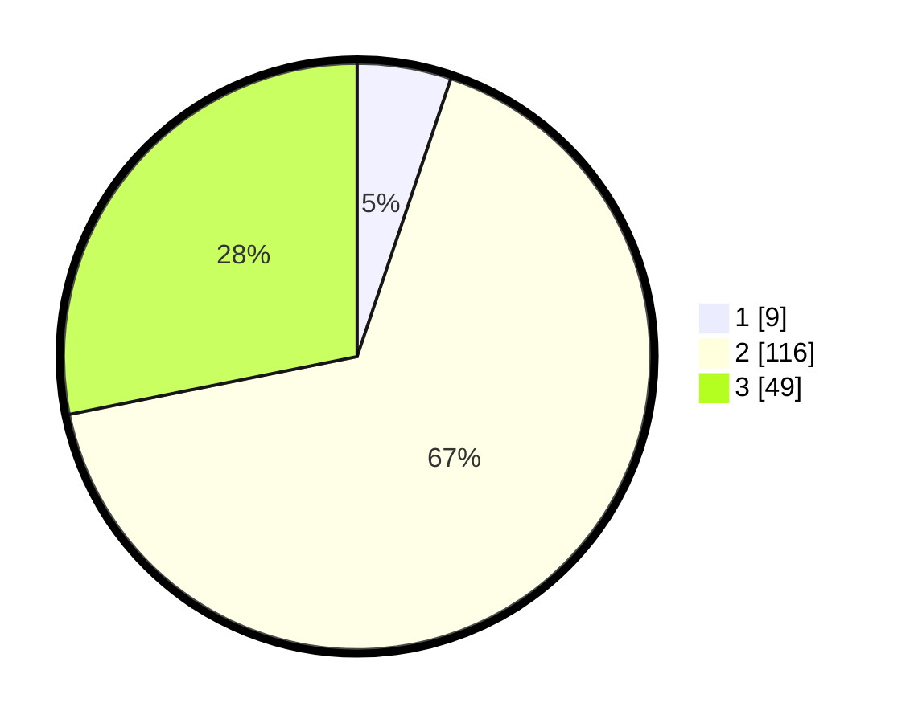

# Hasil

## Grafik

## Tabel

| No. | Nama Paslon    | Suara | Suara (raw) | Persentase |
|:--- |:-------------- | -----:| -----------:| ----------:|
| 1   | ANIES MUHAIMIN | 9     | [9][p-1]    | 5,17       |
| 2   | PRABOWO GIBRAN | 116   | [116][p-2]  | 66,67      |
| 3   | GANJAR MAHFUD  | 49    | [49][p-3]   | 28,16      |

[p-1]: https://github.com/gigit-pemilu/pemilu-2024/blob/main/pilpres/hitung-suara/sub/35-jawa-timur/sub/02-ponorogo/sub/02-ngrayun/sub/2001-wonodadi/sub/003-tps/sub/paslon-1.txt
[p-2]: https://github.com/gigit-pemilu/pemilu-2024/blob/main/pilpres/hitung-suara/sub/35-jawa-timur/sub/02-ponorogo/sub/02-ngrayun/sub/2001-wonodadi/sub/003-tps/sub/paslon-2.txt
[p-3]: https://github.com/gigit-pemilu/pemilu-2024/blob/main/pilpres/hitung-suara/sub/35-jawa-timur/sub/02-ponorogo/sub/02-ngrayun/sub/2001-wonodadi/sub/003-tps/sub/paslon-3.txt

## Foto C Plano

https://sirekap-obj-formc.kpu.go.id/479e/pemilu/ppwp/35/02/02/20/01/3502022001003-20240218-091728--c8ce4af5-0da3-4791-af27-082bf191f1be.jpg

https://sirekap-obj-formc.kpu.go.id/479e/pemilu/ppwp/35/02/02/20/01/3502022001003-20240218-092004--10ca978d-f9f2-427c-bd77-b01cffdc3430.jpg

https://sirekap-obj-formc.kpu.go.id/479e/pemilu/ppwp/35/02/02/20/01/3502022001003-20240218-092115--0023f95d-4f50-4ed7-a2f6-f2653b7f96b8.jpg

## Metadata

| Key        | Value               |
| ---------- | ------------------- |
| Time Stamp | 2024-02-19 06:16:00 |

## DATA PEMILIH TETAP

Jumlah pemilih dalam DPT: **255**.
 * L: **130**.
 * P: **125**.

## DATA PENGGUNA HAK PILIH

Jumlah pengguna hak pilih dalam DPT: **181**.
 * L: **93**.
 * P: **88**.

Jumlah pengguna hak pilih dalam DPTb: **0**.
 * L: **0**.
 * P: **0**.

Jumlah pengguna hak pilih dalam DPK: **1**.
 * L: **1**.
 * P: **0**.

Jumlah pengguna hak pilih: **182**.
 * L: **94**.
 * P: **88**.

## JUMLAH SUARA SAH DAN TIDAK SAH

JUMLAH SELURUH SUARA SAH: **174**.

JUMLAH SUARA TIDAK SAH: **8**.

JUMLAH SELURUH SUARA SAH DAN SUARA TIDAK SAH: **182**.

