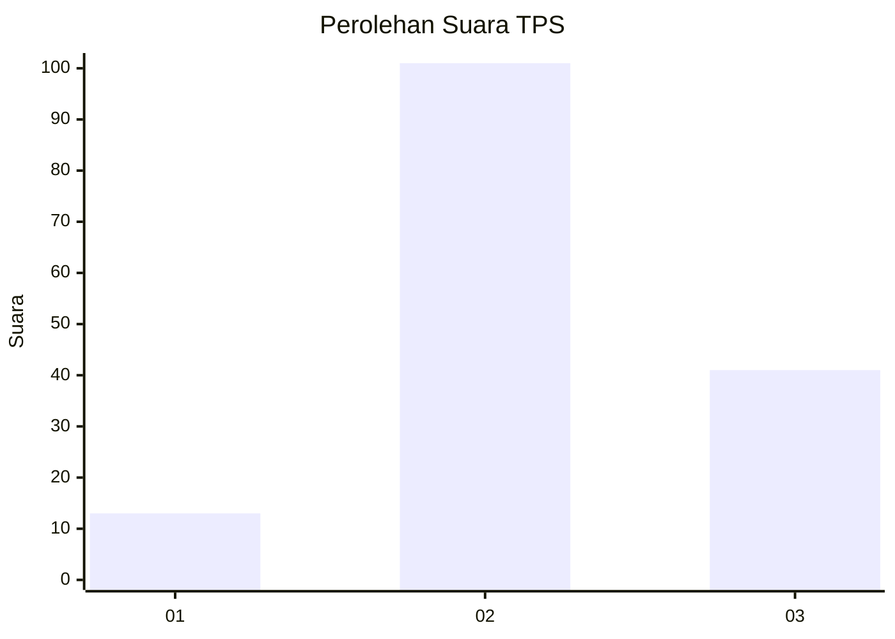
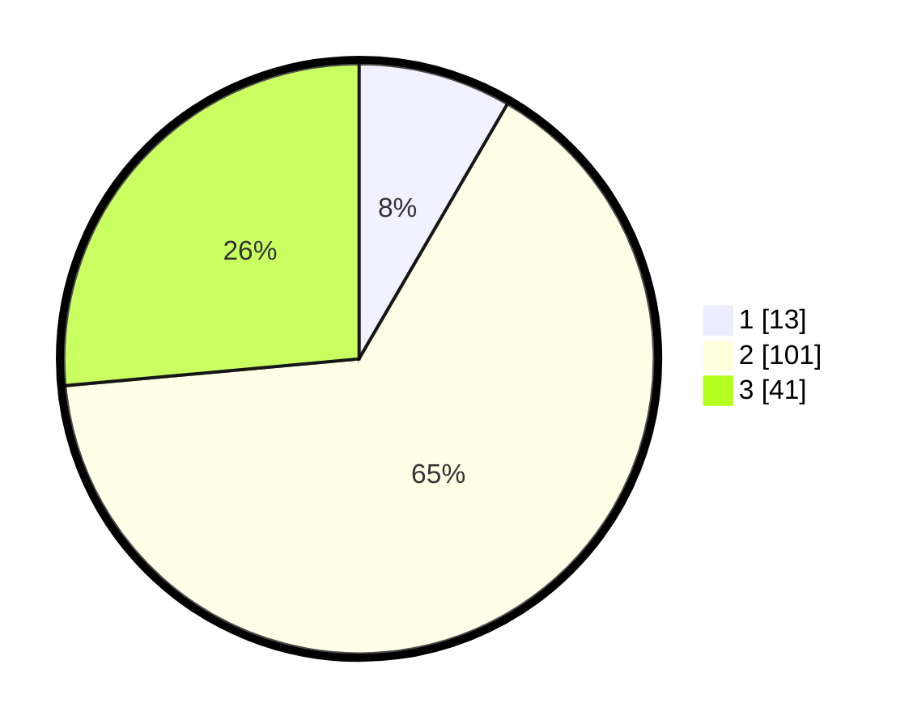

# Hasil

## Grafik

## Tabel

| No. | Nama Paslon    | Suara | Suara (raw) | Persentase |
|:--- |:-------------- | -----:| -----------:| ----------:|
| 1   | ANIES MUHAIMIN | 13    | [13][p-1]   | 8,39       |
| 2   | PRABOWO GIBRAN | 101   | [101][p-2]  | 65,16      |
| 3   | GANJAR MAHFUD  | 41    | [41][p-3]   | 26,45      |

[p-1]: https://github.com/gigit-pemilu/pemilu-2024-35-jawa-timur/blob/main/pilpres/hitung-suara/sub/35-jawa-timur/sub/02-ponorogo/sub/02-ngrayun/sub/2003-baosan-kidul/sub/010-tps/sub/paslon-1.txt
[p-2]: https://github.com/gigit-pemilu/pemilu-2024-35-jawa-timur/blob/main/pilpres/hitung-suara/sub/35-jawa-timur/sub/02-ponorogo/sub/02-ngrayun/sub/2003-baosan-kidul/sub/010-tps/sub/paslon-2.txt
[p-3]: https://github.com/gigit-pemilu/pemilu-2024-35-jawa-timur/blob/main/pilpres/hitung-suara/sub/35-jawa-timur/sub/02-ponorogo/sub/02-ngrayun/sub/2003-baosan-kidul/sub/010-tps/sub/paslon-3.txt

## Foto C Plano

https://sirekap-obj-formc.kpu.go.id/77ca/pemilu/ppwp/35/02/02/20/03/3502022003010-20240214-203833--38471d00-75a5-46e1-8065-2b1a6d0c9c8f.jpg

https://sirekap-obj-formc.kpu.go.id/77ca/pemilu/ppwp/35/02/02/20/03/3502022003010-20240214-203943--d5b4a71b-d979-4f0e-80b5-37e36f3ac71f.jpg

https://sirekap-obj-formc.kpu.go.id/77ca/pemilu/ppwp/35/02/02/20/03/3502022003010-20240214-204058--2e371909-51c3-438f-bfb6-92edc6abc04f.jpg

## Metadata

| Key        | Value               |
| ---------- | ------------------- |
| Time Stamp | 2024-02-17 14:45:18 |

## DATA PEMILIH TETAP

Jumlah pemilih dalam DPT: **222**.
 * L: **119**.
 * P: **103**.

## DATA PENGGUNA HAK PILIH

Jumlah pengguna hak pilih dalam DPT: **167**.
 * L: **86**.
 * P: **81**.

Jumlah pengguna hak pilih dalam DPTb: **7**.
 * L: **0**.
 * P: **0**.

Jumlah pengguna hak pilih dalam DPK: **7**.
 * L: **0**.
 * P: **0**.

Jumlah pengguna hak pilih: **167**.
 * L: **86**.
 * P: **21**.

## JUMLAH SUARA SAH DAN TIDAK SAH

JUMLAH SELURUH SUARA SAH: **155**.

JUMLAH SUARA TIDAK SAH: **12**.

JUMLAH SELURUH SUARA SAH DAN SUARA TIDAK SAH: **167**.

