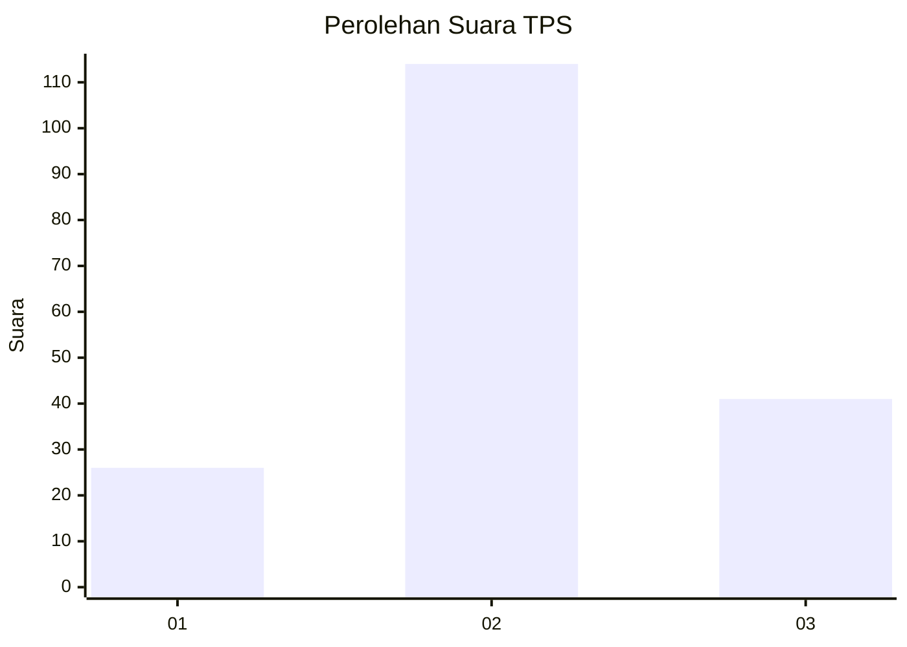
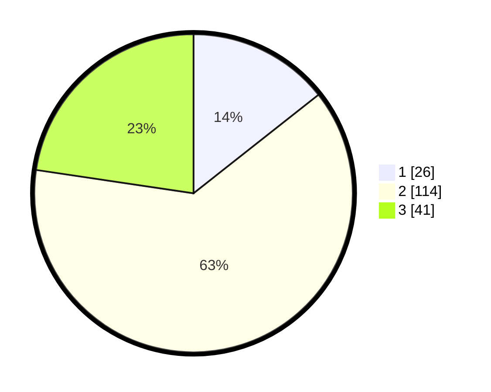

# Hasil

## Grafik

## Tabel

| No. | Nama Paslon    | Suara | Suara (raw) | Persentase |
|:--- |:-------------- | -----:| -----------:| ----------:|
| 1   | ANIES MUHAIMIN | 26    | [26][p-1]   | 14,36      |
| 2   | PRABOWO GIBRAN | 114   | [114][p-2]  | 62,98      |
| 3   | GANJAR MAHFUD  | 41    | [41][p-3]   | 22,65      |

[p-1]: https://github.com/gigit-pemilu/pemilu-2024-35-jawa-timur/blob/main/pilpres/hitung-suara/sub/35-jawa-timur/sub/02-ponorogo/sub/03-bungkal/sub/2002-koripan/sub/001-tps/sub/paslon-1.txt
[p-2]: https://github.com/gigit-pemilu/pemilu-2024-35-jawa-timur/blob/main/pilpres/hitung-suara/sub/35-jawa-timur/sub/02-ponorogo/sub/03-bungkal/sub/2002-koripan/sub/001-tps/sub/paslon-2.txt
[p-3]: https://github.com/gigit-pemilu/pemilu-2024-35-jawa-timur/blob/main/pilpres/hitung-suara/sub/35-jawa-timur/sub/02-ponorogo/sub/03-bungkal/sub/2002-koripan/sub/001-tps/sub/paslon-3.txt

## Foto C Plano

https://sirekap-obj-formc.kpu.go.id/7bbc/pemilu/ppwp/35/02/03/20/02/3502032002001-20240217-055858--8f01a6f1-c7c2-4e1e-9f80-75915ad8c43a.jpg

https://sirekap-obj-formc.kpu.go.id/7bbc/pemilu/ppwp/35/02/03/20/02/3502032002001-20240217-055910--78534258-571c-4663-afb5-6c4969d119a9.jpg

## Metadata

| Key        | Value               |
| ---------- | ------------------- |
| Time Stamp | 2024-02-17 06:30:03 |

