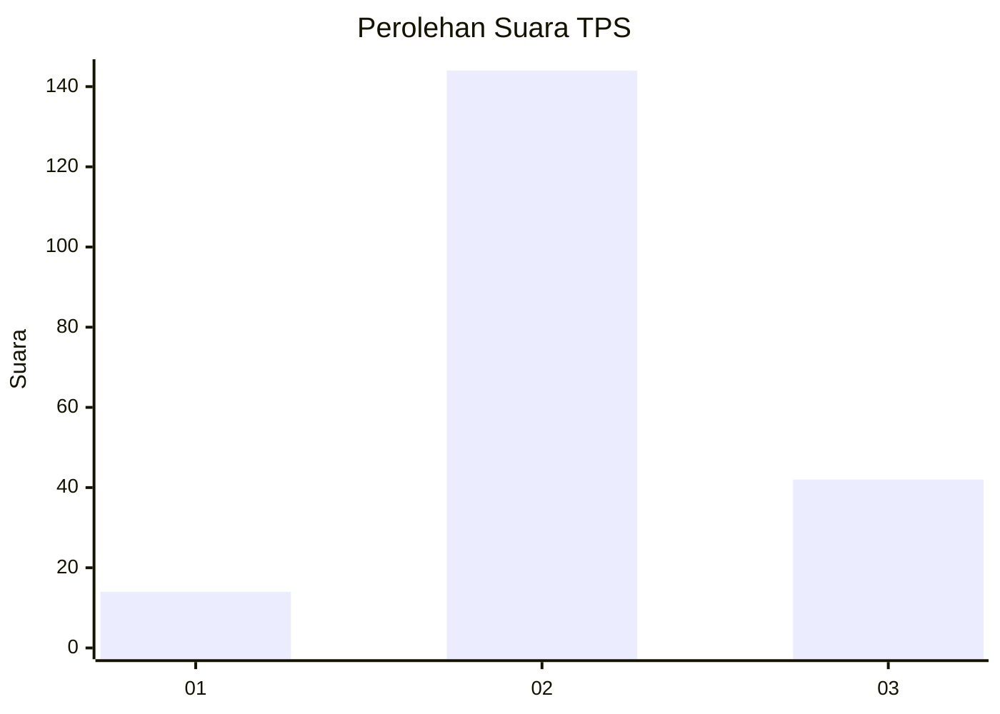

# Hasil

## Grafik

## Tabel

| No. | Nama Paslon    | Suara | Suara (raw) | Persentase |
|:--- |:-------------- | -----:| -----------:| ----------:|
| 1   | ANIES MUHAIMIN | 14    | [14][p-1]   | 7,00       |
| 2   | PRABOWO GIBRAN | 144   | [144][p-2]  | 72,00      |
| 3   | GANJAR MAHFUD  | 42    | [42][p-3]   | 21,00      |

[p-1]: https://github.com/gigit-pemilu/pemilu-2024/blob/main/pilpres/hitung-suara/sub/35-jawa-timur/sub/02-ponorogo/sub/03-bungkal/sub/2005-kalisat/sub/006-tps/sub/paslon-1.txt
[p-2]: https://github.com/gigit-pemilu/pemilu-2024/blob/main/pilpres/hitung-suara/sub/35-jawa-timur/sub/02-ponorogo/sub/03-bungkal/sub/2005-kalisat/sub/006-tps/sub/paslon-2.txt
[p-3]: https://github.com/gigit-pemilu/pemilu-2024/blob/main/pilpres/hitung-suara/sub/35-jawa-timur/sub/02-ponorogo/sub/03-bungkal/sub/2005-kalisat/sub/006-tps/sub/paslon-3.txt

## Foto C Plano

https://sirekap-obj-formc.kpu.go.id/c930/pemilu/ppwp/35/02/03/20/05/3502032005006-20240217-092202--f75707f3-131a-4eed-9793-6a081217d165.jpg

https://sirekap-obj-formc.kpu.go.id/c930/pemilu/ppwp/35/02/03/20/05/3502032005006-20240217-092214--92e1ad37-a358-48c4-8a8f-b5e13e1ceb00.jpg

## Metadata

| Key        | Value               |
| ---------- | ------------------- |
| Time Stamp | 2024-02-17 09:30:03 |

