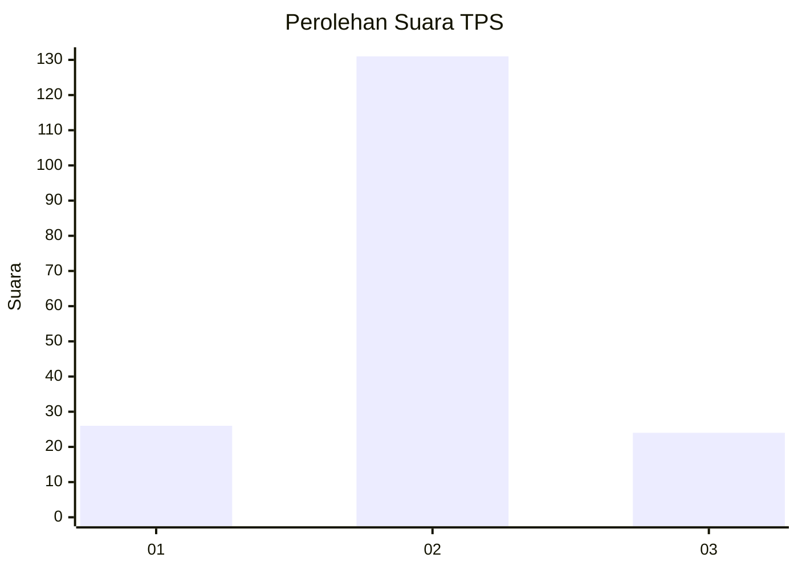
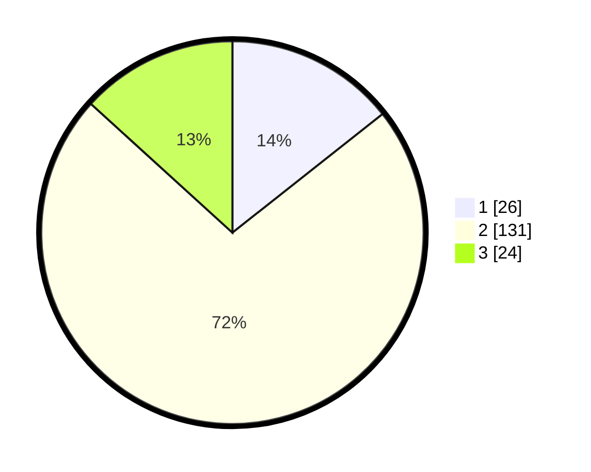

# Hasil

## Grafik

## Tabel

| No. | Nama Paslon    | Suara | Suara (raw) | Persentase |
|:--- |:-------------- | -----:| -----------:| ----------:|
| 1   | ANIES MUHAIMIN | 26    | [26][p-1]   | 14,36      |
| 2   | PRABOWO GIBRAN | 131   | [131][p-2]  | 72,38      |
| 3   | GANJAR MAHFUD  | 24    | [24][p-3]   | 13,26      |

[p-1]: https://github.com/gigit-pemilu/pemilu-2024/blob/main/pilpres/hitung-suara/sub/35-jawa-timur/sub/02-ponorogo/sub/03-bungkal/sub/2007-pager/sub/005-tps/sub/paslon-1.txt
[p-2]: https://github.com/gigit-pemilu/pemilu-2024/blob/main/pilpres/hitung-suara/sub/35-jawa-timur/sub/02-ponorogo/sub/03-bungkal/sub/2007-pager/sub/005-tps/sub/paslon-2.txt
[p-3]: https://github.com/gigit-pemilu/pemilu-2024/blob/main/pilpres/hitung-suara/sub/35-jawa-timur/sub/02-ponorogo/sub/03-bungkal/sub/2007-pager/sub/005-tps/sub/paslon-3.txt

## Foto C Plano

https://sirekap-obj-formc.kpu.go.id/c93a/pemilu/ppwp/35/02/03/20/07/3502032007005-20240215-034226--fbe0d4b3-f457-4c3e-9411-2743ee1b5611.jpg

https://sirekap-obj-formc.kpu.go.id/c93a/pemilu/ppwp/35/02/03/20/07/3502032007005-20240214-221203--b28ddae1-960f-4b42-80a2-f8f3099d320a.jpg

https://sirekap-obj-formc.kpu.go.id/c93a/pemilu/ppwp/35/02/03/20/07/3502032007005-20240214-221247--a655d143-87b9-4f30-92a4-6e7d8b0954bd.jpg

## Metadata

| Key        | Value               |
| ---------- | ------------------- |
| Time Stamp | 2024-02-15 19:30:26 |

