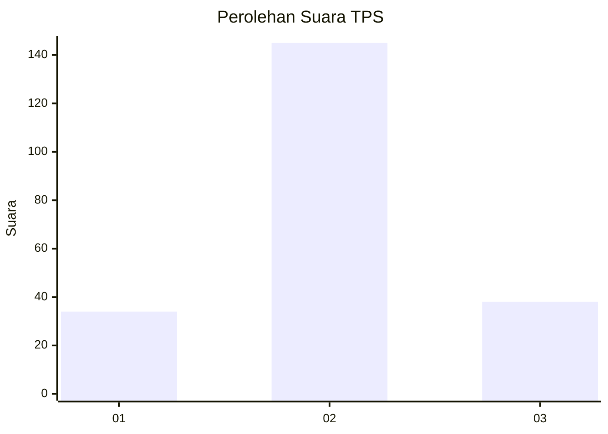
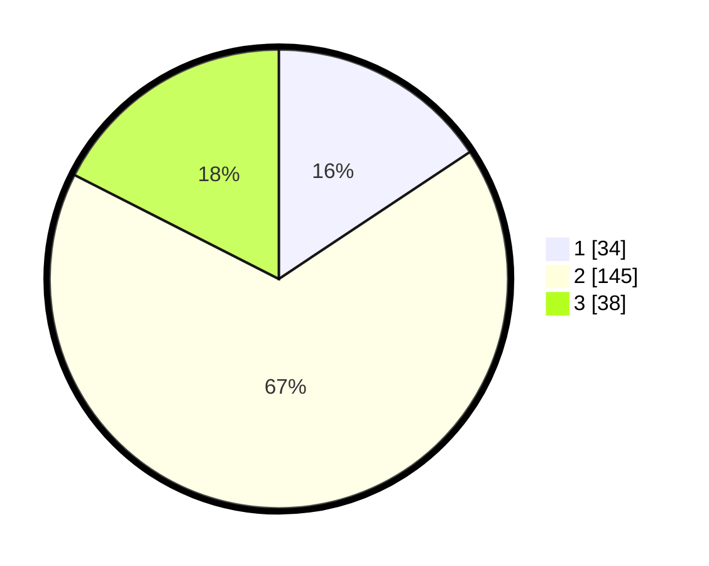

# Hasil

## Grafik

## Tabel

| No. | Nama Paslon    | Suara | Suara (raw) | Persentase |
|:--- |:-------------- | -----:| -----------:| ----------:|
| 1   | ANIES MUHAIMIN | 34    | [34][p-1]   | 15,67      |
| 2   | PRABOWO GIBRAN | 145   | [145][p-2]  | 66,82      |
| 3   | GANJAR MAHFUD  | 38    | [38][p-3]   | 17,51      |

[p-1]: https://github.com/gigit-pemilu/pemilu-2024-35-jawa-timur/blob/main/pilpres/hitung-suara/sub/35-jawa-timur/sub/02-ponorogo/sub/03-bungkal/sub/2009-bungkal/sub/003-tps/sub/paslon-1.txt
[p-2]: https://github.com/gigit-pemilu/pemilu-2024-35-jawa-timur/blob/main/pilpres/hitung-suara/sub/35-jawa-timur/sub/02-ponorogo/sub/03-bungkal/sub/2009-bungkal/sub/003-tps/sub/paslon-2.txt
[p-3]: https://github.com/gigit-pemilu/pemilu-2024-35-jawa-timur/blob/main/pilpres/hitung-suara/sub/35-jawa-timur/sub/02-ponorogo/sub/03-bungkal/sub/2009-bungkal/sub/003-tps/sub/paslon-3.txt

## Foto C Plano

https://sirekap-obj-formc.kpu.go.id/d9ae/pemilu/ppwp/35/02/03/20/09/3502032009003-20240217-064633--90cc5f06-fc02-4e57-ade6-2b30f1a1dce1.jpg

https://sirekap-obj-formc.kpu.go.id/d9ae/pemilu/ppwp/35/02/03/20/09/3502032009003-20240217-064645--ff4253e3-0751-4904-bf6d-dc1c3a8a1338.jpg

## Metadata

| Key        | Value               |
| ---------- | ------------------- |
| Time Stamp | 2024-02-24 22:31:28 |

