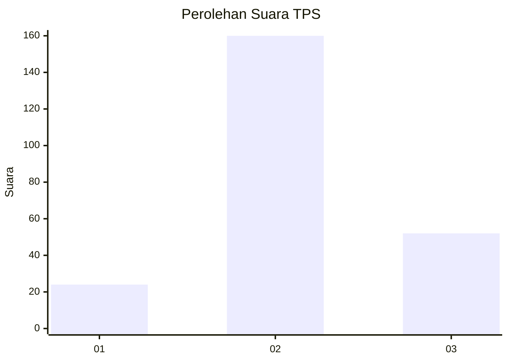
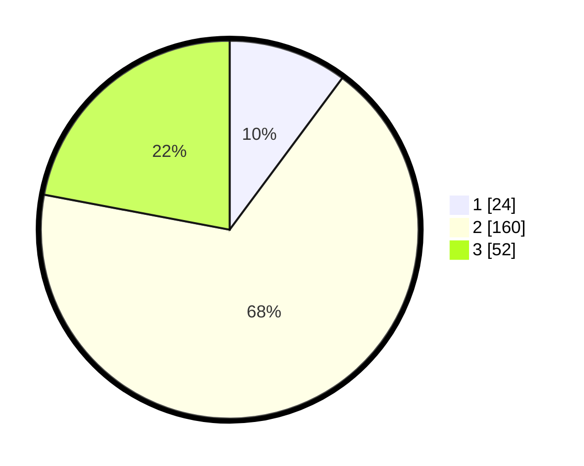

# Hasil

## Grafik

## Tabel

| No. | Nama Paslon    | Suara | Suara (raw) | Persentase |
|:--- |:-------------- | -----:| -----------:| ----------:|
| 1   | ANIES MUHAIMIN | 24    | [24][p-1]   | 10,17      |
| 2   | PRABOWO GIBRAN | 160   | [160][p-2]  | 67,80      |
| 3   | GANJAR MAHFUD  | 52    | [52][p-3]   | 22,03      |

[p-1]: https://github.com/gigit-pemilu/pemilu-2024/blob/main/pilpres/hitung-suara/sub/35-jawa-timur/sub/02-ponorogo/sub/04-sambit/sub/2015-kemuning/sub/004-tps/sub/paslon-1.txt
[p-2]: https://github.com/gigit-pemilu/pemilu-2024/blob/main/pilpres/hitung-suara/sub/35-jawa-timur/sub/02-ponorogo/sub/04-sambit/sub/2015-kemuning/sub/004-tps/sub/paslon-2.txt
[p-3]: https://github.com/gigit-pemilu/pemilu-2024/blob/main/pilpres/hitung-suara/sub/35-jawa-timur/sub/02-ponorogo/sub/04-sambit/sub/2015-kemuning/sub/004-tps/sub/paslon-3.txt

## Foto C Plano

https://sirekap-obj-formc.kpu.go.id/2732/pemilu/ppwp/35/02/04/20/15/3502042015004-20240215-030514--60574126-6816-47a7-adf0-60ff5f0a50d0.jpg

https://sirekap-obj-formc.kpu.go.id/2732/pemilu/ppwp/35/02/04/20/15/3502042015004-20240216-171751--b04d506d-8201-4189-aaba-d0cff97b7688.jpg

https://sirekap-obj-formc.kpu.go.id/2732/pemilu/ppwp/35/02/04/20/15/3502042015004-20240215-193740--e29ee04a-07dd-408e-baa7-45f66c10021b.jpg

## Metadata

| Key        | Value               |
| ---------- | ------------------- |
| Time Stamp | 2024-02-16 22:30:00 |

## DATA PEMILIH TETAP

Jumlah pemilih dalam DPT: **280**.
 * L: **136**.
 * P: **544**.

## DATA PENGGUNA HAK PILIH

Jumlah pengguna hak pilih dalam DPT: **40**.
 * L: **619**.
 * P: **121**.

Jumlah pengguna hak pilih dalam DPTb: **1**.
 * L: **881**.
 * P: **800**.

Jumlah pengguna hak pilih dalam DPK: **501**.
 * L: **0**.
 * P: **1**.

Jumlah pengguna hak pilih: **42**.
 * L: **120**.
 * P: **122**.

## JUMLAH SUARA SAH DAN TIDAK SAH

JUMLAH SELURUH SUARA SAH: **236**.

JUMLAH SUARA TIDAK SAH: **6**.

JUMLAH SELURUH SUARA SAH DAN SUARA TIDAK SAH: **242**.

