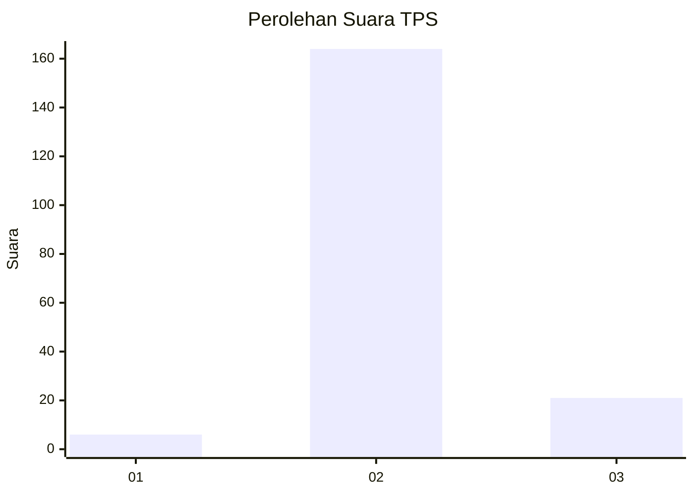
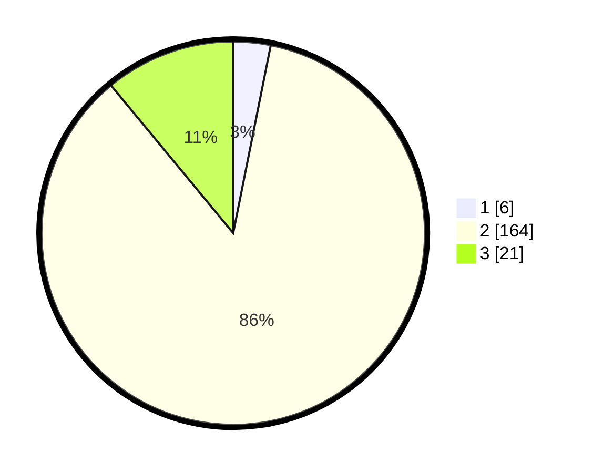

# Hasil

## Grafik

## Tabel

| No. | Nama Paslon    | Suara | Suara (raw) | Persentase |
|:--- |:-------------- | -----:| -----------:| ----------:|
| 1   | ANIES MUHAIMIN | 6     | [6][p-1]    | 3,14       |
| 2   | PRABOWO GIBRAN | 164   | [164][p-2]  | 85,86      |
| 3   | GANJAR MAHFUD  | 21    | [21][p-3]   | 10,99      |

[p-1]: https://github.com/gigit-pemilu/pemilu-2024-35-jawa-timur/blob/main/pilpres/hitung-suara/sub/35-jawa-timur/sub/02-ponorogo/sub/05-sawoo/sub/2001-tumpuk/sub/010-tps/sub/paslon-1.txt
[p-2]: https://github.com/gigit-pemilu/pemilu-2024-35-jawa-timur/blob/main/pilpres/hitung-suara/sub/35-jawa-timur/sub/02-ponorogo/sub/05-sawoo/sub/2001-tumpuk/sub/010-tps/sub/paslon-2.txt
[p-3]: https://github.com/gigit-pemilu/pemilu-2024-35-jawa-timur/blob/main/pilpres/hitung-suara/sub/35-jawa-timur/sub/02-ponorogo/sub/05-sawoo/sub/2001-tumpuk/sub/010-tps/sub/paslon-3.txt

## Foto C Plano

https://sirekap-obj-formc.kpu.go.id/05ef/pemilu/ppwp/35/02/05/20/01/3502052001010-20240215-034113--80483eac-85a8-4b25-b870-9d573997da03.jpg

https://sirekap-obj-formc.kpu.go.id/05ef/pemilu/ppwp/35/02/05/20/01/3502052001010-20240215-034703--c2de99b7-a954-426a-b5fc-01ddb07859e6.jpg

https://sirekap-obj-formc.kpu.go.id/05ef/pemilu/ppwp/35/02/05/20/01/3502052001010-20240215-035100--c65d45b3-c971-4824-b9e1-fd457ff33f78.jpg

## Metadata

| Key        | Value               |
| ---------- | ------------------- |
| Time Stamp | 2024-02-15 15:00:29 |

