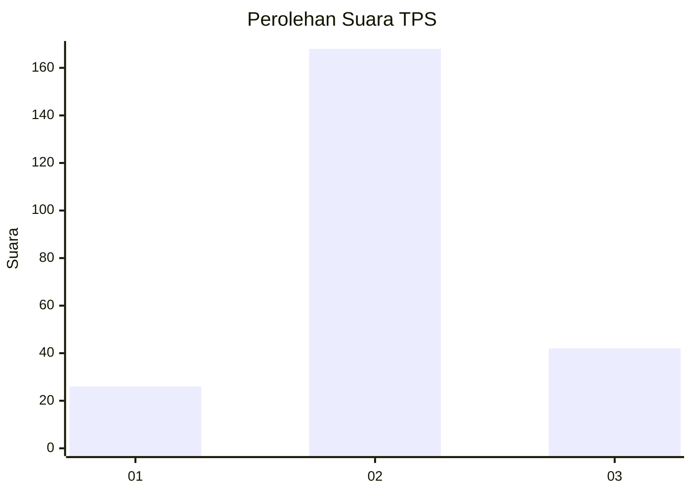
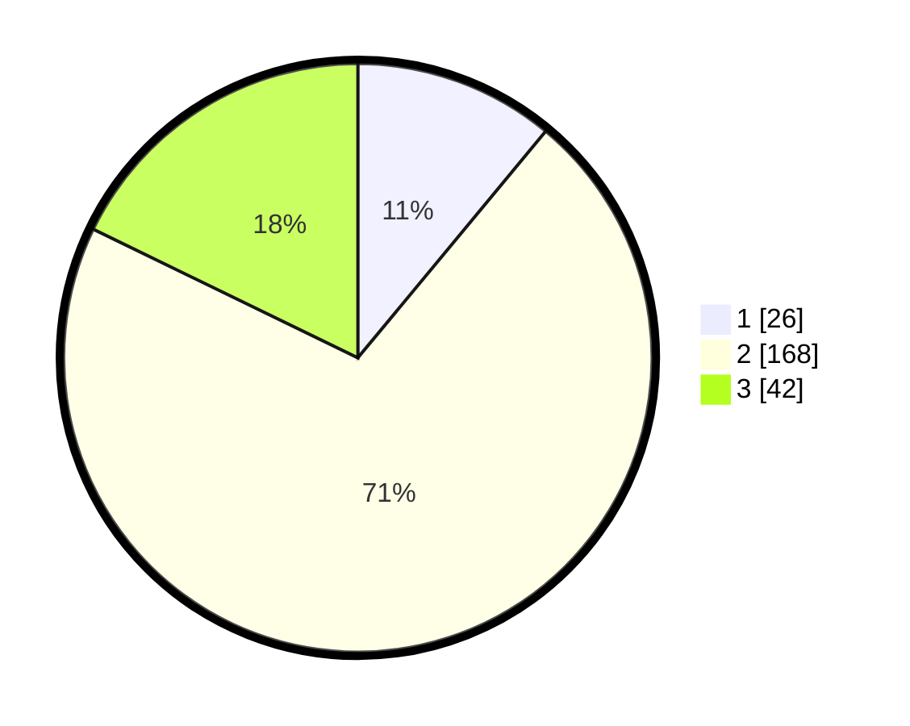

# Hasil

## Grafik

## Tabel

| No. | Nama Paslon    | Suara | Suara (raw) | Persentase |
|:--- |:-------------- | -----:| -----------:| ----------:|
| 1   | ANIES MUHAIMIN | 26    | [26][p-1]   | 11,02      |
| 2   | PRABOWO GIBRAN | 168   | [168][p-2]  | 71,19      |
| 3   | GANJAR MAHFUD  | 42    | [42][p-3]   | 17,80      |

[p-1]: https://github.com/gigit-pemilu/pemilu-2024/blob/main/pilpres/hitung-suara/sub/35-jawa-timur/sub/02-ponorogo/sub/05-sawoo/sub/2002-pangkal/sub/020-tps/sub/paslon-1.txt
[p-2]: https://github.com/gigit-pemilu/pemilu-2024/blob/main/pilpres/hitung-suara/sub/35-jawa-timur/sub/02-ponorogo/sub/05-sawoo/sub/2002-pangkal/sub/020-tps/sub/paslon-2.txt
[p-3]: https://github.com/gigit-pemilu/pemilu-2024/blob/main/pilpres/hitung-suara/sub/35-jawa-timur/sub/02-ponorogo/sub/05-sawoo/sub/2002-pangkal/sub/020-tps/sub/paslon-3.txt

## Foto C Plano

https://sirekap-obj-formc.kpu.go.id/16a8/pemilu/ppwp/35/02/05/20/02/3502052002020-20240214-141916--6c59cfe9-8ef2-4ce1-952b-22a14dd22c30.jpg

https://sirekap-obj-formc.kpu.go.id/16a8/pemilu/ppwp/35/02/05/20/02/3502052002020-20240214-230420--f2e4447c-63a9-40a4-b974-e0318504d95c.jpg

https://sirekap-obj-formc.kpu.go.id/16a8/pemilu/ppwp/35/02/05/20/02/3502052002020-20240214-230540--6d6becac-a3ba-4557-b400-8f08fc478215.jpg

## Metadata

| Key        | Value               |
| ---------- | ------------------- |
| Time Stamp | 2024-02-15 15:00:29 |

