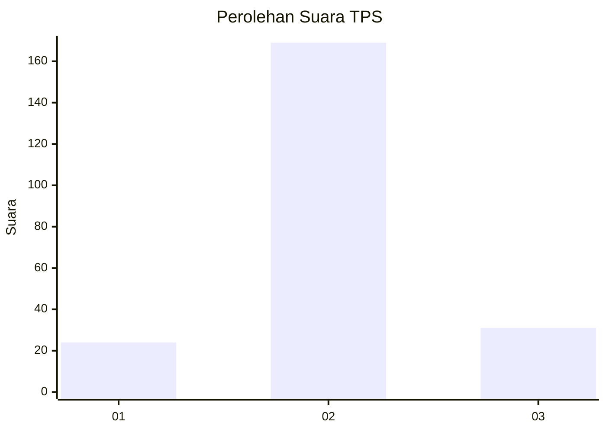
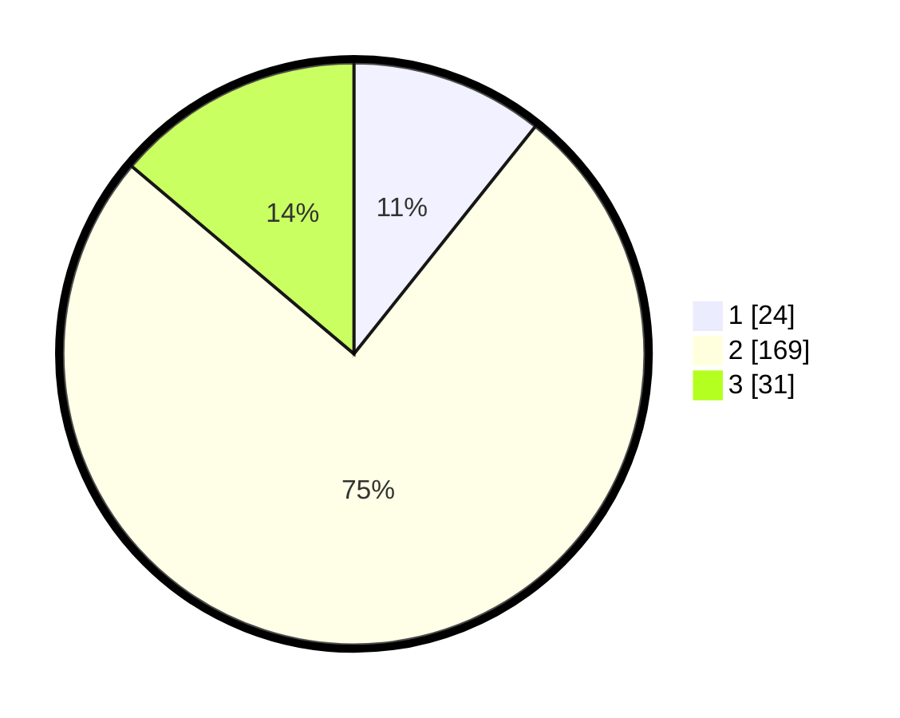

# Hasil

## Grafik

## Tabel

| No. | Nama Paslon    | Suara | Suara (raw) | Persentase |
|:--- |:-------------- | -----:| -----------:| ----------:|
| 1   | ANIES MUHAIMIN | 24    | [24][p-1]   | 10,71      |
| 2   | PRABOWO GIBRAN | 169   | [169][p-2]  | 75,45      |
| 3   | GANJAR MAHFUD  | 31    | [31][p-3]   | 13,84      |

[p-1]: https://github.com/gigit-pemilu/pemilu-2024/blob/main/pilpres/hitung-suara/sub/35-jawa-timur/sub/02-ponorogo/sub/05-sawoo/sub/2005-sriti/sub/005-tps/sub/paslon-1.txt
[p-2]: https://github.com/gigit-pemilu/pemilu-2024/blob/main/pilpres/hitung-suara/sub/35-jawa-timur/sub/02-ponorogo/sub/05-sawoo/sub/2005-sriti/sub/005-tps/sub/paslon-2.txt
[p-3]: https://github.com/gigit-pemilu/pemilu-2024/blob/main/pilpres/hitung-suara/sub/35-jawa-timur/sub/02-ponorogo/sub/05-sawoo/sub/2005-sriti/sub/005-tps/sub/paslon-3.txt

## Foto C Plano

https://sirekap-obj-formc.kpu.go.id/41d8/pemilu/ppwp/35/02/05/20/05/3502052005005-20240214-224645--ef4c0fbe-1dc5-49d7-9965-99340a0f64ec.jpg

https://sirekap-obj-formc.kpu.go.id/41d8/pemilu/ppwp/35/02/05/20/05/3502052005005-20240214-224719--2e38d0e3-5300-462d-b186-c9b7ee257ed9.jpg

https://sirekap-obj-formc.kpu.go.id/41d8/pemilu/ppwp/35/02/05/20/05/3502052005005-20240214-224819--06b828b5-8773-447d-858e-2bffcfd3c500.jpg

## Metadata

| Key        | Value               |
| ---------- | ------------------- |
| Time Stamp | 2024-02-15 15:00:29 |

