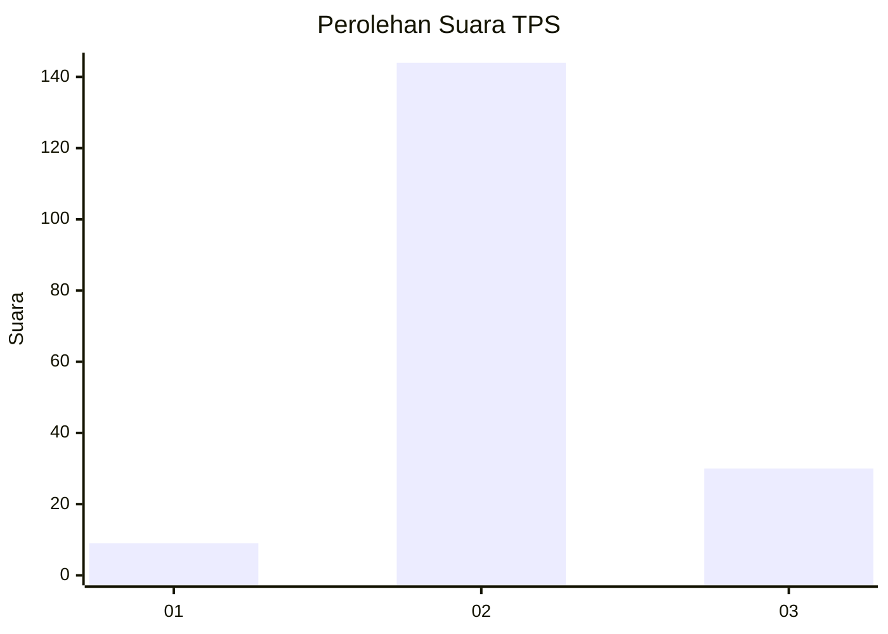
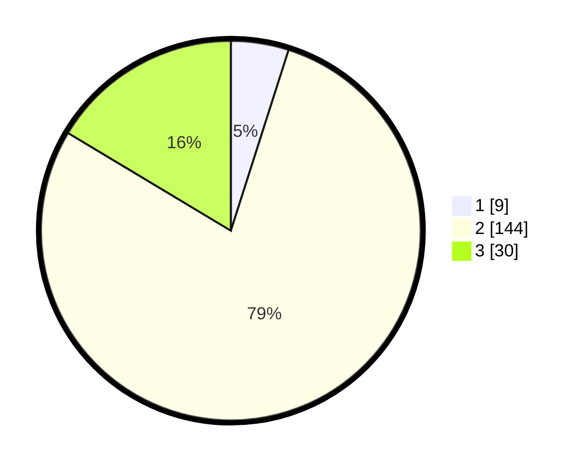

# Hasil

## Grafik

## Tabel

| No. | Nama Paslon    | Suara | Suara (raw) | Persentase |
|:--- |:-------------- | -----:| -----------:| ----------:|
| 1   | ANIES MUHAIMIN | 9     | [9][p-1]    | 4,92       |
| 2   | PRABOWO GIBRAN | 144   | [144][p-2]  | 78,69      |
| 3   | GANJAR MAHFUD  | 30    | [30][p-3]   | 16,39      |

[p-1]: https://github.com/gigit-pemilu/pemilu-2024/blob/main/pilpres/hitung-suara/sub/35-jawa-timur/sub/02-ponorogo/sub/05-sawoo/sub/2005-sriti/sub/007-tps/sub/paslon-1.txt
[p-2]: https://github.com/gigit-pemilu/pemilu-2024/blob/main/pilpres/hitung-suara/sub/35-jawa-timur/sub/02-ponorogo/sub/05-sawoo/sub/2005-sriti/sub/007-tps/sub/paslon-2.txt
[p-3]: https://github.com/gigit-pemilu/pemilu-2024/blob/main/pilpres/hitung-suara/sub/35-jawa-timur/sub/02-ponorogo/sub/05-sawoo/sub/2005-sriti/sub/007-tps/sub/paslon-3.txt

## Foto C Plano

https://sirekap-obj-formc.kpu.go.id/0a5d/pemilu/ppwp/35/02/05/20/05/3502052005007-20240214-234533--59f3893d-a10e-4198-85dd-919892809d7b.jpg

https://sirekap-obj-formc.kpu.go.id/0a5d/pemilu/ppwp/35/02/05/20/05/3502052005007-20240214-234624--f978612f-71a2-4e10-a6fc-e5378b78feb2.jpg

https://sirekap-obj-formc.kpu.go.id/0a5d/pemilu/ppwp/35/02/05/20/05/3502052005007-20240214-234713--a975ddc3-90dd-424f-ba15-0c126609b823.jpg

## Metadata

| Key        | Value               |
| ---------- | ------------------- |
| Time Stamp | 2024-02-15 16:30:25 |

