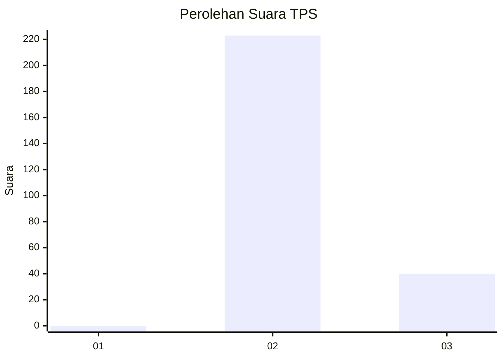
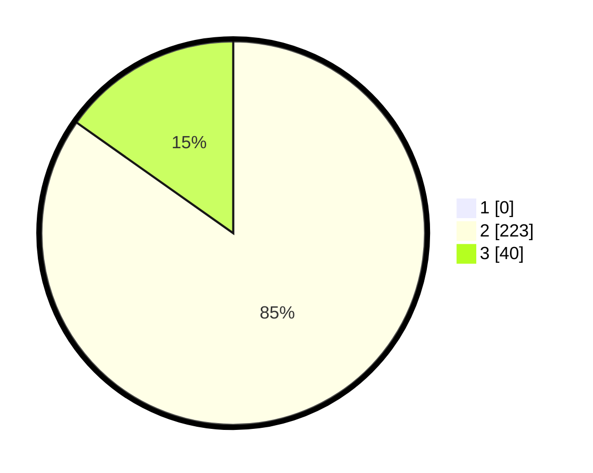

# Hasil

## Grafik

## Tabel

| No. | Nama Paslon    | Suara | Suara (raw) | Persentase |
|:--- |:-------------- | -----:| -----------:| ----------:|
| 1   | ANIES MUHAIMIN | 0     | [0][p-1]    | 0,00       |
| 2   | PRABOWO GIBRAN | 223   | [223][p-2]  | 84,79      |
| 3   | GANJAR MAHFUD  | 40    | [40][p-3]   | 15,21      |

[p-1]: https://github.com/gigit-pemilu/pemilu-2024-35-jawa-timur/blob/main/pilpres/hitung-suara/sub/35-jawa-timur/sub/02-ponorogo/sub/05-sawoo/sub/2006-temon/sub/007-tps/sub/paslon-1.txt
[p-2]: https://github.com/gigit-pemilu/pemilu-2024-35-jawa-timur/blob/main/pilpres/hitung-suara/sub/35-jawa-timur/sub/02-ponorogo/sub/05-sawoo/sub/2006-temon/sub/007-tps/sub/paslon-2.txt
[p-3]: https://github.com/gigit-pemilu/pemilu-2024-35-jawa-timur/blob/main/pilpres/hitung-suara/sub/35-jawa-timur/sub/02-ponorogo/sub/05-sawoo/sub/2006-temon/sub/007-tps/sub/paslon-3.txt

## Foto C Plano

https://sirekap-obj-formc.kpu.go.id/8692/pemilu/ppwp/35/02/05/20/06/3502052006007-20240214-214629--bd813f63-b06d-4e35-8433-51adeca54182.jpg

https://sirekap-obj-formc.kpu.go.id/8692/pemilu/ppwp/35/02/05/20/06/3502052006007-20240214-214933--031ec1dc-9ff7-4a00-a6cd-2354027f605a.jpg

https://sirekap-obj-formc.kpu.go.id/8692/pemilu/ppwp/35/02/05/20/06/3502052006007-20240214-215154--85ba5afb-fae7-46dc-9483-6afc7dd2d8cf.jpg

## Metadata

| Key        | Value               |
| ---------- | ------------------- |
| Time Stamp | 2024-02-15 16:00:26 |

