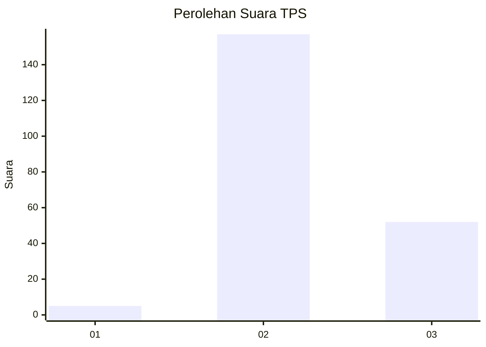
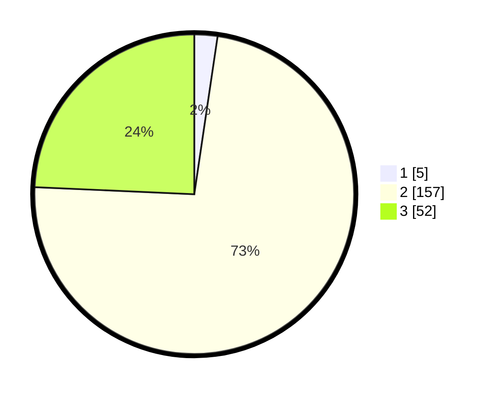

# Hasil

## Grafik

## Tabel

| No. | Nama Paslon    | Suara | Suara (raw) | Persentase |
|:--- |:-------------- | -----:| -----------:| ----------:|
| 1   | ANIES MUHAIMIN | 5     | [5][p-1]    | 2,34       |
| 2   | PRABOWO GIBRAN | 157   | [157][p-2]  | 73,36      |
| 3   | GANJAR MAHFUD  | 52    | [52][p-3]   | 24,30      |

[p-1]: https://github.com/gigit-pemilu/pemilu-2024/blob/main/pilpres/hitung-suara/sub/35-jawa-timur/sub/02-ponorogo/sub/05-sawoo/sub/2007-sawoo/sub/003-tps/sub/paslon-1.txt
[p-2]: https://github.com/gigit-pemilu/pemilu-2024/blob/main/pilpres/hitung-suara/sub/35-jawa-timur/sub/02-ponorogo/sub/05-sawoo/sub/2007-sawoo/sub/003-tps/sub/paslon-2.txt
[p-3]: https://github.com/gigit-pemilu/pemilu-2024/blob/main/pilpres/hitung-suara/sub/35-jawa-timur/sub/02-ponorogo/sub/05-sawoo/sub/2007-sawoo/sub/003-tps/sub/paslon-3.txt

## Foto C Plano

https://sirekap-obj-formc.kpu.go.id/1990/pemilu/ppwp/35/02/05/20/07/3502052007003-20240214-233954--54e0ccdb-e98d-4ca6-b2b1-2760243e57e4.jpg

https://sirekap-obj-formc.kpu.go.id/1990/pemilu/ppwp/35/02/05/20/07/3502052007003-20240214-235230--c211423b-fa80-4cc5-9c9d-b0e17492b4e2.jpg

https://sirekap-obj-formc.kpu.go.id/1990/pemilu/ppwp/35/02/05/20/07/3502052007003-20240214-235303--2c7d61e7-6300-4414-ab44-7d3d51dec5a6.jpg

## Metadata

| Key        | Value               |
| ---------- | ------------------- |
| Time Stamp | 2024-02-15 15:00:29 |

