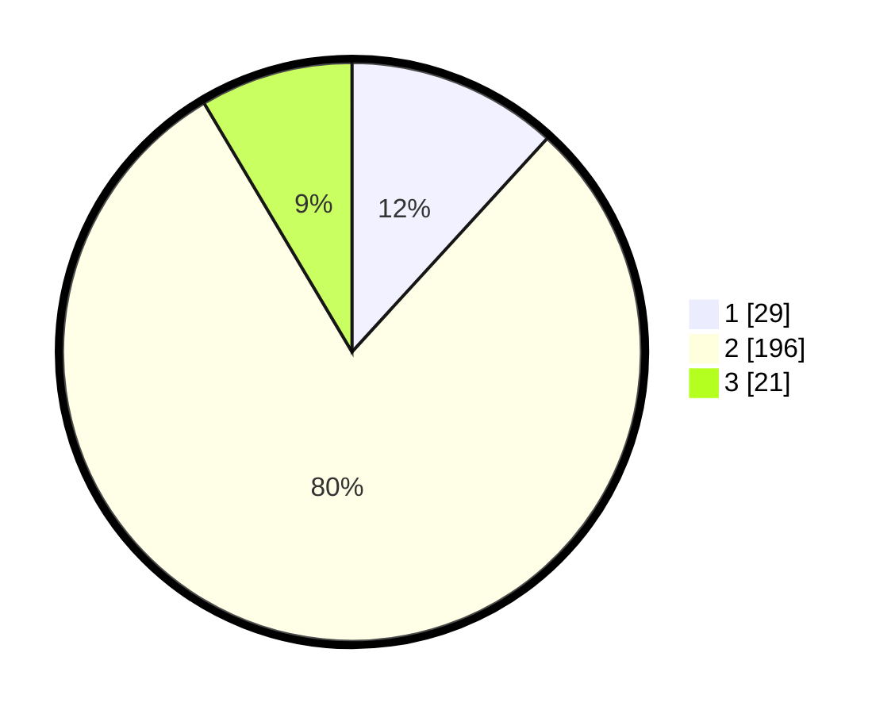

# Hasil

## Grafik

## Tabel

| No. | Nama Paslon    | Suara | Suara (raw) | Persentase |
|:--- |:-------------- | -----:| -----------:| ----------:|
| 1   | ANIES MUHAIMIN | 29    | [29][p-1]   | 11,79      |
| 2   | PRABOWO GIBRAN | 196   | [196][p-2]  | 79,67      |
| 3   | GANJAR MAHFUD  | 21    | [21][p-3]   | 8,54       |

[p-1]: https://github.com/gigit-pemilu/pemilu-2024/blob/main/pilpres/hitung-suara/sub/35-jawa-timur/sub/02-ponorogo/sub/05-sawoo/sub/2007-sawoo/sub/007-tps/sub/paslon-1.txt
[p-2]: https://github.com/gigit-pemilu/pemilu-2024/blob/main/pilpres/hitung-suara/sub/35-jawa-timur/sub/02-ponorogo/sub/05-sawoo/sub/2007-sawoo/sub/007-tps/sub/paslon-2.txt
[p-3]: https://github.com/gigit-pemilu/pemilu-2024/blob/main/pilpres/hitung-suara/sub/35-jawa-timur/sub/02-ponorogo/sub/05-sawoo/sub/2007-sawoo/sub/007-tps/sub/paslon-3.txt

## Foto C Plano

https://sirekap-obj-formc.kpu.go.id/df46/pemilu/ppwp/35/02/05/20/07/3502052007007-20240214-214219--44b76f1e-0359-408d-aa13-c19a4e7f3fe9.jpg

https://sirekap-obj-formc.kpu.go.id/df46/pemilu/ppwp/35/02/05/20/07/3502052007007-20240214-225916--ae609c47-2b2a-4dc4-a737-89ec413d3f14.jpg

https://sirekap-obj-formc.kpu.go.id/df46/pemilu/ppwp/35/02/05/20/07/3502052007007-20240214-214713--89277a5c-27c2-4b10-8bbd-43f70a29928a.jpg

## Metadata

| Key        | Value               |
| ---------- | ------------------- |
| Time Stamp | 2024-02-19 06:16:00 |

