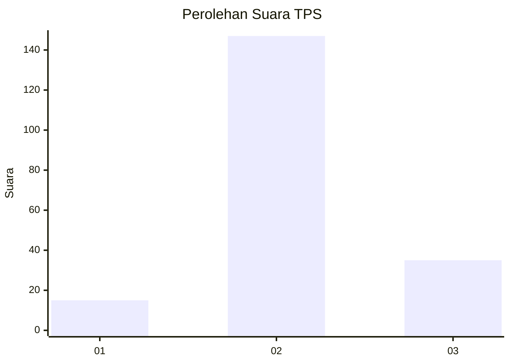

# Hasil

## Grafik

## Tabel

| No. | Nama Paslon    | Suara | Suara (raw) | Persentase |
|:--- |:-------------- | -----:| -----------:| ----------:|
| 1   | ANIES MUHAIMIN | 15    | [15][p-1]   | 7,61       |
| 2   | PRABOWO GIBRAN | 147   | [147][p-2]  | 74,62      |
| 3   | GANJAR MAHFUD  | 35    | [35][p-3]   | 17,77      |

[p-1]: https://github.com/gigit-pemilu/pemilu-2024-35-jawa-timur/blob/main/pilpres/hitung-suara/sub/35-jawa-timur/sub/02-ponorogo/sub/05-sawoo/sub/2008-prayungan/sub/004-tps/sub/paslon-1.txt
[p-2]: https://github.com/gigit-pemilu/pemilu-2024-35-jawa-timur/blob/main/pilpres/hitung-suara/sub/35-jawa-timur/sub/02-ponorogo/sub/05-sawoo/sub/2008-prayungan/sub/004-tps/sub/paslon-2.txt
[p-3]: https://github.com/gigit-pemilu/pemilu-2024-35-jawa-timur/blob/main/pilpres/hitung-suara/sub/35-jawa-timur/sub/02-ponorogo/sub/05-sawoo/sub/2008-prayungan/sub/004-tps/sub/paslon-3.txt

## Foto C Plano

https://sirekap-obj-formc.kpu.go.id/69de/pemilu/ppwp/35/02/05/20/08/3502052008004-20240214-235109--5a21c363-88a2-4254-984b-41e4f5e8c8b4.jpg

https://sirekap-obj-formc.kpu.go.id/69de/pemilu/ppwp/35/02/05/20/08/3502052008004-20240214-235156--f80649ac-cdc3-4c94-a3d8-3d2f9242d8fc.jpg

https://sirekap-obj-formc.kpu.go.id/69de/pemilu/ppwp/35/02/05/20/08/3502052008004-20240214-235332--37b33bd5-03ed-4f94-ad50-0f60f85c23f1.jpg

## Metadata

| Key        | Value               |
| ---------- | ------------------- |
| Time Stamp | 2024-02-15 15:00:29 |

