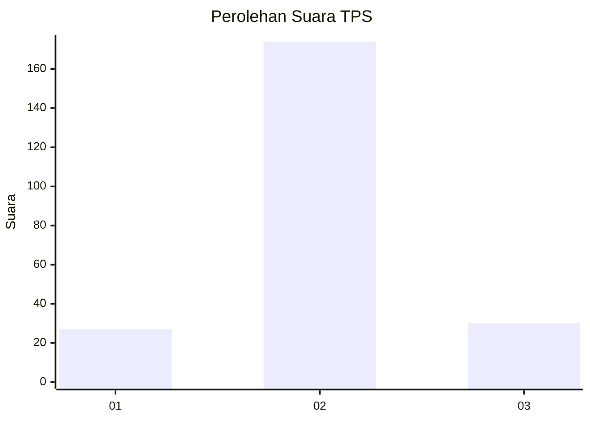
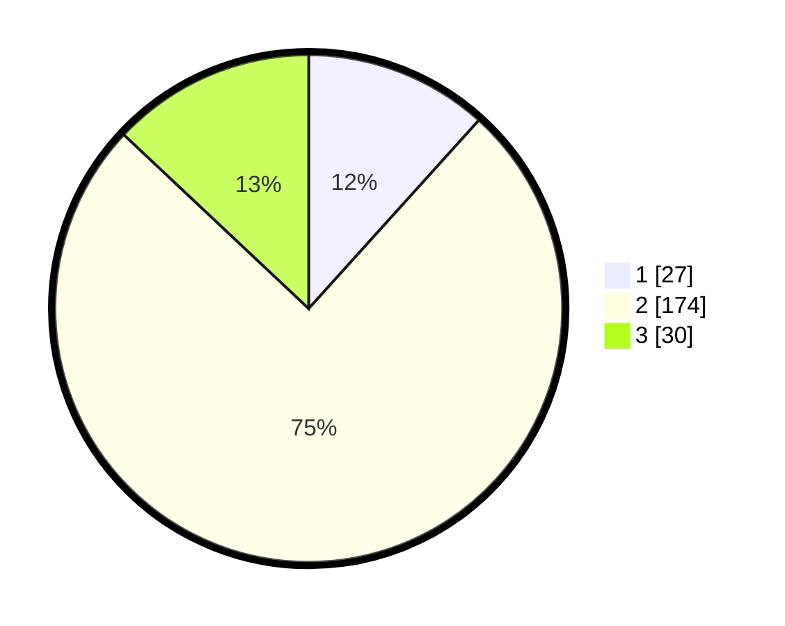

# Hasil

## Grafik

## Tabel

| No. | Nama Paslon    | Suara | Suara (raw) | Persentase |
|:--- |:-------------- | -----:| -----------:| ----------:|
| 1   | ANIES MUHAIMIN | 27    | [27][p-1]   | 11,69      |
| 2   | PRABOWO GIBRAN | 174   | [174][p-2]  | 75,32      |
| 3   | GANJAR MAHFUD  | 30    | [30][p-3]   | 12,99      |

[p-1]: https://github.com/gigit-pemilu/pemilu-2024-35-jawa-timur/blob/main/pilpres/hitung-suara/sub/35-jawa-timur/sub/02-ponorogo/sub/05-sawoo/sub/2010-grogol/sub/003-tps/sub/paslon-1.txt
[p-2]: https://github.com/gigit-pemilu/pemilu-2024-35-jawa-timur/blob/main/pilpres/hitung-suara/sub/35-jawa-timur/sub/02-ponorogo/sub/05-sawoo/sub/2010-grogol/sub/003-tps/sub/paslon-2.txt
[p-3]: https://github.com/gigit-pemilu/pemilu-2024-35-jawa-timur/blob/main/pilpres/hitung-suara/sub/35-jawa-timur/sub/02-ponorogo/sub/05-sawoo/sub/2010-grogol/sub/003-tps/sub/paslon-3.txt

## Foto C Plano

https://sirekap-obj-formc.kpu.go.id/36ca/pemilu/ppwp/35/02/05/20/10/3502052010003-20240214-224844--f359a34f-aa1f-418b-ac3f-52b9c67f6829.jpg

https://sirekap-obj-formc.kpu.go.id/36ca/pemilu/ppwp/35/02/05/20/10/3502052010003-20240214-224359--f167e7a4-b061-4550-97a2-1f8bad3dde43.jpg

https://sirekap-obj-formc.kpu.go.id/36ca/pemilu/ppwp/35/02/05/20/10/3502052010003-20240214-224630--85d249cc-036b-45d2-950c-ab80396b2065.jpg

## Metadata

| Key        | Value               |
| ---------- | ------------------- |
| Time Stamp | 2024-02-15 15:00:29 |

