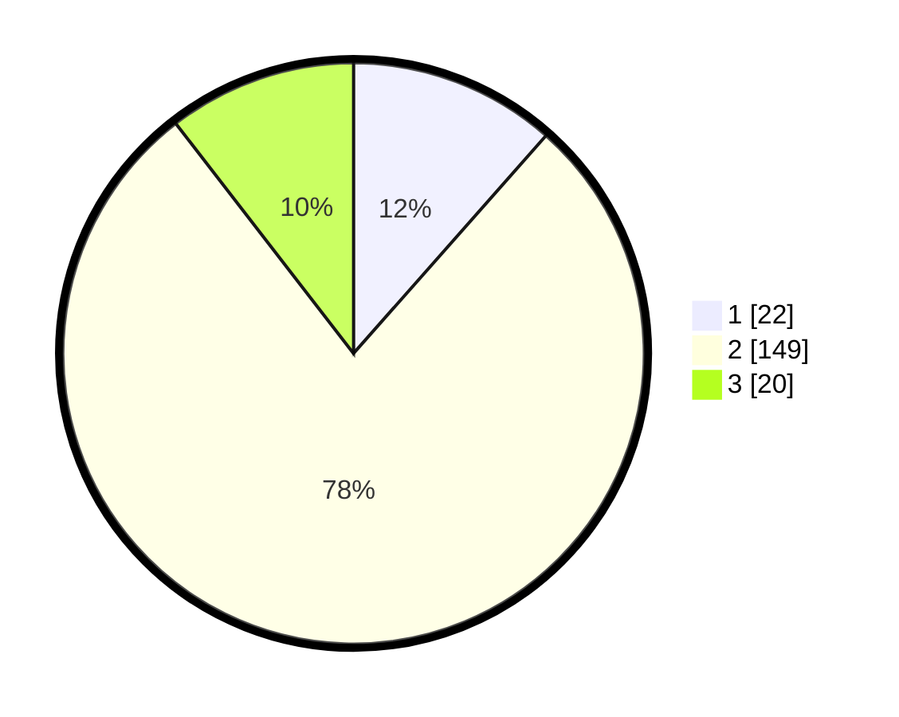

# Hasil

## Grafik

## Tabel

| No. | Nama Paslon    | Suara | Suara (raw) | Persentase |
|:--- |:-------------- | -----:| -----------:| ----------:|
| 1   | ANIES MUHAIMIN | 22    | [22][p-1]   | 11,52      |
| 2   | PRABOWO GIBRAN | 149   | [149][p-2]  | 78,01      |
| 3   | GANJAR MAHFUD  | 20    | [20][p-3]   | 10,47      |

[p-1]: https://github.com/gigit-pemilu/pemilu-2024/blob/main/pilpres/hitung-suara/sub/35-jawa-timur/sub/02-ponorogo/sub/06-sooko/sub/2001-ngadirojo/sub/003-tps/sub/paslon-1.txt
[p-2]: https://github.com/gigit-pemilu/pemilu-2024/blob/main/pilpres/hitung-suara/sub/35-jawa-timur/sub/02-ponorogo/sub/06-sooko/sub/2001-ngadirojo/sub/003-tps/sub/paslon-2.txt
[p-3]: https://github.com/gigit-pemilu/pemilu-2024/blob/main/pilpres/hitung-suara/sub/35-jawa-timur/sub/02-ponorogo/sub/06-sooko/sub/2001-ngadirojo/sub/003-tps/sub/paslon-3.txt

## Foto C Plano

https://sirekap-obj-formc.kpu.go.id/6bbb/pemilu/ppwp/35/02/06/20/01/3502062001003-20240214-234732--11d6220d-4f30-4853-b0cd-dfbc12c515e5.jpg

https://sirekap-obj-formc.kpu.go.id/6bbb/pemilu/ppwp/35/02/06/20/01/3502062001003-20240214-234855--36dff224-7fad-4240-bd68-7adee2355915.jpg

https://sirekap-obj-formc.kpu.go.id/6bbb/pemilu/ppwp/35/02/06/20/01/3502062001003-20240214-235047--ebd61053-f2a3-42a6-b57d-af3a36f4e4f5.jpg

## Metadata

| Key        | Value               |
| ---------- | ------------------- |
| Time Stamp | 2024-02-15 21:30:27 |

## DATA PEMILIH TETAP

Jumlah pemilih dalam DPT: **266**.
 * L: **133**.
 * P: **133**.

## DATA PENGGUNA HAK PILIH

Jumlah pengguna hak pilih dalam DPT: **215**.
 * L: **107**.
 * P: **108**.

Jumlah pengguna hak pilih dalam DPTb: **1**.
 * L: **1**.
 * P: **0**.

Jumlah pengguna hak pilih dalam DPK: **0**.
 * L: **0**.
 * P: **0**.

Jumlah pengguna hak pilih: **216**.
 * L: **108**.
 * P: **108**.

## JUMLAH SUARA SAH DAN TIDAK SAH

JUMLAH SELURUH SUARA SAH: **191**.

JUMLAH SUARA TIDAK SAH: **25**.

JUMLAH SELURUH SUARA SAH DAN SUARA TIDAK SAH: **216**.

