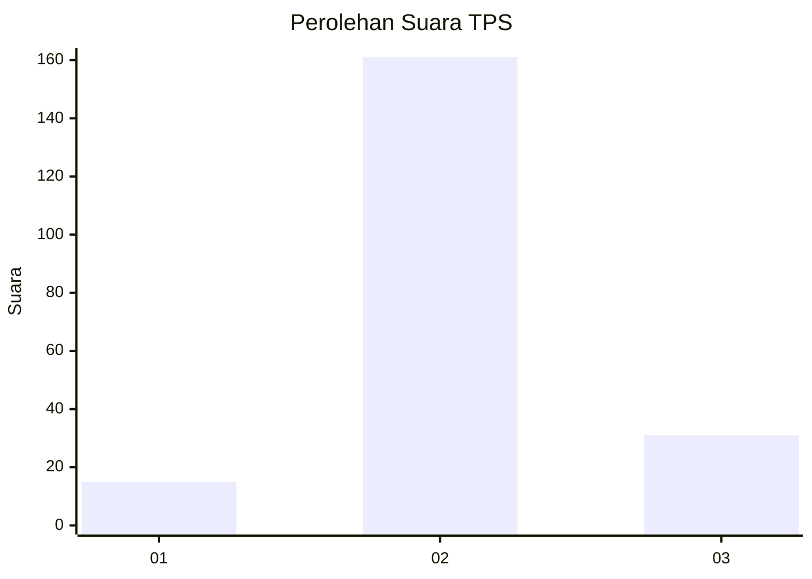

# Hasil

## Grafik

## Tabel

| No. | Nama Paslon    | Suara | Suara (raw) | Persentase |
|:--- |:-------------- | -----:| -----------:| ----------:|
| 1   | ANIES MUHAIMIN | 15    | [15][p-1]   | 7,25       |
| 2   | PRABOWO GIBRAN | 161   | [161][p-2]  | 77,78      |
| 3   | GANJAR MAHFUD  | 31    | [31][p-3]   | 14,98      |

[p-1]: https://github.com/gigit-pemilu/pemilu-2024/blob/main/pilpres/hitung-suara/sub/35-jawa-timur/sub/02-ponorogo/sub/06-sooko/sub/2001-ngadirojo/sub/004-tps/sub/paslon-1.txt
[p-2]: https://github.com/gigit-pemilu/pemilu-2024/blob/main/pilpres/hitung-suara/sub/35-jawa-timur/sub/02-ponorogo/sub/06-sooko/sub/2001-ngadirojo/sub/004-tps/sub/paslon-2.txt
[p-3]: https://github.com/gigit-pemilu/pemilu-2024/blob/main/pilpres/hitung-suara/sub/35-jawa-timur/sub/02-ponorogo/sub/06-sooko/sub/2001-ngadirojo/sub/004-tps/sub/paslon-3.txt

## Foto C Plano

https://sirekap-obj-formc.kpu.go.id/1bbf/pemilu/ppwp/35/02/06/20/01/3502062001004-20240218-162038--6d6506d1-5c54-4103-a15a-4b344e3004eb.jpg

https://sirekap-obj-formc.kpu.go.id/1bbf/pemilu/ppwp/35/02/06/20/01/3502062001004-20240218-162040--25908909-f4ef-4d2e-b852-4457e8bd8e80.jpg

https://sirekap-obj-formc.kpu.go.id/1bbf/pemilu/ppwp/35/02/06/20/01/3502062001004-20240218-162039--5ce26e85-bafe-4767-9c02-94d3d456bfdc.jpg

## Metadata

| Key        | Value               |
| ---------- | ------------------- |
| Time Stamp | 2024-02-19 06:16:00 |

## DATA PEMILIH TETAP

Jumlah pemilih dalam DPT: **275**.
 * L: **134**.
 * P: **141**.

## DATA PENGGUNA HAK PILIH

Jumlah pengguna hak pilih dalam DPT: **235**.
 * L: **116**.
 * P: **119**.

Jumlah pengguna hak pilih dalam DPTb: **2**.
 * L: **1**.
 * P: **1**.

Jumlah pengguna hak pilih dalam DPK: **0**.
 * L: **0**.
 * P: **0**.

Jumlah pengguna hak pilih: **237**.
 * L: **117**.
 * P: **120**.

## JUMLAH SUARA SAH DAN TIDAK SAH

JUMLAH SELURUH SUARA SAH: **207**.

JUMLAH SUARA TIDAK SAH: **30**.

JUMLAH SELURUH SUARA SAH DAN SUARA TIDAK SAH: **237**.

