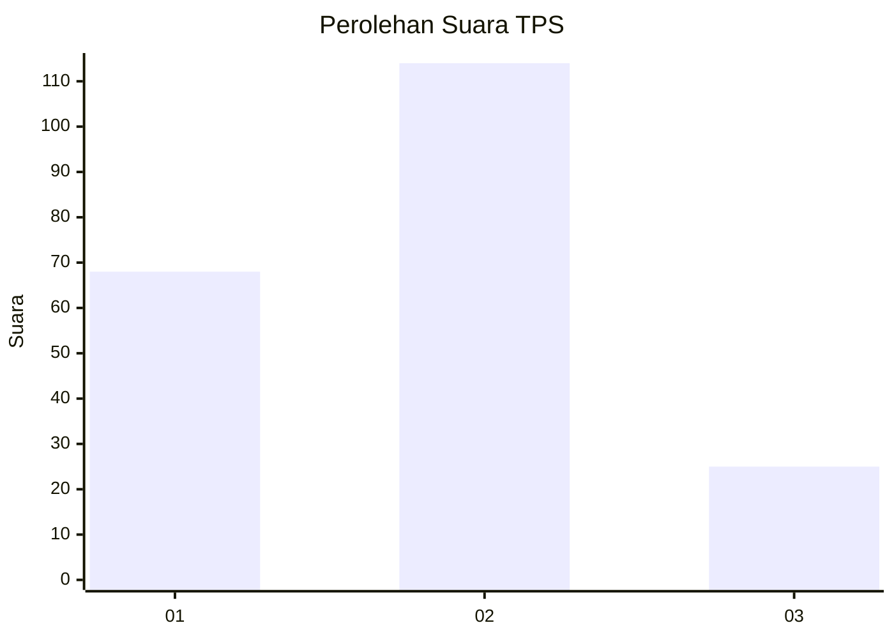
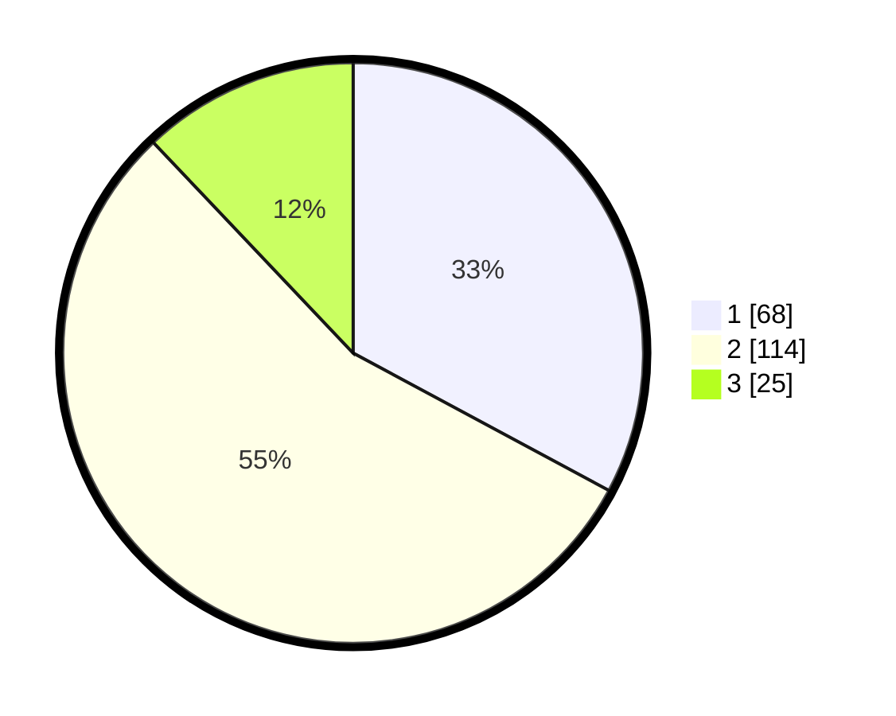

# Hasil

## Grafik

## Tabel

| No. | Nama Paslon    | Suara | Suara (raw) | Persentase |
|:--- |:-------------- | -----:| -----------:| ----------:|
| 1   | ANIES MUHAIMIN | 68    | [68][p-1]   | 32,85      |
| 2   | PRABOWO GIBRAN | 114   | [114][p-2]  | 55,07      |
| 3   | GANJAR MAHFUD  | 25    | [25][p-3]   | 12,08      |

[p-1]: https://github.com/gigit-pemilu/pemilu-2024/blob/main/pilpres/hitung-suara/sub/35-jawa-timur/sub/02-ponorogo/sub/06-sooko/sub/2001-ngadirojo/sub/006-tps/sub/paslon-1.txt
[p-2]: https://github.com/gigit-pemilu/pemilu-2024/blob/main/pilpres/hitung-suara/sub/35-jawa-timur/sub/02-ponorogo/sub/06-sooko/sub/2001-ngadirojo/sub/006-tps/sub/paslon-2.txt
[p-3]: https://github.com/gigit-pemilu/pemilu-2024/blob/main/pilpres/hitung-suara/sub/35-jawa-timur/sub/02-ponorogo/sub/06-sooko/sub/2001-ngadirojo/sub/006-tps/sub/paslon-3.txt

## Foto C Plano

https://sirekap-obj-formc.kpu.go.id/798b/pemilu/ppwp/35/02/06/20/01/3502062001006-20240218-195618--9538b24e-1fb3-4acc-bcc8-72261da93c4d.jpg

https://sirekap-obj-formc.kpu.go.id/798b/pemilu/ppwp/35/02/06/20/01/3502062001006-20240218-194900--e39daa5c-f1b1-4abe-9065-d90a0a303140.jpg

https://sirekap-obj-formc.kpu.go.id/798b/pemilu/ppwp/35/02/06/20/01/3502062001006-20240218-195444--192653d2-e6b7-4856-834a-8d8222016d7f.jpg

## Metadata

| Key        | Value               |
| ---------- | ------------------- |
| Time Stamp | 2024-02-19 06:16:00 |

## DATA PEMILIH TETAP

Jumlah pemilih dalam DPT: **253**.
 * L: **116**.
 * P: **137**.

## DATA PENGGUNA HAK PILIH

Jumlah pengguna hak pilih dalam DPT: **208**.
 * L: **100**.
 * P: **108**.

Jumlah pengguna hak pilih dalam DPTb: **3**.
 * L: **1**.
 * P: **2**.

Jumlah pengguna hak pilih dalam DPK: **2**.
 * L: **1**.
 * P: **1**.

Jumlah pengguna hak pilih: **213**.
 * L: **102**.
 * P: **111**.

## JUMLAH SUARA SAH DAN TIDAK SAH

JUMLAH SELURUH SUARA SAH: **207**.

JUMLAH SUARA TIDAK SAH: **6**.

JUMLAH SELURUH SUARA SAH DAN SUARA TIDAK SAH: **213**.

