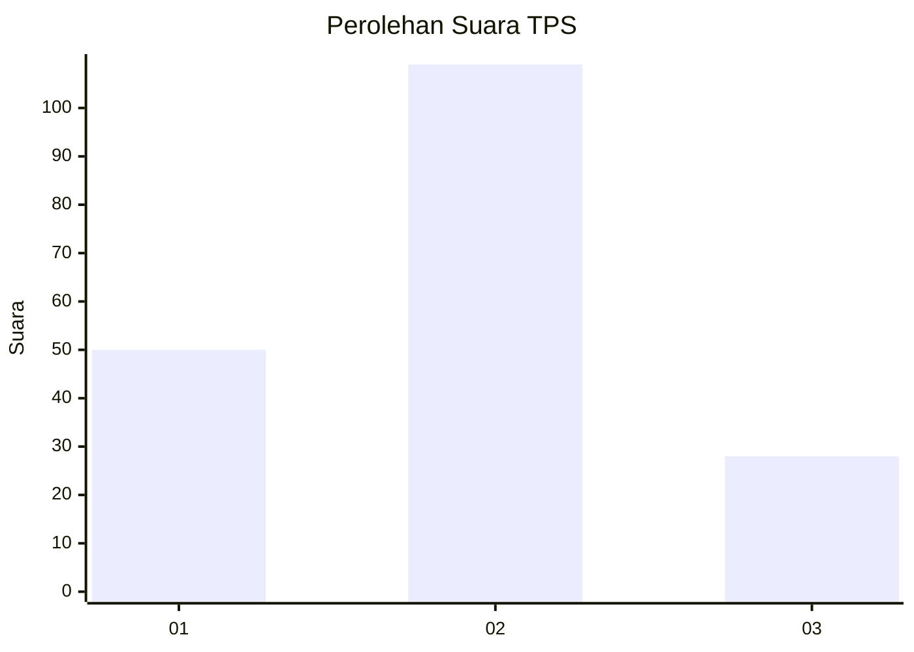
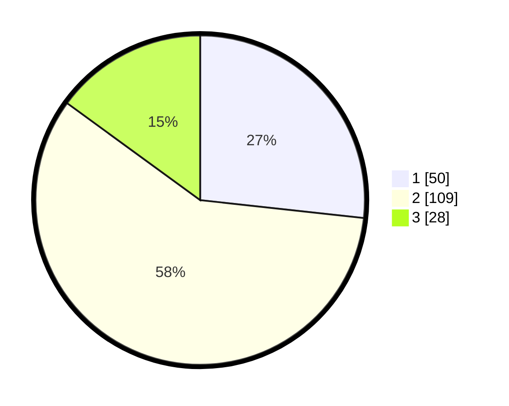

# Hasil

## Grafik

## Tabel

| No. | Nama Paslon    | Suara | Suara (raw) | Persentase |
|:--- |:-------------- | -----:| -----------:| ----------:|
| 1   | ANIES MUHAIMIN | 50    | [50][p-1]   | 26,74      |
| 2   | PRABOWO GIBRAN | 109   | [109][p-2]  | 58,29      |
| 3   | GANJAR MAHFUD  | 28    | [28][p-3]   | 14,97      |

[p-1]: https://github.com/gigit-pemilu/pemilu-2024-35-jawa-timur/blob/main/pilpres/hitung-suara/sub/35-jawa-timur/sub/02-ponorogo/sub/06-sooko/sub/2005-bedoho/sub/004-tps/sub/paslon-1.txt
[p-2]: https://github.com/gigit-pemilu/pemilu-2024-35-jawa-timur/blob/main/pilpres/hitung-suara/sub/35-jawa-timur/sub/02-ponorogo/sub/06-sooko/sub/2005-bedoho/sub/004-tps/sub/paslon-2.txt
[p-3]: https://github.com/gigit-pemilu/pemilu-2024-35-jawa-timur/blob/main/pilpres/hitung-suara/sub/35-jawa-timur/sub/02-ponorogo/sub/06-sooko/sub/2005-bedoho/sub/004-tps/sub/paslon-3.txt

## Foto C Plano

https://sirekap-obj-formc.kpu.go.id/feef/pemilu/ppwp/35/02/06/20/05/3502062005004-20240214-210514--760809a6-2eab-48ce-82d0-bab6bd4d732b.jpg

https://sirekap-obj-formc.kpu.go.id/feef/pemilu/ppwp/35/02/06/20/05/3502062005004-20240214-233112--0f274310-052f-4571-937d-c9707126ec97.jpg

https://sirekap-obj-formc.kpu.go.id/feef/pemilu/ppwp/35/02/06/20/05/3502062005004-20240214-233156--91fc0810-09bf-4b72-a104-55a245328a3a.jpg

## Metadata

| Key        | Value               |
| ---------- | ------------------- |
| Time Stamp | 2024-02-15 15:00:29 |

