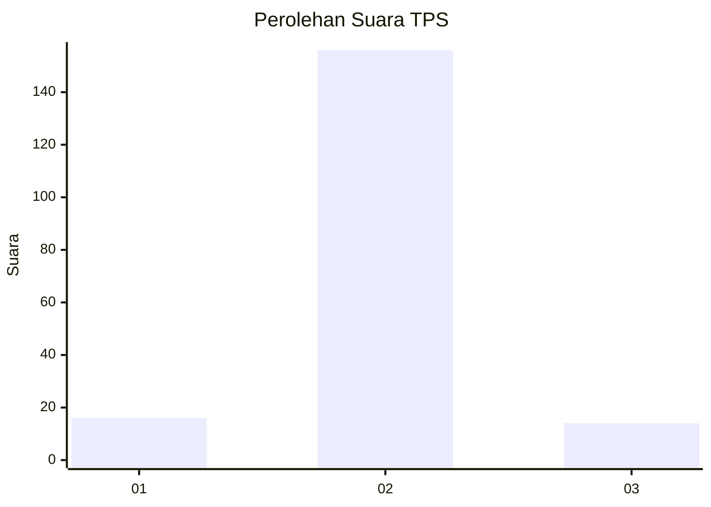
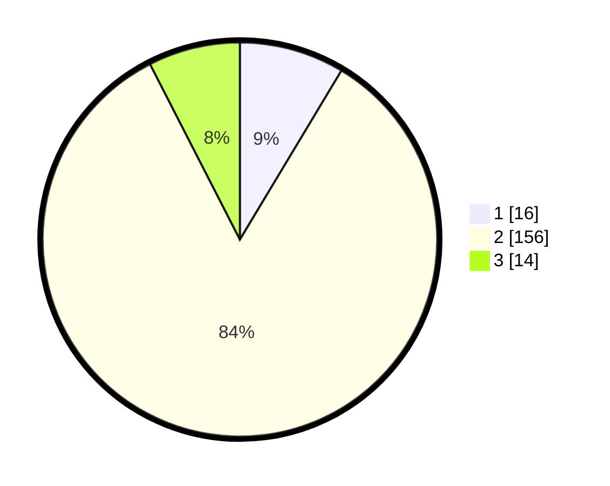

# Hasil

## Grafik

## Tabel

| No. | Nama Paslon    | Suara | Suara (raw) | Persentase |
|:--- |:-------------- | -----:| -----------:| ----------:|
| 1   | ANIES MUHAIMIN | 16    | [16][p-1]   | 8,60       |
| 2   | PRABOWO GIBRAN | 156   | [156][p-2]  | 83,87      |
| 3   | GANJAR MAHFUD  | 14    | [14][p-3]   | 7,53       |

[p-1]: https://github.com/gigit-pemilu/pemilu-2024/blob/main/pilpres/hitung-suara/sub/35-jawa-timur/sub/02-ponorogo/sub/07-pulung/sub/2001-karangpatihan/sub/004-tps/sub/paslon-1.txt
[p-2]: https://github.com/gigit-pemilu/pemilu-2024/blob/main/pilpres/hitung-suara/sub/35-jawa-timur/sub/02-ponorogo/sub/07-pulung/sub/2001-karangpatihan/sub/004-tps/sub/paslon-2.txt
[p-3]: https://github.com/gigit-pemilu/pemilu-2024/blob/main/pilpres/hitung-suara/sub/35-jawa-timur/sub/02-ponorogo/sub/07-pulung/sub/2001-karangpatihan/sub/004-tps/sub/paslon-3.txt

## Foto C Plano

https://sirekap-obj-formc.kpu.go.id/290e/pemilu/ppwp/35/02/07/20/01/3502072001004-20240217-104649--b1fe70a4-dcee-40d0-8a15-4a9fc78c33e9.jpg

https://sirekap-obj-formc.kpu.go.id/290e/pemilu/ppwp/35/02/07/20/01/3502072001004-20240217-104650--c4b5e36a-0e3d-47d3-8364-46a2fbe9f0fd.jpg

https://sirekap-obj-formc.kpu.go.id/290e/pemilu/ppwp/35/02/07/20/01/3502072001004-20240217-104649--711219e1-d738-4eb0-a44b-eb4e0ac977d4.jpg

## Metadata

| Key        | Value               |
| ---------- | ------------------- |
| Time Stamp | 2024-02-17 13:37:34 |

## DATA PEMILIH TETAP

Jumlah pemilih dalam DPT: **241**.
 * L: **128**.
 * P: **113**.

## DATA PENGGUNA HAK PILIH

Jumlah pengguna hak pilih dalam DPT: **188**.
 * L: **102**.
 * P: **86**.

Jumlah pengguna hak pilih dalam DPTb: **0**.
 * L: **0**.
 * P: **0**.

Jumlah pengguna hak pilih dalam DPK: **3**.
 * L: **1**.
 * P: **2**.

Jumlah pengguna hak pilih: **191**.
 * L: **103**.
 * P: **88**.

## JUMLAH SUARA SAH DAN TIDAK SAH

JUMLAH SELURUH SUARA SAH: **186**.

JUMLAH SUARA TIDAK SAH: **5**.

JUMLAH SELURUH SUARA SAH DAN SUARA TIDAK SAH: **191**.

