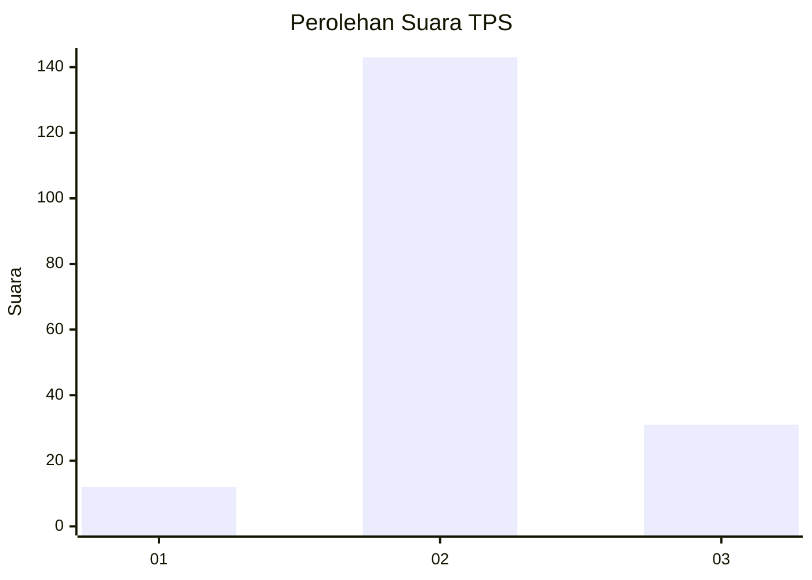
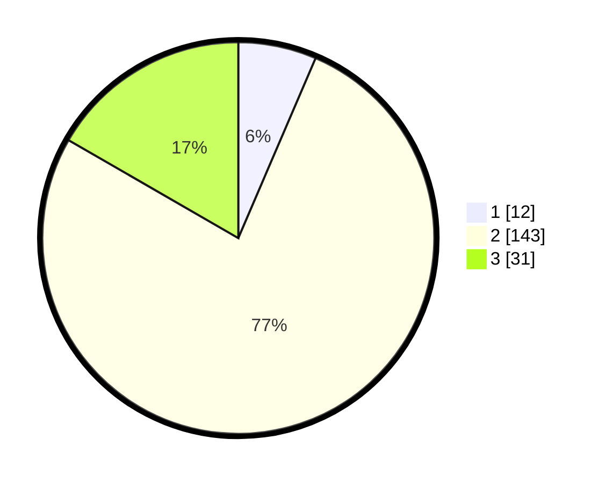

# Hasil

## Grafik

## Tabel

| No. | Nama Paslon    | Suara | Suara (raw) | Persentase |
|:--- |:-------------- | -----:| -----------:| ----------:|
| 1   | ANIES MUHAIMIN | 12    | [12][p-1]   | 6,45       |
| 2   | PRABOWO GIBRAN | 143   | [143][p-2]  | 76,88      |
| 3   | GANJAR MAHFUD  | 31    | [31][p-3]   | 16,67      |

[p-1]: https://github.com/gigit-pemilu/pemilu-2024-35-jawa-timur/blob/main/pilpres/hitung-suara/sub/35-jawa-timur/sub/02-ponorogo/sub/07-pulung/sub/2005-singgahan/sub/007-tps/sub/paslon-1.txt
[p-2]: https://github.com/gigit-pemilu/pemilu-2024-35-jawa-timur/blob/main/pilpres/hitung-suara/sub/35-jawa-timur/sub/02-ponorogo/sub/07-pulung/sub/2005-singgahan/sub/007-tps/sub/paslon-2.txt
[p-3]: https://github.com/gigit-pemilu/pemilu-2024-35-jawa-timur/blob/main/pilpres/hitung-suara/sub/35-jawa-timur/sub/02-ponorogo/sub/07-pulung/sub/2005-singgahan/sub/007-tps/sub/paslon-3.txt

## Foto C Plano

https://sirekap-obj-formc.kpu.go.id/6ca9/pemilu/ppwp/35/02/07/20/05/3502072005007-20240214-141112--cdb7f76a-980a-46be-b3d0-12e39b4fa495.jpg

https://sirekap-obj-formc.kpu.go.id/6ca9/pemilu/ppwp/35/02/07/20/05/3502072005007-20240214-141136--448c785b-c469-4d3b-8309-4992f705cc01.jpg

https://sirekap-obj-formc.kpu.go.id/6ca9/pemilu/ppwp/35/02/07/20/05/3502072005007-20240214-141355--f72d6097-740f-4c96-8484-0321d025b245.jpg

## Metadata

| Key        | Value               |
| ---------- | ------------------- |
| Time Stamp | 2024-02-20 11:00:00 |

