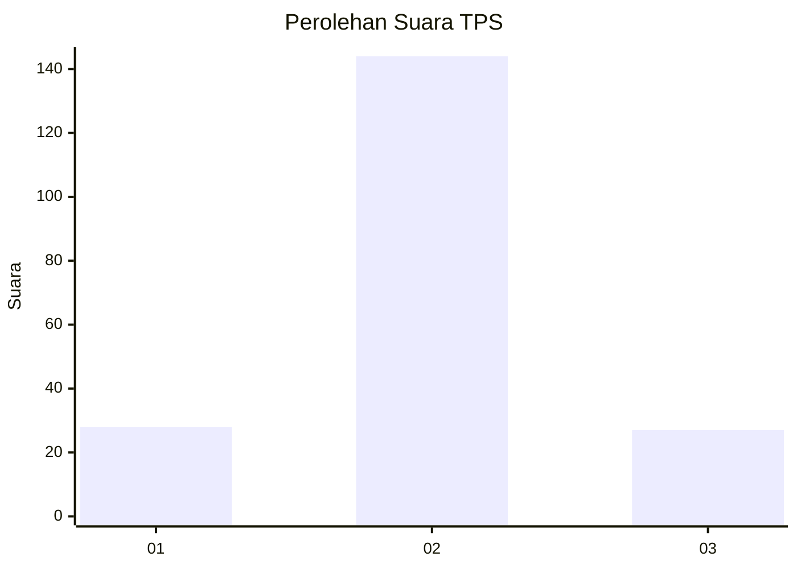
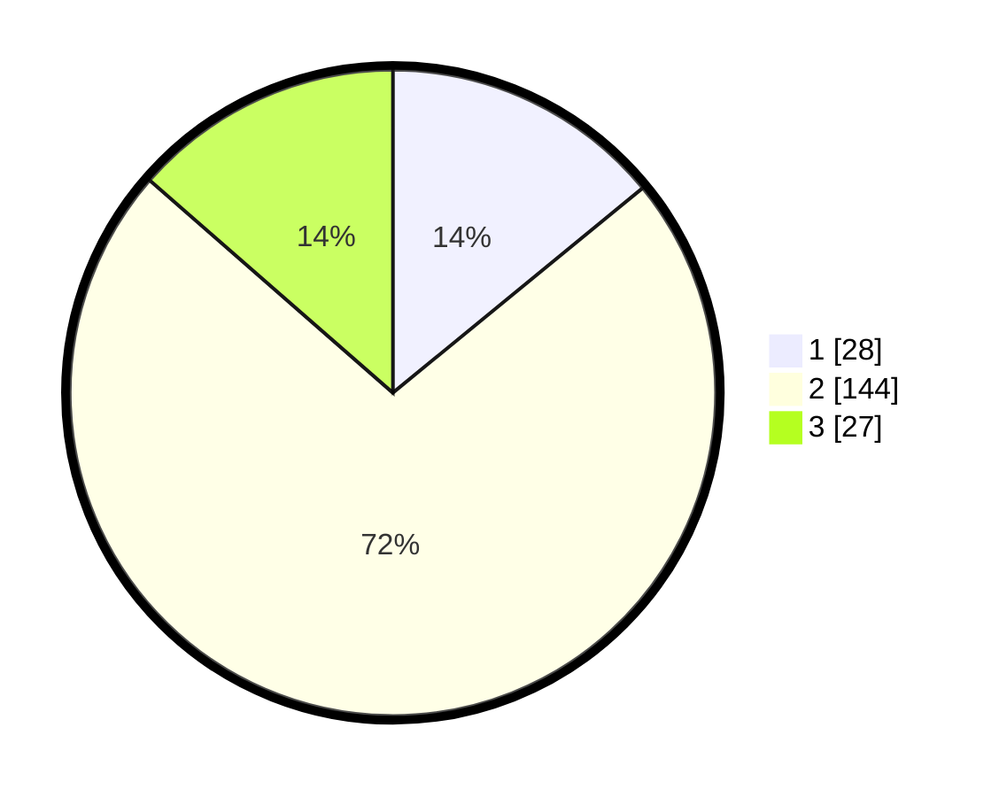

# Hasil

## Grafik

## Tabel

| No. | Nama Paslon    | Suara | Suara (raw) | Persentase |
|:--- |:-------------- | -----:| -----------:| ----------:|
| 1   | ANIES MUHAIMIN | 28    | [28][p-1]   | 14,07      |
| 2   | PRABOWO GIBRAN | 144   | [144][p-2]  | 72,36      |
| 3   | GANJAR MAHFUD  | 27    | [27][p-3]   | 13,57      |

[p-1]: https://github.com/gigit-pemilu/pemilu-2024/blob/main/pilpres/hitung-suara/sub/35-jawa-timur/sub/02-ponorogo/sub/07-pulung/sub/2007-pulung/sub/013-tps/sub/paslon-1.txt
[p-2]: https://github.com/gigit-pemilu/pemilu-2024/blob/main/pilpres/hitung-suara/sub/35-jawa-timur/sub/02-ponorogo/sub/07-pulung/sub/2007-pulung/sub/013-tps/sub/paslon-2.txt
[p-3]: https://github.com/gigit-pemilu/pemilu-2024/blob/main/pilpres/hitung-suara/sub/35-jawa-timur/sub/02-ponorogo/sub/07-pulung/sub/2007-pulung/sub/013-tps/sub/paslon-3.txt

## Foto C Plano

https://sirekap-obj-formc.kpu.go.id/05c3/pemilu/ppwp/35/02/07/20/07/3502072007013-20240214-210238--c9393901-112f-400d-ad4f-6ac2b2148fda.jpg

https://sirekap-obj-formc.kpu.go.id/05c3/pemilu/ppwp/35/02/07/20/07/3502072007013-20240214-220821--6935c291-10b6-4b0b-9b31-3184469e6ba1.jpg

https://sirekap-obj-formc.kpu.go.id/05c3/pemilu/ppwp/35/02/07/20/07/3502072007013-20240214-220933--51b604b3-c0e5-421c-b899-c4a49068b95a.jpg

## Metadata

| Key        | Value               |
| ---------- | ------------------- |
| Time Stamp | 2024-02-15 15:00:29 |

