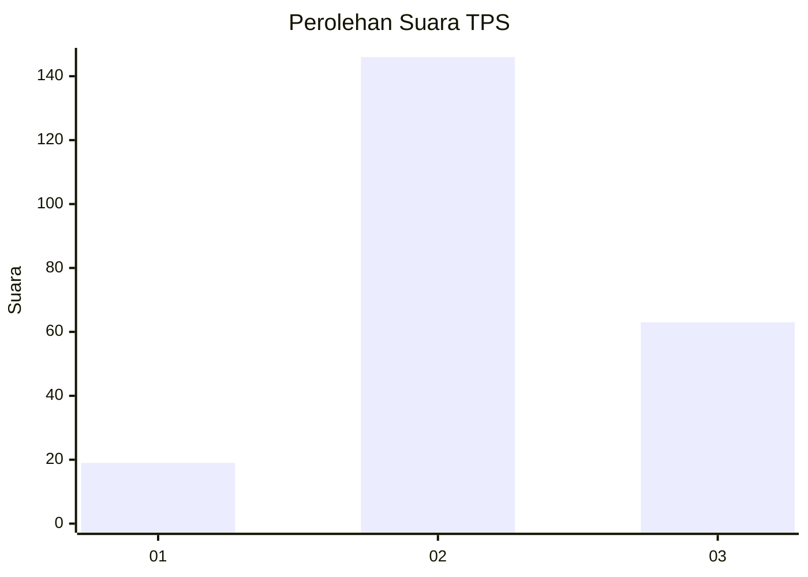

# Hasil

## Grafik

## Tabel

| No. | Nama Paslon    | Suara | Suara (raw) | Persentase |
|:--- |:-------------- | -----:| -----------:| ----------:|
| 1   | ANIES MUHAIMIN | 19    | [19][p-1]   | 8,33       |
| 2   | PRABOWO GIBRAN | 146   | [146][p-2]  | 64,04      |
| 3   | GANJAR MAHFUD  | 63    | [63][p-3]   | 27,63      |

[p-1]: https://github.com/gigit-pemilu/pemilu-2024/blob/main/pilpres/hitung-suara/sub/35-jawa-timur/sub/02-ponorogo/sub/07-pulung/sub/2012-pomahan/sub/006-tps/sub/paslon-1.txt
[p-2]: https://github.com/gigit-pemilu/pemilu-2024/blob/main/pilpres/hitung-suara/sub/35-jawa-timur/sub/02-ponorogo/sub/07-pulung/sub/2012-pomahan/sub/006-tps/sub/paslon-2.txt
[p-3]: https://github.com/gigit-pemilu/pemilu-2024/blob/main/pilpres/hitung-suara/sub/35-jawa-timur/sub/02-ponorogo/sub/07-pulung/sub/2012-pomahan/sub/006-tps/sub/paslon-3.txt

## Foto C Plano

https://sirekap-obj-formc.kpu.go.id/e662/pemilu/ppwp/35/02/07/20/12/3502072012006-20240214-224632--81d415d9-465c-46da-bb73-8d83857eccd1.jpg

https://sirekap-obj-formc.kpu.go.id/e662/pemilu/ppwp/35/02/07/20/12/3502072012006-20240214-224734--8b9ec311-e90a-4dbe-a538-0320798ed710.jpg

https://sirekap-obj-formc.kpu.go.id/e662/pemilu/ppwp/35/02/07/20/12/3502072012006-20240222-084959--563944cb-b711-4f2a-89fd-b045506a27ad.jpg

## Metadata

| Key        | Value               |
| ---------- | ------------------- |
| Time Stamp | 2024-02-22 09:00:00 |

