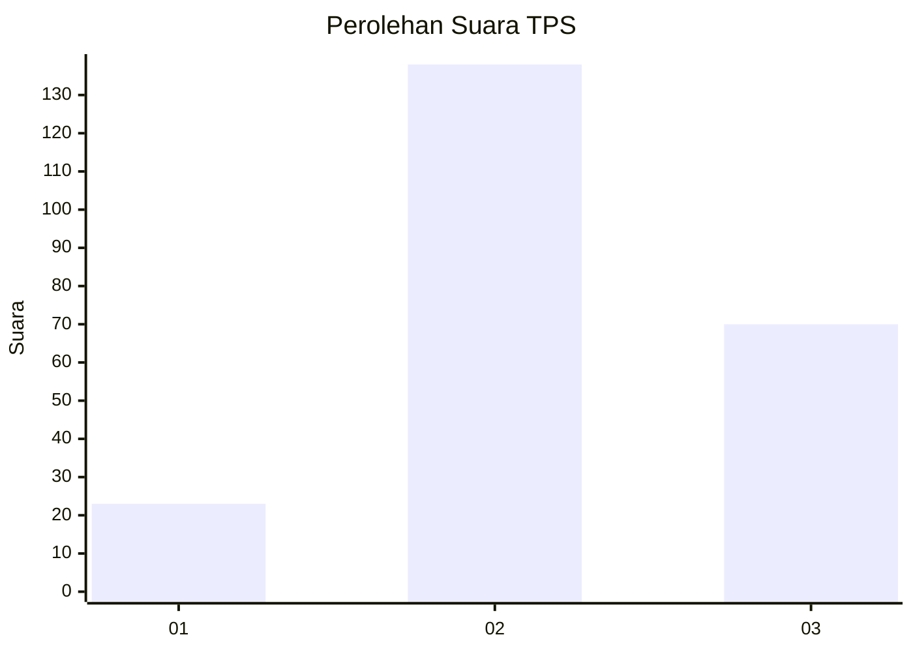
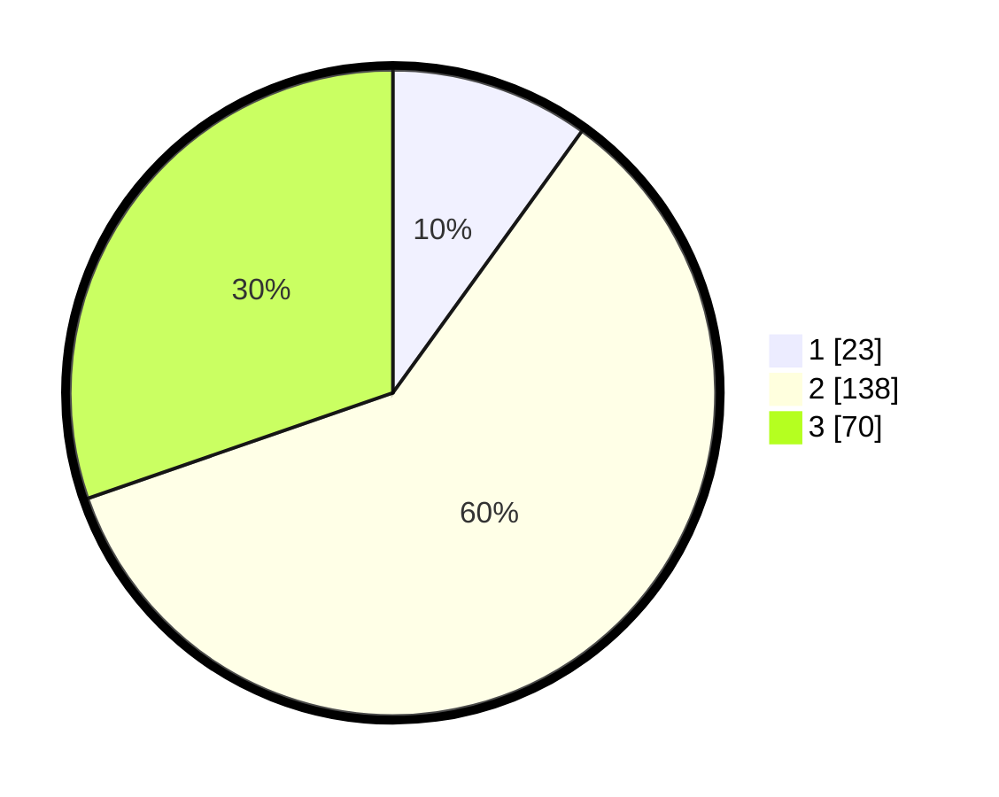

# Hasil

## Grafik

## Tabel

| No. | Nama Paslon    | Suara | Suara (raw) | Persentase |
|:--- |:-------------- | -----:| -----------:| ----------:|
| 1   | ANIES MUHAIMIN | 23    | [23][p-1]   | 9,96       |
| 2   | PRABOWO GIBRAN | 138   | [138][p-2]  | 59,74      |
| 3   | GANJAR MAHFUD  | 70    | [70][p-3]   | 30,30      |

[p-1]: https://github.com/gigit-pemilu/pemilu-2024-35-jawa-timur/blob/main/pilpres/hitung-suara/sub/35-jawa-timur/sub/02-ponorogo/sub/08-mlarak/sub/2001-tugu/sub/001-tps/sub/paslon-1.txt
[p-2]: https://github.com/gigit-pemilu/pemilu-2024-35-jawa-timur/blob/main/pilpres/hitung-suara/sub/35-jawa-timur/sub/02-ponorogo/sub/08-mlarak/sub/2001-tugu/sub/001-tps/sub/paslon-2.txt
[p-3]: https://github.com/gigit-pemilu/pemilu-2024-35-jawa-timur/blob/main/pilpres/hitung-suara/sub/35-jawa-timur/sub/02-ponorogo/sub/08-mlarak/sub/2001-tugu/sub/001-tps/sub/paslon-3.txt

## Foto C Plano

https://sirekap-obj-formc.kpu.go.id/4593/pemilu/ppwp/35/02/08/20/01/3502082001001-20240217-202102--85d20226-a95e-4ae9-a3ff-6c9ff3e9dca7.jpg

https://sirekap-obj-formc.kpu.go.id/4593/pemilu/ppwp/35/02/08/20/01/3502082001001-20240215-031250--d797e784-d637-47e6-b2d9-81525a7afd71.jpg

https://sirekap-obj-formc.kpu.go.id/4593/pemilu/ppwp/35/02/08/20/01/3502082001001-20240215-031518--90edc93c-99e5-4c26-b758-c6507c098cf3.jpg

## Metadata

| Key        | Value               |
| ---------- | ------------------- |
| Time Stamp | 2024-02-19 06:16:00 |

