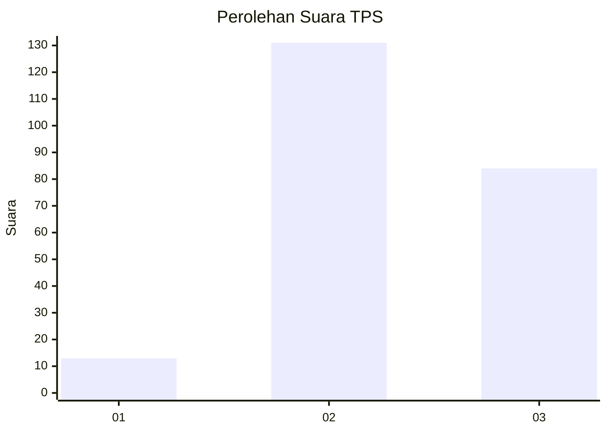
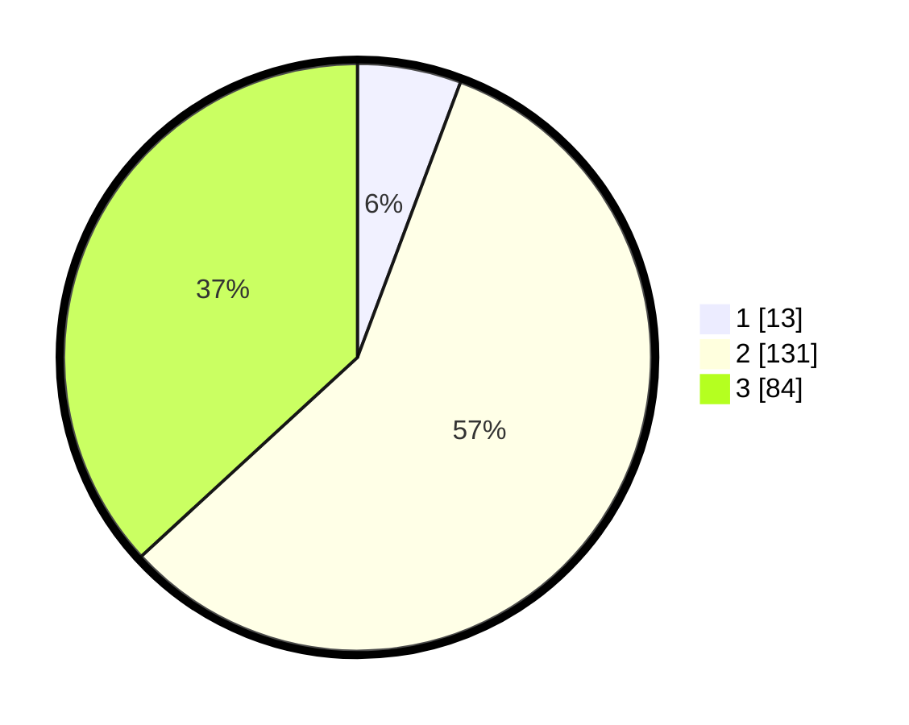

# Hasil

## Grafik

## Tabel

| No. | Nama Paslon    | Suara | Suara (raw) | Persentase |
|:--- |:-------------- | -----:| -----------:| ----------:|
| 1   | ANIES MUHAIMIN | 13    | [13][p-1]   | 5,70       |
| 2   | PRABOWO GIBRAN | 131   | [131][p-2]  | 57,46      |
| 3   | GANJAR MAHFUD  | 84    | [84][p-3]   | 36,84      |

[p-1]: https://github.com/gigit-pemilu/pemilu-2024-35-jawa-timur/blob/main/pilpres/hitung-suara/sub/35-jawa-timur/sub/02-ponorogo/sub/08-mlarak/sub/2001-tugu/sub/004-tps/sub/paslon-1.txt
[p-2]: https://github.com/gigit-pemilu/pemilu-2024-35-jawa-timur/blob/main/pilpres/hitung-suara/sub/35-jawa-timur/sub/02-ponorogo/sub/08-mlarak/sub/2001-tugu/sub/004-tps/sub/paslon-2.txt
[p-3]: https://github.com/gigit-pemilu/pemilu-2024-35-jawa-timur/blob/main/pilpres/hitung-suara/sub/35-jawa-timur/sub/02-ponorogo/sub/08-mlarak/sub/2001-tugu/sub/004-tps/sub/paslon-3.txt

## Foto C Plano

https://sirekap-obj-formc.kpu.go.id/e57e/pemilu/ppwp/35/02/08/20/01/3502082001004-20240217-203706--1caed517-15e3-449e-b78f-7dcfc1728466.jpg

https://sirekap-obj-formc.kpu.go.id/e57e/pemilu/ppwp/35/02/08/20/01/3502082001004-20240217-202131--4ce35869-a6f9-4aed-8791-5c8fced35e4c.jpg

https://sirekap-obj-formc.kpu.go.id/e57e/pemilu/ppwp/35/02/08/20/01/3502082001004-20240217-202206--0bb6c768-c0c1-4fbc-b782-4704b63c1702.jpg

## Metadata

| Key        | Value               |
| ---------- | ------------------- |
| Time Stamp | 2024-02-19 06:16:00 |

