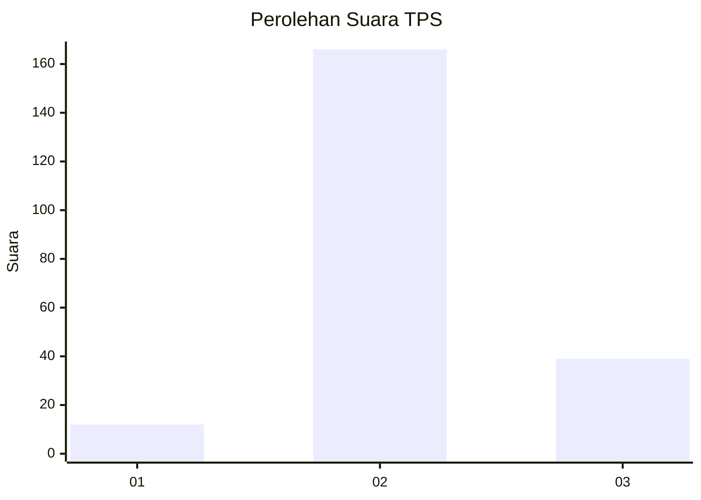

# Hasil

## Grafik

## Tabel

| No. | Nama Paslon    | Suara | Suara (raw) | Persentase |
|:--- |:-------------- | -----:| -----------:| ----------:|
| 1   | ANIES MUHAIMIN | 12    | [12][p-1]   | 5,53       |
| 2   | PRABOWO GIBRAN | 166   | [166][p-2]  | 76,50      |
| 3   | GANJAR MAHFUD  | 39    | [39][p-3]   | 17,97      |

[p-1]: https://github.com/gigit-pemilu/pemilu-2024-35-jawa-timur/blob/main/pilpres/hitung-suara/sub/35-jawa-timur/sub/02-ponorogo/sub/08-mlarak/sub/2001-tugu/sub/006-tps/sub/paslon-1.txt
[p-2]: https://github.com/gigit-pemilu/pemilu-2024-35-jawa-timur/blob/main/pilpres/hitung-suara/sub/35-jawa-timur/sub/02-ponorogo/sub/08-mlarak/sub/2001-tugu/sub/006-tps/sub/paslon-2.txt
[p-3]: https://github.com/gigit-pemilu/pemilu-2024-35-jawa-timur/blob/main/pilpres/hitung-suara/sub/35-jawa-timur/sub/02-ponorogo/sub/08-mlarak/sub/2001-tugu/sub/006-tps/sub/paslon-3.txt

## Foto C Plano

https://sirekap-obj-formc.kpu.go.id/4b74/pemilu/ppwp/35/02/08/20/01/3502082001006-20240217-121103--5aa44486-78f6-441d-9242-be43618763f9.jpg

https://sirekap-obj-formc.kpu.go.id/4b74/pemilu/ppwp/35/02/08/20/01/3502082001006-20240217-121353--e2c79c93-7103-4888-b8ec-6c2f3e0f5ed7.jpg

https://sirekap-obj-formc.kpu.go.id/4b74/pemilu/ppwp/35/02/08/20/01/3502082001006-20240217-110905--395f488b-f267-418a-b9bf-2ca5d5d06a16.jpg

## Metadata

| Key        | Value               |
| ---------- | ------------------- |
| Time Stamp | 2024-02-17 16:00:02 |

